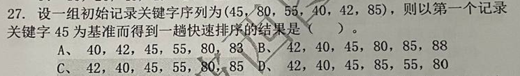
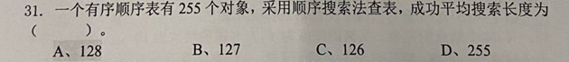
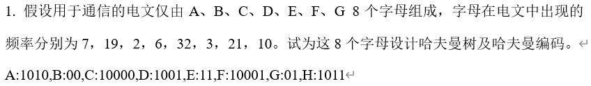
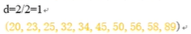
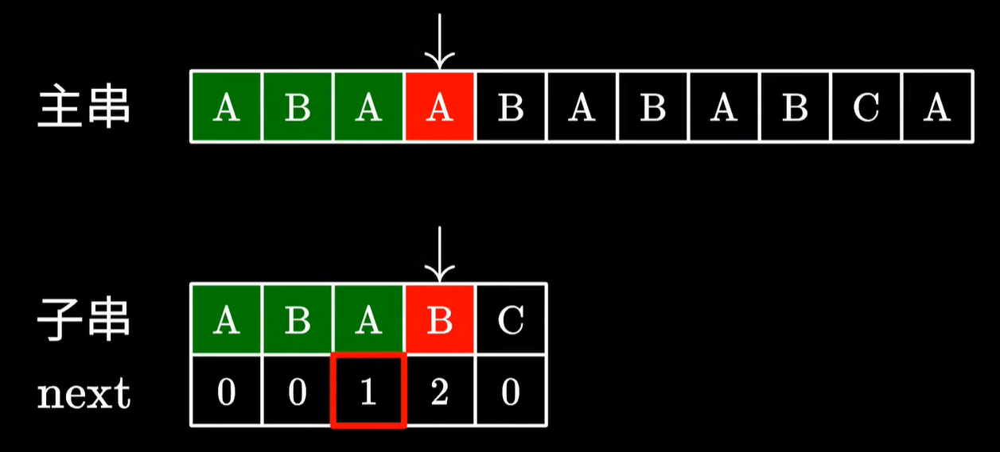
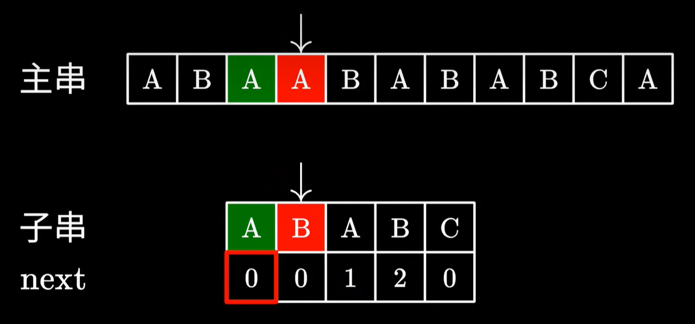
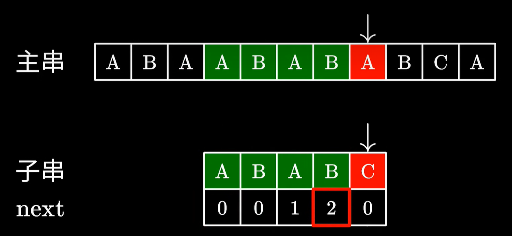
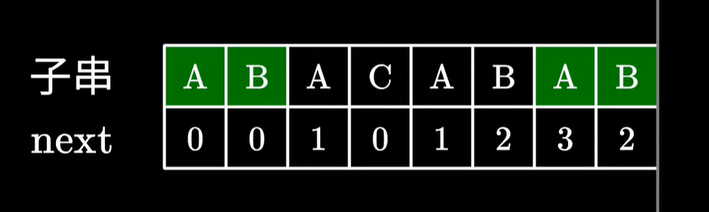
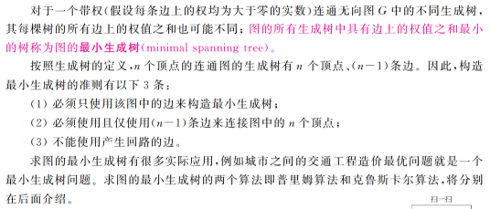

# 选择
  

图片上的问题是关于数据结构逻辑分类的，选择题的正确答案是：C. 线性结构和非线性结构

这是因为在数据结构的逻辑分类中，最基本的分类是将数据结构分为线性结构和非线性结构。

线性结构的数据元素是一对一的关系，如链表、队列、栈和数组。
非线性结构的数据元素是多对多或一对多的关系，如图和树。

其他选项，如动态和静态结构，紧凑和非紧凑结构，是描述数据结构的其他方面，而不是它们的逻辑分类。

  

根据您提供的图片，题目是关于链表操作的：

如果链表 L 的长度 LengthList(L) 是5，在执行删除操作 DelList(L, 2) 后，链表 `L` 的长度是多少？

这里 DelList(L, 2)`表示删除链表 L 中位置为2的元素。由于原来链表的长度是5，删除一个元素后，链表的长度应该是4。

因此，正确答案是：C. 4

  

在数据结构中，与所使用的计算机无关的是：C. 逻辑结构

逻辑结构指的是数据元素之间的逻辑关系，如线性关系、层次关系或网状关系，这种关系与数据在计算机内部的存储方式无关，它不依赖于具体的计算机或存储介质。物理结构和存储结构则与具体的计算机系统和存储介质有关。

  

代码片段包含两个嵌套的 for 循环。这段代码的时间复杂度是由两个循环决定的。外循环运行 m 次，内循环对于外循环的每次迭代都运行 n 次。因此，内部代码 a[i][j]=i*j; 将执行 m*n 次。

所以，这段代码的时间复杂度是：C. O(m*n)

  

这段C代码是两个嵌套的 for 循环。根据给出的代码，需要计算语句 T 的执行次数。

如果两个循环都是独立地从 1 到 `n` 迭代，那么内部的语句 `T` 将被执行 `n` 次对于外部循环的每一次迭代。由于外部循环也迭代 `n` 次，那么 `T` 会被执行 `n * n` 次，即 `n` 的平方次。

所以正确的时间复杂度是：A. \( O(n^2) \)

>如果是 j<=i：
>
>这是一个典型的示例，显示了一个循环内嵌套另一个循环。外循环对 i 从 1 迭代到 n，内循环在每次外循环的迭代中对 j 从 1 迭代到 i。所以，对于 i 的每个值，T 将执行 i 次。这就形成了以下的执行次数序列：
>
>当 i=1, T 执行 1 次；
>当 i=2, T 执行 2 次；
>当 i=3, T 执行 3 次；
>...
>当 i=n, T 执行 n 次。
>
>T 的总执行次数是 1 + 2 + 3 + ... + n，这是一个等差数列的和，其公式是 n(n+1)/2。

  

此段代码中，i 以3倍的速率增长，直到 i 大于或等于 n。每次循环，i 都乘以3，所以如果我们循环 k 次，i 的值将是 3^k。当 3^k 大于或等于 n 时，循环停止。

要找出循环执行了多少次，我们可以求解 3^k >= n，这意味着 k 大约是 log3(n)。因此，这个函数的时间复杂度是以3为底 n 的对数。

所以，正确答案是：D. O(log3n)

  

这段代码的工作方式是从 i=1 开始，每次循环 i 的值都翻倍，直到 i 大于 n。

这相当于每次循环都将问题的规模缩小一半。这种类型的循环通常具有对数时间复杂度。为了找到 i 等于或超过 n 需要循环多少次，我们解等式 2^k = n，其中 k 是循环的次数。解这个等式相当于求 n 的以2为底的对数，所以时间复杂度是 O(log2n)。

因此，正确答案是：A. O(log2n)

  

在一个链队列中，`f`（通常表示front）是队首指针，指向队列的第一个元素，而`r`（通常表示rear）是队尾指针，指向队列的最后一个元素。在队列中，删除操作通常发生在队首，即移除队列中的第一个元素。

所以，如果要删除队列的一个节点（即队列的第一个节点或队首），我们需要将队首指针 `f` 移动到下一个节点。这是因为在队列中，元素是从队首移除的，而新元素是从队尾添加的。

因此，正确答案是：C. f = f->next

这表示将队首指针 `f` 更新为指向当前队首节点的下一个节点，即移除了当前的队首节点。

  

当列车顺序进入一个栈结构的站台时，列车的出站顺序会遵循后进先出（LIFO）的原则。这意味着一辆列车只有在进入站台后所有前面的列车已经离开时才能离开。我们可以根据这个原则来分析每个选项是否可能。

A. 1234
这是可能的，因为列车可以按照进站的顺序离开。

B. 1243
这也是可能的。列车1离开，列车2进入然后离开，接着列车3和4依次进入，列车4先离开，然后列车3离开。

C. 1324
这是不可能的。要想让列车3在列车2之前出站，列车2必须在列车3之后进站，或者列车2在没有出站的情况下，列车3进站并出站。但根据题目的进站顺序，列车2在列车3之前进站，因此列车3不可能在列车2之前出站。

D. 1423
这是可能的。列车1离开，然后列车2进入站台但停留在那里，列车4进入然后立即离开，随后列车3进入然后立即离开，最后列车2离开。

所以，不可能的出站顺序为：

C. 1324

  

在分析算法的时间复杂度时，我们通常关注最高阶项，因为它决定了算法的增长速率。在这个函数中，`T(n) = 300n + 20n log n + 10n^2`，有三项：线性项、线性对数项和二次项。

在大 O 表示法中，我们关注的是当 n 趋向于无穷大时，哪一项的增长速率最高。在这个例子中，`10n^2` 是最高阶项，因为随着 n 的增长，它会比其他项增长得更快。

所以，这个函数的时间复杂度是：C. O(n^2)

## 归并排序，对序列进行一次归并

  

正确答案选A

>"长度为2的有序表"指的是一个包含两个元素的列表，这两个元素已经按照某种特定的顺序排列好了，这种顺序通常是按照从小到大或者从大到小的顺序。
>
>在归并排序的上下文中，"长度为2的有序表"通常表示在排序过程的某个阶段，你有多个包含两个元素的子序列，每个子序列内部的元素都是有序的，而这些子序列之间可能还没有完全排序。
>
>例如，如果你有一组数字 `[3, 1, 4, 2]`，按照归并排序的第一步，你会将它们分成两个子序列 `[3, 1]` 和 `[4, 2]`。在这里，每个子序列可以视为一个长度为2的未排序表。接下来，你会分别对这两个子序列进行排序，得到 `[1, 3]` 和 `[2, 4]`。现在，这两个子序列就变成了“长度为2的有序表”，因为它们内部各自都是有序的。然后在归并排序的下一步中，你会将这两个有序的子序列合并成一个完全有序的序列。

通过一趟归并排序后的正确结果是 `[16, 23, 25, 35, 40, 48, 79, 82]`。这个结果是通过将原始序列分成四对长度为2的有序子序列，然后将这些子序列归并排序得到的。在归并排序中，每一对有序子序列会合并为一个有序序列，然后这些更长的有序序列继续归并，直到得到一个完全排序的序列。

在提供的选项A、B、C和D中，没有任何一个选项与通过一趟归并排序后得到的结果完全匹配。这可能是因为题目的选项有误，或者题目意图测试对归并排序理解的错误。正确的归并排序过程是这样的：

1. 分割序列为四个子序列：(25, 48), (16, 35), (79, 82), (23, 40)。
2. 每个子序列已经是有序的，因为它们只有两个元素。
3. 进行一趟归并排序：
   - 归并 (25, 48) 和 (16, 35) 得到 (16, 25, 35, 48)
   - 归并 (79, 82) 和 (23, 40) 得到 (23, 40, 79, 82)
   - 最后，归并 (16, 25, 35, 48) 和 (23, 40, 79, 82) 得到最终排序结果。

因此，正确答案应该是一趟归并后的有序列表 `[16, 23, 25, 35, 40, 48, 79, 82]`。由于这不匹配任何给定的选项，正确答案可能不在提供的选项中。

--------------------------
- 对（25, 48, 16, 35, 79, 82, 23, 40）进行归并排序后的过程和结果是？

在对序列（25, 48, 16, 35, 79, 82, 23, 40）进行归并排序的过程中，每一步的变化如下：

1. 初始序列:
   `[25, 48, 16, 35, 79, 82, 23, 40]`

2. 分割序列并开始排序:
   - 分割前半部分: `[25, 48]`
   - 分割后半部分: `[16, 35]`

3. 合并排序结果:
   - 合并 `[25, 48]` 和 `[16, 35]` 得到 `[16, 25, 35, 48]`

4. 分割序列并开始排序:
   - 分割前半部分: `[79, 82]`
   - 分割后半部分: `[23, 40]`

5. 合并排序结果:
   - 合并 `[79, 82]` 和 `[23, 40]` 得到 `[23, 40, 79, 82]`

6. 最终合并两个有序子序列:
   - 合并 `[16, 25, 35, 48]` 和 `[23, 40, 79, 82]` 得到最终排序结果 `[16, 23, 25, 35, 40, 48, 79, 82]`

所以，归并排序的最终结果是一个有序序列 `[16, 23, 25, 35, 40, 48, 79, 82]`。在每一步中，都是将两个较小的有序列表合并成一个更大的有序列表，最终得到整个有序的序列。

- 为什么不分割前半部分: [25, 48, 16, 35]
分割后半部分: [79, 82, 23, 40]？

在归并排序算法中，分割的过程是将当前序列对半分割，直到每个子序列只包含一个元素或者两个元素，因为一个元素或者两个元素易于排序。这是一个递归的过程，目的是让合并的操作更加简单，因为合并两个已排序的序列比排序一个未排序的序列要简单得多。

在您提到的序列（25, 48, 16, 35, 79, 82, 23, 40）中，分割的第一步确实是将序列分为两个部分：前半部分 `[25, 48, 16, 35]` 和后半部分 `[79, 82, 23, 40]`。这是归并排序的第一步，也是递归分割开始的地方。

之后，这两个子序列 `[25, 48, 16, 35]` 和 `[79, 82, 23, 40]` 分别再次被分割。对于前半部分 `[25, 48, 16, 35]`，它会被分割成 `[25, 48]` 和 `[16, 35]`；对于后半部分 `[79, 82, 23, 40]`，它会被分割成 `[79, 82]` 和 `[23, 40]`。这样做是为了让每个子序列足够小，以至于可以很容易地对其进行排序。

在我的之前的解释中，我直接展示了这些分割后的小序列的合并过程，因为它们是排序和合并的基本单位。但实际上，在合并之前，确实是有一个完整的分割过程的，它将原始序列分解成越来越小的子序列，直到这些子序列可以容易地被排序和合并。

归并排序的关键步骤：
1. **分割**：将原始序列分割成更小的子序列，直到子序列的长度为1或2，这样它们自然就是有序的（单个元素自视为有序，两个元素可以简单地排序）。
2. **合并**：有序子序列可以被合并成一个有序序列。因为子序列是有序的，所以合并操作可以简单地从两个子序列的头部开始，选择两者中较小的元素放入新序列，直到所有元素都被合并。

如果你不按照这个过程去做，直接对 `[25, 48, 16, 35]` 和 `[79, 82, 23, 40]` 这样的未排序子序列进行合并，你就不能保证最终的结果是有序的。所以，归并排序的正确性依赖于递归地分割和合并过程，确保每次合并操作的两个输入子序列都是有序的。

简而言之，归并排序的精髓在于**分治法**的应用：先解决子问题（对小的子序列排序），然后将子问题的答案组合起来（合并有序的子序列），从而解决原问题（排序整个序列）。

- 不能对 [25, 48, 16, 35] 和 [79, 82, 23, 40] 这样的未排序子序列排序吗？

可以对 `[25, 48, 16, 35]` 和 `[79, 82, 23, 40]` 这样的子序列进行排序，但在归并排序的过程中，这种排序是通过递归地分割子序列直到它们变得足够小（最理想是一个或两个元素），然后通过合并已排序的子序列来完成的。这种方法允许算法以统一和高效的方式来处理排序问题。

如果你不通过递归分割，而是直接对这些子序列进行排序，那么你需要使用另一种排序算法（如插入排序、选择排序或快速排序等）来对这些子序列进行排序，然后再进行归并。这样做实际上是在归并排序外部引入了另一种排序逻辑。

归并排序的优势在于其合并步骤非常高效，因为它假定合并的两个子序列已经是有序的。如果合并未排序的序列，归并排序的优势就会丧失，因为合并操作依赖于子序列的有序性来确保整个序列的有序性。这也是为什么归并排序通常是通过递归进行分割直至每个子序列简单到可以直接视为有序，然后再将它们合并起来。
>举例：（若是[16, 51, 50, 49]这种则其内还没排序合并好，不可以和另外的序列合并，这种就不能为下面例，不合规矩）
>
>合并有序列表 `[16, 49, 50, 51]` 和 `[23, 40, 79, 82]` 得到最终排序结果的过程如下：
>
>1. 初始列表:
>   `[16, 49, 50, 51, 23, 40, 79, 82]`
>
>2. 合并过程:
>   - `[16]` (取 `16`，因为 16 < 23)
>   - `[16, 23]` (取 `23`，因为 23 < 49)
>   - `[16, 23, 40]` (取 `40`，因为 40 < 49)
>   - `[16, 23, 40, 49]` (取 `49`，因为 49 < 79)
>   - `[16, 23, 40, 49, 50]` (取 `50`，因为 50 < 79)
>   - `[16, 23, 40, 49, 50, 51]` (取 `51`，因为 51 < 79)
>   - `[16, 23, 40, 49, 50, 51, 79]` (取 `79`，因为没有更多的元素在第一个列表中)
>   - `[16, 23, 40, 49, 50, 51, 79, 82]` (最后添加 `82`)
>
>在每一步，我们比较两个列表的头部元素，并选择更小的那个加入到合并后的列表中。如果一个列表的所有元素都被选中，剩余的另一个列表中的所有元素将按顺序加入到合并后的列表中。
>
>3. 最终排序结果:
>   `[16, 23, 40, 49, 50, 51, 79, 82]`
>
>这个过程展示了归并排序的合并阶段，即如何将两个已排序的子列表合并成一个单一的、更大的、有序的列表。

  

在二分查找中，我们首先找到中间位置的元素。由于数组是从0开始计数的，所以10个元素的数组中间位置的索引是 `(0 + 9) / 2`，其中9是最后一个元素的索引。在整数除法中，这将给出 `4` 作为中间位置的索引。

因此，实际的第一个比较应该是数组中索引为4的元素，即 `20`。但由于我先前解释的错误，请允许我重新计算正确的比较序列。

给定的数组为 `{4, 6, 10, 12, 20, 30, 50, 70, 88, 100}`，我们需要找到58的二分查找比较序列。

1. 中间位置是 `(0 + 9) / 2 = 4`，比较的元素是 `20`。
2. `20` 小于 `58`，所以我们将在右半部分 `{30, 50, 70, 88, 100}` 继续查找。
3. 这个子数组的中间位置是 `(5 + 9) / 2 = 7`（数组的整体索引），比较的元素是 `70`。
4. `70` 大于 `58`，所以我们将在 `{30, 50}` 中继续查找。
5. 这个子数组的中间位置是 `(5 + 6) / 2 = 5`（数组的整体索引），比较的元素是 `30`。
6. `30` 小于 `58`，所以我们将在 `{50}` 中继续查找，这是数组中 `30` 和 `70` 之间的元素。
7. `50` 小于 `58`，而数组中没有其他元素，所以查找结束。

正确的比较序列是 `20, 70, 30, 50`，所以正确答案是 B. 20, 70, 30, 50。

>为什么这里十个元素的中间位置元素是第5个而不是第6个？这两个都在中间位置啊？
>
在二分查找算法中，选择中间位置元素时通常采用“下整”方法，即当中间位置不是整数时，会取较小的那个整数作为中间位置的索引。对于有10个元素的数组，中间位置的索引计算方法是：

$$
\text{中间索引} = \left\lfloor \frac{\text{起始索引} + \text{结束索引}}{2} \right\rfloor
$$

对于数组 {4, 6, 10, 12, 20, 30, 50, 70, 88, 100}，起始索引是0，结束索引是9（因为数组索引从0开始）。计算中间位置索引为：

$$
\text{中间索引} = \left\lfloor \frac{0 + 9}{2} \right\rfloor = \left\lfloor 4.5 \right\rfloor = 4
$$

因此，中间位置元素是数组中索引为4的元素，即第五个元素 `20`（因为我们从1开始计数元素，而索引是从0开始）。这就是为什么我们选取第五个元素作为中间值进行比较的原因。

根据二分查找的这个过程，我们会首先比较20，然后根据比较结果决定是检查左边还是右边的子数组，并重复这个过程。这样确保了算法的效率和正确性。

  

在数据结构中，一个串的真子串是指除了该串本身和空串以外的所有可能的子串。对于一个长度为 \( n \) 的字符串，它的子串数量（包含空串和串本身）是 
$$
 \frac{n(n + 1)}{2} 
$$
，这是因为我们可以选择子串的起始位置和结束位置。

对于字符串 "software"，它的长度 \( n \) 为 8。计算所有子串的数量（包含空串和串本身）：

$$
 \text{所有子串的数量} = \frac{8 \times (8 + 1)}{2} = \frac{8 \times 9}{2} = 36 
$$

由于真子串的定义排除了串本身和空串，所以我们从总数中减去这两个，得到真子串的数量：

$$
 \text{真子串的数量} = 36 - 2 = 34 
$$

所以，"software" 的真子串个数是 34。不过这个选项在提供的选项中并不存在，可能是我对题目的理解有误，或者题目本身有误，请您核对题目和选项是否正确。

  

正确答案是 C. 便于插入和删除。

链表的特点是节点之间通过指针相连，可以非常方便地插入和删除节点，不需要移动其他元素，这样就大大提高了这两种操作的效率。其他选项描述的并不是链表的优点。选项A、B和D更多的是顺序存储结构（如数组）的特点。

  

给出的选项中，正确的是：C. 空串是零个字符的串

空串是指不含有任何字符的字符串，长度为0。选项A错误，因为空串指的是没有字符的字符串，而空格串至少包含一个空格字符。选项B也错误，因为"tel"并不是"Teleptone"的一部分。选项D同样错误，空串的长度是0，不是1。

  

在这个问题中，如果我们使用邻接矩阵法来表示一个有N个顶点的图，那么矩阵的维数应该是：
$$
  N \times N 
$$
邻接矩阵是一个二维数组，其大小为图中顶点的数量N乘以自身，因此每个顶点都与图中的每个顶点（包括它自己）在矩阵中有一个对应的位置，用以表示两个顶点之间是否有边相连。

## 已知叶子节点数n，求哈夫曼树节点总数

  

哈夫曼树是一种带权路径长度最短的二叉树，也就是最优二叉树。在哈夫曼树中，有一个性质是除了叶子结点外，每个结点都正好有两个子结点。这意味着，除了根结点之外，每增加一个非叶子结点就必须增加两个叶子结点。

为了构建一个有 \( n \) 个叶子结点的哈夫曼树，我们从 \( n \) 个叶子结点开始，每次合并两个结点为一个新结点直到只剩下一个结点（这个结点成为根结点）。每次合并减少一个叶子结点的同时增加一个非叶子结点。因为最开始有 \( n \) 个叶子结点，所以我们需要合并 \( n-1 \) 次才能得到最后的根结点。

现在，我们来推导结点总数：
- 一开始有 \( n \) 个叶子结点。
- 每次合并增加一个非叶子结点，总共增加 \( n-1 \) 个非叶子结点。
- 加上最初的 \( n \) 个叶子结点，结点总数就是 \( n + (n - 1) \)。

所以结点总数是 \( 2n - 1 \)。

正确答案是 D、\( 2n-1 \)。

-----------------
简单来说：

考虑霍夫曼树生成过程，叶子结点n，叶子结点最小的两个合并，一直到根，总共n-1，所以共2n-1

>        O
>       / \
>      O   O
>         / \
>        O   O
>           / \
>          O   O

  

  
选B

  

  

  

  

  

  

  

  

  

这道题目要求的是最短路径生成算法，具体选项的含义如下：

A. 普里姆算法（Prim's algorithm）：用于在一个加权无向图中找到最小生成树。它不是找单源最短路径的算法。

B. 克鲁斯卡尔算法（Kruskal's algorithm）：也是用来找到加权无向图中的最小生成树的算法。

C. 迪杰斯特拉算法（Dijkstra's algorithm）：用于在图中找到一个顶点到其他所有顶点的最短路径，适用于没有负权边的图。

D. 哈夫曼算法（Huffman's algorithm）：通常用于数据编码，与图的最短路径问题无关。

根据这些描述，正确答案是：

C. 迪杰斯特拉算法

因为它是专门设计来找单个源点到其他所有点的最短路径的算法。

  

  

  

  

# 填空

1. 数据结构包括数据的<u>逻辑结构</u>、数据的<u>存储结构</u>、和数据的运算这三个面的内容。
2. 向一个长度为n的线性表的第i个元素(1<=i<=n+1)之前插入一个元素时，需向后移动<u>n-i+1</u>个元素。
3. 顺序表中逻辑上相邻的元素物理位置<u>必定</u>相邻，单链表中逻辑上相邻的元素物理位置<u>不一定</u>相邻。

# 大题

## 二叉树遍历

  

由于我无法直接绘图，但我可以详细描述如何根据给定的先序遍历和中序遍历结果来重建这棵二叉树，并由此得到后序遍历的序列。

首先，根据先序遍历结果`ABCDEFG`，我们知道`A`是根节点。

在中序遍历`CBDAEGF`中，`A`前面的`CBD`位于`A`的左子树中，而`EGF`位于`A`的右子树中。因此，我们的二叉树的顶部是：

```
    A
   / \
  /   \
CBD   EGF
```

接下来，我们将左子树`CBD`和右子树`EGF`分开考虑。

在左子树`CBD`中，根据先序遍历（根节点在前），`B`是这个子树的根节点，且在`B`之后是`C`和`D`。在中序遍历`CBD`中，`C`在`B`的左边，`D`在`B`的右边。因此，左子树如下：

```
  B
 / \
C   D
```

接下来看右子树`EGF`，先序遍历中`E`在前，所以它是右子树的根节点。在中序遍历中`G`位于`E`的右边，`F`位于`G`的右边。因此，右子树如下：

```
  E
   \
    G
     \
      F
```

现在我们可以将这两部分组合起来，得到完整的二叉树：

```
    A
   / \
  B   E
 / \   \
C   D   G
         \
          F
```

有了这棵树，我们就可以确定后序遍历序列了。后序遍历的顺序是左-右-根。

所以对于左子树`B`，后序遍历是`C`、`D`、`B`。
对于右子树`E`，后序遍历是`G`、`F`、`E`。
最后加上根节点`A`，我们得到完整的后序遍历序列：

```
CDBGEFA
```

这就是给定先序和中序遍历结果对应的二叉树的后序遍历序列。

----------------------------------
练习题：

假定一颗二叉树的括号表示为A(B(,D(G)),C(E,F))，请分别写出它的先序、中序、层次的遍历序列。

根据给定的二叉树的括号表示`A(B(,D(G)),C(E,F))`，我们可以解读这棵树的结构。这里的每一对括号表示一个节点的左右子树，逗号前面是左子树，逗号后面是右子树。

基于这个表示法，我们可以将树展开如下：

```
     A
   /   \
  B     C
   \   / \
    D E   F
   /
  G
```

现在我们可以写出它的先序、中序和层次遍历序列。

**先序遍历（根左右）**:
1. 访问根节点 A
2. 访问左子节点 B
3. 因为 B 的左子树为空，继续访问 B 的右子节点 D
4. 访问 D 的左子节点 G
5. 回到 A，访问 A 的右子节点 C
6. 访问 C 的左子节点 E
7. 访问 C 的右子节点 F

先序遍历序列：A, B, D, G, C, E, F

**中序遍历（左根右）**:
1. 从根节点 A 开始，遍历左子树 B
2. 因为 B 的左子树为空，先空过
3. 访问 B
4. 访问 B 的右子树 D
5. 访问 D 的左子树 G
6. 回到根节点 A
7. 访问右子树 C
8. 访问 C 的左子节点 E
9. 访问 C
10. 访问 C 的右子节点 F

中序遍历序列：B, G, D, A, E, C, F

**层次遍历（逐层从左到右）**:
1. 访问第一层的根节点 A
2. 访问第二层的节点 B, C
3. 访问第三层的节点 D, E, F
4. 访问第四层的节点 G

层次遍历序列：A, B, C, D, E, F, G

所以，我们得到：
- 先序遍历序列：A, B, D, G, C, E, F
- 中序遍历序列：B, G, D, A, E, C, F
- 层次遍历序列：A, B, C, D, E, F, G

  

后（左右根）  <u>ACDB</u> <u>GIGF</u> E 

中（左根右）  <u>ABCD</u> E <u>FGHI</u>

根：E
```
          E
         / \
        B   F
       / \   \
      A   D   H
         /   / \
        C   G   I
```

## 建立二叉排序树

  


## 求叶子节点数

  

```
公式：

1. 结点数总数N = 度为0的结点的个数n0 + n1 + n2 + n3 
2. N = （所有度结点之和）0*n0 + 1 *n1 + 2 *n2 + 3 *n3 + 1
```
0 + n1 + 400 + 300 + 1 = n0 + n1 + 200 + 100

左右相消，得到n0（叶子节点）=401

## 哈希表/散列表

  

好的，我们将继续使用线性探查法将剩余的关键字（18，49，24，38，43）放入哈希表中。线性探查法解决冲突的方式是：如果计算出的位置已被占用，就探查下一个位置，直到找到空位。

根据提供的哈希函数 H(key) = key % 11，我们来计算剩余关键字的散列地址并放入表中：

- **18**：
  H(18) = 18 % 11 = 7
  位置7为空，所以18放在位置7。

- **49**：
  H(49) = 49 % 11 = 5
  位置5已被27占用，探查下一个位置6，位置6为空，所以49放在位置6。

- **24**：
  H(24) = 24 % 11 = 2
  位置2已被13占用，探查下一个位置3，位置3为空，所以24放在位置3。

- **38**：
  H(38) = 38 % 11 = 5
  位置5已被27占用，位置6已被49占用，探查下一个位置7，位置7已被18占用，继续探查位置8，位置8为空，所以38放在位置8。

- **43**：
  H(43) = 43 % 11 = 10
  位置10已被32占用，探查下一个位置0，位置0为空，所以43放在位置0。

现在，我们可以填写完整的表：

| 0    | 1    | 2    | 3   | 4    | 5    | 6   | 7    | 8   | 9   | 10  |
| --- | --- | --- | --- | --- | --- | --- | --- | --- | --- | --- |
| 43  |       | 13  | 24 |       | 27 | 49 | 18 | 38 |       | 32  |

这样就完成了哈希表的构建。

-----------------------

练习题：

  
```
K  %  m 
19 % 13 = 6，所以把19写到下标6的下面就行
14 % 13 = 1
23 % 13 = 10

1 % 13 = 1，可是下标1已经有14了，所以往后找空的填。
刚好下标2就有空，填入。探照次数因找了两次填2。
.......以此类推
```
ASL=所有的探照次数之和/关键码序列个数

  
ASL=

  

  

  

  

## 模式匹配

  

next怎么求：

>看考点，然后按表格-1打头，往后填

nextval怎么求：

>就看这个关键字下面的next，next是几就去为几的下标位置。然后再看此下标的关键字和原来的关键字一样吗？
>
>如果一样就填入新关键字的next值，如果不一样就将此关键字的next照写下来

## 广义表

  
关键看逗号和括号数

  

圆圈表示表，方框表示原子
  

## 求存储地址

  

公式：LOC【1,2】=2000+（i*n+j）*k     

（n为二维数组列的个数，k为元素长度）

i对应LOC[1,2]里的1，j对应2

## 代码设计

## 哈夫曼树
  

左边错误，右边正确
  

1. 将所有节点按照权重排序，权重最小的节点排在最前。
2. 取出两个权重最小的节点，创建一个新的内部节点作为它们的父节点，这个新节点的权重是两个子节点权重之和。
3. 将新创建的内部节点加入到节点的列表中，并重新排序。

## 最小生成树
  

>最小生成树的形状是：
>
>包含所有顶点，但是不能有环路的一个图。
>
>它不唯一，但是权值相加是唯一的。

### （1）prim算法（从局部到整体）

适合点比较少，边比较多的
  

从v1出发，选最小的v3，再把这俩看成整体，再选最小的。

### （2）kruskal算法

适合点多的图
  


把所有的顶点都放在一个集合或者队列中，然后再来考虑它的最小权值。

找权最小的边连起来，如果形成一个环路，则返回上一步。

## 深度遍历、广度遍历、邻里表建立
  
>(3)的最小生成树有两个算法，普里姆和克鲁斯卡尔，会哪个就用哪个画

## 排序
  

### （1）快速排序过程
  
### （2）希尔排序过程
d = n(几个数)/2 = 10/2 = 5
所以把前面五个数字分为不同的类型，后面5个各跟着前面五个一组。再把组内进行排序，并按结果更改位置。

  

继续：

d = 5/2 = 2
所以前两个分为不同类型，再后面每两个相对应与之一组。组内再次排。

  

  

### （3）堆排序过程
  
  
按层次画出树

开始初始排序，
  
再把根89换到最后，把最后的34移到树的顶端，再此对比，让内部节点值大于两个根的节点
  
以此类推......

# 考点

## 数据结构的含义和分类

数据结构是计算机科学中的一个重要概念，它是关于如何组织和存储数据的方法和技术。数据结构的目的是为了使数据的存储更高效，并使对数据的访问和修改操作更加方便和快速。数据结构的选择和设计对程序的性能有重要影响。

数据结构通常分为两大类：

### 1. 线性数据结构
这类数据结构中的元素以线性的方式排列，每个元素最多有一个前驱和一个后继。常见的线性数据结构包括：
   - **数组**：将元素存储在<u>连续</u>的内存位置中。
   - **链表**：包括单链表、双向链表、循环链表等，元素<u>分散</u>存储，通过指针相互连接。
   - **栈**：一种后进先出（LIFO）的数据结构。
   - **队列**：一种先进先出（FIFO）的数据结构。

### 2. 非线性数据结构
这类数据结构中的元素不是简单的线性排列，而是可以有多个关系。常见的非线性数据结构包括：
   - **树**：如二叉树、平衡树（如AVL树）、堆等，具有分支的层次结构。
   - **图**：由节点（顶点）和边组成，可以表示复杂的关系，如网络、路径等。
```
      线性数据结构：数组、链表、栈、队列
         /
（数 据 结 构）
         \
      非线性数据结构：树、图
```
除此之外，还有一些更复杂的数据结构，如哈希表、堆积树（Trie）、B树、红黑树等，它们在特定的应用场景下提供了高效的数据存储和访问方法。

数据结构除了按照线性和非线性分类之外，还可以根据不同的标准或视角进行分类。以下是一些常见的分类方式：

### 1. 按存储结构分类
- **顺序存储结构**：数据元素存放在地址连续的存储单元里，如数组。
- **链式存储结构**：数据元素存放在任意的存储单元里，这些存储单元可以是连续的也可以是非连续的，如各种链表。

### 2. 按数据的可变性分类
- **静态数据结构**：一旦创建就不能改变其结构，例如数组。
- **动态数据结构**：可以在运行时动态地改变其结构，例如链表、树、图等。

### 3. 按抽象数据类型分类
- **简单数据结构**：基本数据类型，如整型、浮点型、字符型等。
- **复合数据结构**：由基本数据类型组合而成，如结构体、类。

### 4. 按应用领域分类
- **集合结构**：元素之间除了“属于同一个集合”外没有其他关系。
- **线性结构**：元素之间一对一的关系。
- **树结构**：元素之间一对多的关系。
- **图结构**：元素之间多对多的关系。

### 5. 按数据处理方式分类
- **输入/输出数据结构**：如文件、缓冲区。
- **存储数据结构**：用于内部存储和组织数据，如链表、树、图等。

每种分类方法都有其独特的视角，用于解决特定类型的问题或满足特定的应用需求。理解这些不同的分类和数据结构的特点，可以帮助选择最适合特定问题的数据结构。

## 求时间复杂度方法

求解时间复杂度通常遵循以下步骤：

1. **确定算法的输入规模**：时间复杂度通常与输入数据的大小有关，所以首先要确定算法处理的数据规模。

2. **找出基本操作**：基本操作是算法中最频繁执行的操作。例如，在排序算法中，基本操作可能是比较两个数的大小。

3. **计算基本操作的执行次数**：分析算法中基本操作的执行频率，这通常取决于输入数据的规模。

4. **使用大O表示法**：将基本操作的执行次数表示为O(表达式)，其中表达式表示操作次数与输入规模的关系。例如，如果操作次数是输入规模n的线性函数，则时间复杂度为O(n)。

5. **考虑最坏情况**：通常时间复杂度是基于算法在最坏情况下的表现来评估的。

6. **忽略常数和非主导项**：在大O表示法中，通常忽略常数因子和非主导项，因为它们对于大规模输入的影响较小。例如，O(2n)和O(n)被认为是相同的时间复杂度。

7. **递归算法的特殊处理**：如果算法是递归的，可能需要使用递推关系或主定理来确定时间复杂度。

举例来说，考虑一个简单的线性查找算法，它遍历一个数组来查找一个元素。在这种情况下，基本操作是比较，而在最坏情况下，我们可能需要比较数组中的每个元素。因此，如果数组的大小为n，时间复杂度为O(n)。

----------------------------
让我们用最简单的方式来理解时间复杂度：

想象一下，你在一个长长的房间里找一本书。这个房间里有很多书架，每个书架上都摆满了书。

1. **计算步骤**：时间复杂度就是你找到那本书所需要走过的书架数量。如果你需要检查每个书架上的每本书，那么你走的步数就是你的时间复杂度。

2. **简化计算**：我们不在乎具体走了多少步，只关心这个步数是怎么随着房间的书架数量增长的。比如，如果房间里书架的数量翻倍了，找书的步数是不是也翻倍了？

3. **大O表示法**：我们用一种叫做“大O表示法”的方式来描述这种增长关系。比如，如果每增加一个书架，你的查找步数就增加一步，我们就说这个查找的时间复杂度是O(n)，其中n代表书架的数量。

4. **最坏情况**：我们通常考虑的是最坏的情况，比如那本书可能在最后一个书架上，所以你需要查看所有的书架。

5. **简化细节**：在计算时间复杂度时，我们不太在乎一些小细节（比如走过一个书架需要多少步）。我们只关心当房间里书架的总数增加时，你查找的步数怎么变化。

举个例子：如果你每次只检查一个书架上的一本书，那么找到那本书可能需要检查所有的书架，这就是O(n)的时间复杂度。但如果你每次能同时检查两个书架，找书的速度就会加快，时间复杂度会变得更小。

所以，时间复杂度其实就是一个衡量你完成任务（比如找书）需要多少步骤（或多少时间）的方法。它告诉我们，当任务规模变化（比如书架数量增加）时，所需的步骤或时间是如何变化的。

--------------------------------------
我会用一些简单的编程例子来解释时间复杂度。让我们用C语言的例子来解释时间复杂度。

### 1. 线性搜索
首先，是一个简单的线性搜索算法，它遍历数组来查找特定的元素。

```c
#include <stdbool.h>

bool linear_search(int arr[], int n, int target) {
    for (int i = 0; i < n; i++) {
        if (arr[i] == target) {
            return true;
        }
    }
    return false;
}
```

在这个例子中，如果数组有`n`个元素，那么在最坏的情况下（目标元素不在数组中或者在数组的最后位置），你需要检查数组中的每个元素，所以时间复杂度是`O(n)`。

### 2. 二分查找
接下来是二分查找算法，适用于已排序的数组。

```c
#include <stdbool.h>

bool binary_search(int arr[], int left, int right, int target) {
    while (left <= right) {
        int mid = left + (right - left) / 2;
        if (arr[mid] == target) {
            return true;
        } else if (arr[mid] < target) {
            left = mid + 1;
        } else {
            right = mid - 1;
        }
    }
    return false;
}
```

每次操作都排除了一半的可能性，所以时间复杂度是`O(log n)`。

### 3. 冒泡排序
下面是一个冒泡排序的例子：

```c
void bubble_sort(int arr[], int n) {
    for (int i = 0; i < n-1; i++) {     
        for (int j = 0; j < n-i-1; j++) {
            if (arr[j] > arr[j+1]) {
                int temp = arr[j];
                arr[j] = arr[j+1];
                arr[j+1] = temp;
            }
        }
    }
}
```

这个算法有两层循环，每层循环都遍历了数组的部分或全部，所以时间复杂度是`O(n^2)`。

### 4. 数组求和
最后，一个计算数组元素和的简单程序：

```c
int sum_array(int arr[], int n) {
    int total = 0;
    for (int i = 0; i < n; i++) {
        total += arr[i];
    }
    return total;
}
```

这个算法通过一个循环遍历数组一次，所以时间复杂度是`O(n)`。

通过这些C语言的例子，你可以看到算法中不同操作的时间复杂度是如何计算的。这有助于我们评估算法处理大量数据时的效率。

## 单链表和顺序表

在数据结构中，单链表和顺序表是两种不同的数据存储结构，它们用于组织和管理数据。这两种结构有各自的特点和用途：

### 单链表（Singly Linked List）
1. **定义**：单链表是一种线性数据结构，由一系列节点（Node）组成。每个节点包含两部分：一部分存储数据元素，另一部分存储指向下一个节点的指针。
2. **特点**：
   - **动态大小**：链表的大小可以动态变化，不需要预先定义大小。
   - **非连续存储**：节点不需要在内存中连续存储，它们通过指针连接。
   - **插入和删除效率高**：在链表中插入或删除元素不需要移动其他元素，只需修改指针即可。
   - **内存利用率高**：只分配所需的内存，没有空间浪费。
   - **访问效率较低**：访问链表中的元素需要从头节点开始逐个遍历。

### 顺序表（Sequential List）
1. **定义**：顺序表是一种线性数据结构，它将元素顺序存储在一块连续的内存空间中。在大多数情况下，顺序表通过数组实现。
2. **特点**：
   - **固定大小**：顺序表的大小通常在初始化时定义，虽然也有动态数组的实现。
   - **连续存储**：所有元素在内存中连续存放。
   - **随机访问**：可以直接通过索引快速访问任何元素，访问效率高。
   - **插入和删除效率低**：插入或删除元素可能需要移动大量元素来维持元素的连续性。
   - **可能有空间浪费**：如果预先分配的空间没有完全使用，会有空间浪费。

### 总结
- **单链表**适合于经常进行插入和删除操作的场景，特别是在不知道数据量大小的情况下。
- **顺序表**则适用于经常进行随机访问的应用场景，但插入和删除操作效率较低。

## 线性表

线性表呢？是上述俩个的统称？

是的，线性表是一个更广泛的术语，它包括顺序表和单链表。线性表是一种数据结构，用于存储具有相同特性的数据元素。在线性表中，数据元素之间是一对一的关系。这意味着除了第一个和最后一个元素之外，每个元素都有一个前驱和一个后继。

线性表可以有两种主要的物理结构：

1. **顺序存储结构**：也就是顺序表。在这种结构中，表中的元素存储在连续的存储空间内，元素之间的逻辑顺序和物理顺序相同。

2. **链式存储结构**：包括单链表、双链表、循环链表等。在这种结构中，表中的元素分散存储在内存中，元素之间通过指针连接。

因此，线性表是一个总称，它根据存储结构的不同可以分为<u>顺序表和链表（包括单链表）</u>。线性表的选择取决于具体的应用需求，如对存储空间的效率、数据访问速度、数据插入和删除操作的频繁程度等。
## 广义表

  

  

广义表的图形表示：

  

广义表的存储结构：

  


## 有序表和顺序表有什么区别？

有序表和顺序表是两种不同的数据结构概念，它们的主要区别在于元素的排列方式和存储方式：

### 有序表（Ordered List）
- **排列方式**：在有序表中，元素按照某种特定的顺序（如数值顺序、字母顺序等）存储。这意味着表中的元素是根据它们的键值（或某些属性）来排序的。
- **查找效率**：由于元素是有序的，有序表可以使用高效的查找算法，如二分查找，提高查找效率。
- **插入和删除操作**：插入和删除操作可能需要移动元素以保持元素的顺序，这在某些实现中可能是成本较高的操作。
- **实现方式**：可以基于不同的内部结构实现，如数组或链表。

### 顺序表（Sequential List）
- **存储方式**：顺序表是指元素在物理存储上按顺序连续存放的数据结构，通常是基于数组实现的。
- **排列方式**：在顺序表中，元素的排列并不一定是有序的。元素的顺序是根据它们加入表时的顺序，或者在内存中的物理位置。
- **访问效率**：由于是连续存储，顺序表支持快速的随机访问。
- **插入和删除操作**：插入和删除操作可能需要移动一些元素以维持元素的连续性，这在数组基础的顺序表中特别明显。

### 总结
- **有序表**的关键特点在于元素的**有序性**，不论其内部如何实现（数组或链表）。
- **顺序表**的核心在于元素的**连续存储**，通常基于数组实现，但元素不一定非得是有序的。

在具体应用中，选择哪种结构取决于对元素访问、插入和删除操作的性能要求。例如，如果需要频繁的查找操作，有序表可能更合适；如果需要频繁的随机访问，顺序表可能更优。

## 归并排序的方法

归并排序（Merge Sort）是一种高效的排序算法，采用分而治之的方法将问题分解为易于解决的子问题。其基本步骤如下：

1. **分割**：递归地将当前序列平均分割成两半。
2. **征服**：递归地对两半序列进行归并排序。
3. **合并**：将两个有序的子序列合并成一个有序序列。

下面是归并排序的详细步骤：

### 递归版本的归并排序

1. **递归分割**：
   - 如果序列的长度大于1，则可以分割。
   - 将序列分为两个子序列，每个子序列包含一半的元素。
   - 对这两个子序列递归进行归并排序。

2. **合并操作**：
   - 当子序列排序完成后，执行合并操作。
   - 创建一个临时数组，用于存放合并后的有序序列。
   - 比较两个子序列的前端元素，将较小的元素移动到临时数组中。
   - 重复此过程直到所有元素都被移动到临时数组中。
   - 将临时数组中的元素复制回原始序列，此时这部分序列是有序的。

### 非递归版本的归并排序（自底向上）

1. **初始归并**：
   - 将序列视为n个已经排序的子序列，每个子序列的长度为1。
   - 相邻子序列成对归并，生成n/2个长度为2的有序子序列。

2. **迭代合并**：
   - 增加子序列的长度，每次迭代翻倍，从2到4，再到8，一直到子序列长度大于或等于整个序列的长度。
   - 在每一轮迭代中，再次将相邻的有序子序列归并成更长的有序子序列。

归并排序的时间复杂度为 O(n log n)，其中n是序列中的元素数量。这种效率相比于简单排序算法（如冒泡排序、插入排序等）要好得多，尤其是在元素数量较大的时候。尽管归并排序需要额外的内存空间来存储临时数组，但它的稳定性和效率使其成为排序大型数据集的好选择。

>我用一个简单的例子来解释归并排序：
>
>想象一下你有一堆乱序的漫画书，你想把它们按照顺序排列起来。归并排序的策略就像是这样：
>
>1. **分割**：首先，你把漫画书分成两堆。如果这两堆还是太大，就继续分，直到每堆只有一个书或者一本书都没有。
>
>2. **排序**：然后，你开始比较每两堆里最上面的漫画书。你拿出较早的那本，把它放到一边。
>
>3. **合并**：你继续这样比较和拿出书，直到其中一堆空了。然后你把另一堆剩下的书全部放到排序好的漫画书堆上。
>
>4. **重复**：接着，你回到更大的两堆书，重复这个比较和合并的过程。每次合并，你都是在把两堆已经排好序的书合并成一堆更大的排好序的书堆。
>
>5. **完成**：最后，你会得到一堆排好序的漫画书，从最早的到最新的。
>
>归并排序的关键就在于这个“合并”过程。你每次都是在合并两个已经排好序的小堆书，这样比起从头开始排序来要简单得多。而且无论多少书，你都只是重复这个“分割、排序、合并”的过程，直到整个堆都排好了序。这就是归并排序的魔力所在！

## 邻接矩阵

邻接矩阵是一种用于表示图的数据结构。它使用一个二维数组（或者一个矩阵）来表示顶点之间的连接关系。在这个矩阵中，行和列都代表图中的顶点。如果两个顶点之间有边相连，则相应的矩阵元素被标记；没有连接的顶点对应的元素则不被标记或者标记为无穷大（在有权图中表示没有直接路径）。

这里是一个简单的邻接矩阵的示例，假设我们有一个包含四个顶点的无向图：

```
顶点 1  2  3  4
     ----------
1 |  0  1  0  1
2 |  1  0  1  1
3 |  0  1  0  0
4 |  1  1  0  0
```

这个矩阵表明：
- 顶点1与顶点2有连接（因为在矩阵的1行2列位置有一个1）。
- 顶点1与顶点4有连接（因为在矩阵的1行4列位置有一个1）。
- 顶点2与顶点3有连接，顶点2与顶点4也有连接。
- 顶点3与顶点1和顶点4都没有直接连接（因为第3行都是0）。

对于无向图，邻接矩阵总是对称的，因为如果顶点A与顶点B相连，那么顶点B也必然与顶点A相连。对于有向图，矩阵可能不是对称的，因为连接的方向很重要（即从A到B的连接可能存在，而从B到A的连接可能不存在）。在无权图中，矩阵通常包含0（表示没有边）和1（表示有边）；在有权图中，矩阵包含的是边的权重。

使用邻接矩阵的优点是可以快速查询任意两个顶点之间是否存在边。但缺点是，无论图中实际存在多少边，都需要为每一对顶点分配空间，这意味着它的空间复杂度是\( O(N^2) \)，这使得邻接矩阵在边相对顶点很少的稀疏图中效率不高。

## 邻接矩阵法

邻接矩阵法是图论中的一种表示图的方法。在这种方法中，图的每个顶点都与一个矩阵中的行和列相关联。图中的边用这个矩阵来表示，它是一个二维数组，其大小为
 $$
  N \times N 
 $$
 ，其中 \( N \) 是图中顶点的数量。

对于无向图：
- 如果顶点 \( i \) 和顶点 \( j \) 之间有一条边，那么矩阵的元素 \( A[i][j] \) 和 \( A[j][i] \) 将被设置为1（或者边的权重，如果是加权图的话）。
- 如果没有边连接顶点 \( i \) 和 \( j \)，则 \( A[i][j] \) 和 \( A[j][i] \) 将被设置为0。
- 对角线上的元素 \( A[i][i] \) 通常是0，表示没有顶点连接到自身。

对于有向图：
- 如果有一条从顶点 \( i \) 指向顶点 \( j \) 的边，那么 \( A[i][j] \) 是1（或者边的权重），而 \( A[j][i] \) 是0，除非还有一条从顶点 \( j \) 指向顶点 \( i \) 的边。

邻接矩阵是一种直观的表示方法，特别是对于稠密图（大量的边连接着顶点），因为矩阵提供了快速访问任意两个顶点之间关系的能力。但它的缺点是不论图中的边的数量如何，空间复杂度总是 \( O(N^2) \)，这对于稀疏图（只有少量的边）来说可能是空间的浪费。在这种情况下，通常使用邻接表作为一种更加空间高效的替代方案。

---------------------
用最简单易懂的方式教一下我:

当然可以。想象一下，你有一个社交网络，想记录下哪些人是朋友。你可以用一个表格来做这件事，这个表格就是邻接矩阵。

设想你有5个朋友，我们把他们编号为1到5。现在，我们创建一个5行5列的表格，每一行和每一列都代表这5个朋友中的一个。

在这个表格中：
- 如果朋友1和朋友2是朋友，我们在第1行第2列的交点写上1，同时在第2行第1列也写上1（因为朋友关系是双向的）。
- 如果朋友1和朋友3不是朋友，那么在第1行第3列和第3行第1列的交点都写上0。

表格的每一行和每一列都遵循这个规则。如果是社交网络，通常表格的对角线（即第1行第1列、第2行第2列，以此类推）都是0，因为它表示的是一个人和自己是不是朋友，而这个通常是没有意义的。

这样，你就能通过查看这个表格来快速知道任何两个人之间是否是朋友了。这就是邻接矩阵的基本思想。在数学和计算机科学中，我们用这种方法来记录图中的顶点（如朋友、城市等）是如何通过边（如朋友关系、道路等）连接的。

## 树

1. 树的度：树中所有结点的度中的最大值。通常将度为m的树称为m次树。
2. 分支（Branch）：从一个节点到其任何后代节点的连线。
3. 路径（Path）：从一个节点到另一个节点的节点序列。
4. 路径长度：该路径所通过的结点数目减一。
5. 树的高度：树中结点的最大层次。
6. 二叉树（Binary Tree）：每个节点最多有两个子节点的树。

### 树的结点

在计算机科学中，树是一种数据结构，它模仿了生物界中树的结构，但在可视化时通常是倒置的，即根在顶部，叶子在底部。树结构由节点（或称作“结点”）组成，这些节点有以下特性：

1. **根节点（Root Node）**：

   >树的顶端有一个特殊的节点，这是树结构的起始点。在整个树结构中，只有一个根节点。

2. **父节点和子节点（Parent and Child Nodes）**：

   >在树中，除了根节点外的每个节点都有一个父节点，并且可以有零个、一个或多个子节点。

3. **叶节点（Leaf Nodes）**：
   >没有子节点的节点被称为叶节点或叶子。

4. **内部节点（Internal Nodes）**：
   >至少有一个子节点的节点被称为内部节点。

5. **边（Edges）**：
   >节点之间的连接称为边。每条边都直接连接两个节点，表示它们之间的关系。

6. **兄弟节点（Sibling Nodes）**：
   >共享同一个父节点的节点被称为兄弟节点。

7. **路径（Path）**：
   >从一个节点到另一个节点的一系列边构成了一条路径。

8.  **层级（Level）**：
    >根节点处于第0层，它的子节点处于第1层，依此类推。节点的层级表示从根到该节点的距离。

9.  **高度（Height）**：
    >节点的高度是从该节点到最远叶节点的最长路径的边数。整个树的高度是其根节点的高度。

10. **深度（Depth）**：
    >节点的深度是从根节点到该节点的边数。

11. **度（Degree）**：
    >一个节点的度是其子节点的数量。

树结构在计算机科学中应用广泛，例如用于表示文件系统的层次结构，用作数据存储结构（如搜索树、平衡树、二叉树等），以及用于算法中（如解析算法、搜索算法）等等。

## 二叉树的类型

二叉树是每个节点最多有两个子节点的树结构，通常子节点被称作“左子节点”和“右子节点”。二叉树的分类主要基于节点的特性和树的形态，以下是常见的几种分类：

1. **满二叉树 (Full Binary Tree)**: 
   - 每个节点都有零个或两个子节点。
   - 树中不会有只有一个子节点的节点存在。
   - 所有叶子节点都在同一层级上。

2. **完全二叉树 (Complete Binary Tree)**: 
   - 除了最后一层外，其他每一层的节点数都达到最大值。
   - 在最后一层，节点从左到右填充，可能并不完全。
   - 最后一层的节点可能不是全部填满的，但如果填充，则必须从左边开始连续填充。

3. **平衡二叉树 (Balanced Binary Tree)**: 
   - 任意节点的两个子树的高度差不超过1。
   - 这个概念用来实现数据结构，如AVL树，它是自平衡的二叉搜索树。

4. **二叉搜索树 (Binary Search Tree, BST)**: 
   - 任意节点的左子树中的所有节点的值都小于该节点的值。
   - 任意节点的右子树中的所有节点的值都大于该节点的值。
   - 这样的性质使得二叉搜索树增删查操作具有高效性。

5. **退化或不平衡二叉树 (Degenerate or Unbalanced Binary Tree)**: 
   - 每个父节点都只有一个子节点的二叉树。
   - 这样的树实际上是一个链表，操作效率低。

6. **哈夫曼树 (Huffman Tree)**:
   - 一种特殊的二叉树，用于哈夫曼编码，它是基于节点权重构建的最优二叉树。

7. **表达式树 (Expression Tree)**:
   - 二叉树的一种，用于表示算术表达式中的运算符和操作数。
   - 叶子节点是操作数，其他节点是运算符。

这些分类可以帮助人们根据具体的需求和特性选择合适的二叉树结构。例如，二叉搜索树在数据库索引和其他查找密集型应用中很有用，而平衡二叉树可以保证搜索操作的效率。

### 满二叉树的结构

满二叉树是每个节点都有0个或2个子节点的二叉树，所有叶子节点都在同一层上。

这是一个满二叉树的简单示例：

```
    1
   / \
  2   3
 / \ / \
4  5 6  7
```

在这棵树中，每个节点要么有两个子节点，就像节点1、2、3一样；要么是叶子节点，没有子节点，就像节点4、5、6、7一样。所有的叶子节点都在树的最底部一层。

### 完全二叉树的结构

完全二叉树是一种特殊的二叉树，它的所有层都是完全填满的，除了可能的最后一层。而且，最后一层的节点尽可能地靠左排列。

这里是一个完全二叉树的示例：

```
    1
   / \
  2   3
 / \ /
4  5 6
```

在这棵树里，前两层是完全填满的。第三层（最后一层）可能没有完全填满，但是所有的节点都靠左排列。如果我们继续添加节点，下一个节点将会是节点7，它将会放在节点3的右边，成为第三层的最后一个节点。

## 哈夫曼树

哈夫曼树（Huffman Tree），也称为最优二叉树或哈夫曼编码树，是一种用于数据压缩的有效的编码方法。它是由美国人大卫·哈夫曼（David Huffman）在1952年提出的。哈夫曼树的构建基于字符频率或概率，使得整体的平均编码长度最小，因此常用于无损数据压缩。

哈夫曼树的构建过程如下：

1. 统计各字符出现的频率或概率，将每个字符视为一个节点，并将其频率或概率作为节点的权重。
2. 将所有节点按照权重排序，权重最小的节点排在最前。
3. 取出两个权重最小的节点，创建一个新的内部节点作为它们的父节点，这个新节点的权重是两个子节点权重之和。
4. 将新创建的内部节点加入到节点的列表中，并重新排序。
5. 重复步骤3和4，直到列表中只剩下一个节点，这个节点即为哈夫曼树的根节点。

在哈夫曼树中，从根节点到叶子节点的路径可以用来定义字符的编码：一般约定向左的路径为“0”，向右的路径为“1”。这样，每个字符都对应一个唯一的二进制串，且根据哈夫曼树的性质，常用的字符具有较短的编码，而不常用的字符编码较长，从而达到压缩数据的目的。

哈夫曼树的一个重要特性是它是前缀码，意味着没有任何字符的编码是另一个字符编码的前缀，这样就可以无歧义地解码数据。

---------------------------
用最简单易懂的方式教一下我：

好的，让我们用一个简单的例子来理解哈夫曼树是如何工作的：

想象一下，你有一串字符，比如："aaabbc"，你想要用一种方法把它压缩存储起来。哈夫曼树能帮助我们做到这一点。

首先，我们统计每个字符出现的次数：
- 'a' 出现了 3 次
- 'b' 出现了 2 次
- 'c' 出现了 1 次

然后，我们用这些字符和它们的出现次数创建小的“树”，每个树都只有一个节点，这个节点代表一个字符。

现在，我们把这些树按照出现次数（频率）排序，频率低的放前面：

```
c(1)  b(2)  a(3)
```

接下来，我们开始构建哈夫曼树：
1. 我们取频率最低的两个树，'c' 和 'b'，然后创建一个新的节点，频率是两者之和，也就是3。这个新节点现在成为了 'c' 和 'b' 的父节点。

```
   (3)
  /   \
c(1)  b(2)
```

2. 现在，我们再次排序剩下的所有树（新创建的树和原始的树），按照频率：

```
a(3)  (3)
```

3. 我们再次取频率最低的两个树，现在是 'a' 和我们刚创建的树，创建一个新的节点，频率是6，它变成了这两个树的父节点。

```
     (6)
    /   \
a(3)    (3)
       /   \
     c(1)  b(2)
```

现在，我们的哈夫曼树构建完成了。我们可以使用这棵树来给字符编码：
- 'a' 的编码是 "0"（因为它在左边）。
- 'b' 的编码是 "11"（先向右再向右）。
- 'c' 的编码是 "10"（先向右再向左）。

使用这些新的编码，我们的原始字符串 "aaabbc" 就可以编码成 "00011110"。看，比原来的字符串短了吧？这就是哈夫曼编码的魔力！

解码的时候，我们只需要从树的顶部开始，根据每个0和1往左或往右走，直到我们到达一个叶子节点，那就是我们的字符。这样，我们就能一步步读回原始的字符串了。

## 二叉树的遍历

二叉树的遍历是指按照某种顺序访问二叉树中每个节点一次且仅一次的过程。

二叉树的遍历是指按照某种顺序访问二叉树中每个节点一次且仅一次的过程。遍历二叉树有多种方法，主要分为以下几种：

  


1. **先序遍历（Pre-order Traversal）**:
   - 访问根节点
   - 先序遍历左子树
   - 遍历右子树
   - **顺序**: 根 -> 左 -> 右
   - ABDGCEF

2. **中序遍历（In-order Traversal）**:
   - 中序遍历左子树
   - 访问根节点
   - 中序遍历右子树
   - **顺序**: 左 -> 根 -> 右
   - DGBAECF

3. **后序遍历（Post-order Traversal）**:
   - 后序遍历左子树
   - 后序遍历右子树
   - 访问根节点
   - **顺序**: 左 -> 右 -> 根
   - GDBEFCA

4. **层序遍历（Level-order Traversal）或广度优先遍历**:
   - 从根节点开始，逐层访问二叉树中的每个节点
   - 在同一层中，按照从左到右的顺序访问每个节点

## 二叉排序树

二叉排序树（Binary Search Tree，简称BST）是一种特殊的二叉树，它具有以下特性：

1. **节点的排列规则**：在二叉排序树中，每个节点都包含一个键（key）和相应的值。节点的排列遵循特定规则：
   - 每个节点的左子树中所有元素的键都小于该节点的键。
   - 每个节点的右子树中所有元素的键都大于该节点的键。

2. **唯一性**：树中没有键值相同的节点。

3. **动态数据结构**：二叉排序树可以在运行时动态地插入或删除节点，以保持其结构。

4. **中序遍历有序**：对二叉排序树进行中序遍历（先访问左子树，然后访问根节点，最后访问右子树）将得到一个有序的键序列。

5. **搜索效率**：在平衡的二叉排序树中查找元素的时间复杂度是对数级的（O(log n)），但在最坏的情况下（例如，树退化为链表）搜索的时间复杂度会上升到线性（O(n)）。

6. **操作**：常见的操作包括插入、删除、查找特定键的节点等。

二叉排序树广泛应用于计算机科学中，特别是在需要经常进行搜索和排序的场景中。然而，为了保持高效的搜索性能，通常需要通过平衡机制（如AVL树或红黑树）来避免树的结构失衡。

---------------------------

当然，我可以用一个简单的比喻来解释二叉排序树（Binary Search Tree，BST）。

想象一下，你有一个书架，你要把一系列的书按照页数从少到多排列。这个书架就像是一个二叉排序树。

1. **书架的每层**：每层书架代表树中的一个节点。每个节点（也就是每层书架）都放一本书。

2. **左边和右边**：如果一本书的页数比当前层的书少，就放在左边的下一层；如果页数多，就放在右边的下一层。

3. **没有重复**：每本书的页数都是独一无二的，所以没有两本页数相同的书。

4. **找书的方法**：当你想找一本特定页数的书时，你从顶层（根节点）开始，根据页数多少决定是向左还是向右查找，直到找到那本书。

5. **效率问题**：如果书架的左右两边都平均放着书，你找书就会很快。但如果所有的书都放在一边，比如都在左边，那找书就会变慢，因为你得一层层往下找。

这就是二叉排序树的基本概念：它是一种特殊的“书架”，用来存放和查找数据，通过一种特定的方式来组织数据，使得查找、添加和删除操作都相对高效。

## KMP算法（模式匹配）

数据结构中的串（字符串）模式匹配是一种在一个主串（text）中查找子串（pattern）的过程。KMP就是一种常见的模式匹配算法。

KMP算法通过预处理模式串，创建一个部分匹配表（Partial Match Table），用以在不匹配时，将模式串合理地向右滑动多个位置。

>next数组的本质就是寻找子串中“相同前后缀的长度”，并且一定是最长的前后缀

举例：
  

  

  

  

  

  

再举例：

  

  

“next”数组在 KMP 算法中用于确定发生不匹配时搜索指针应移动到的下一个位置。 “nextval”数组是“next”数组的更优化版本，它会跳过不必要的字符比较。

KMP算法（Knuth-Morris-Pratt算法）是一种高效的字符串匹配算法，由Donald Knuth、Vaughan Pratt和James H. Morris共同发明。它用于在一个文本字符串中搜索一个词（一个子串）的出现位置。这个算法的关键优势在于能够在不回溯文本字符串的指针的情况下，通过回溯词的指针，跳过尽可能多的字符进行匹配。

KMP算法的核心是一个预处理过程，它构造了一个部分匹配表（也称为`next`数组或`failure function`），这个表用于决定在不匹配发生时模式串的指针应该移动到哪个位置。这个表基于模式串本身的前缀和后缀的最长公共元素来构建，这样可以避免重复检查已经比较过的字符。

KMP算法的基本步骤如下：

1. **预处理模式串**：通过模式串构造`next`数组（也有`nextval`的优化版本），该数组表示当模式串中的某个字符与文本串不匹配时，模式串应该从哪个位置开始重新匹配。

2. **搜索**：将文本串和模式串的指针置于初始位置。逐个比较文本串和模式串中的字符，当遇到不匹配的情况时，根据`next`数组移动模式串的指针（而不是文本串的指针）。

3. **匹配成功或失败**：如果模式串的指针达到模式串的末尾，那么就找到了一个匹配。如果文本串的指针达到文本串的末尾而没有找到匹配，则匹配失败。

例如，对于模式串`"ABCDABD"`，其`next`数组（包括`-1`作为起始位）将是`[-1, 0, 0, 0, 0, 1, 2, 0]`。这意味着，如果模式串的第七个字符（`"D"`）与文本串不匹配，我们不需要重新比较前面的`"ABC"`，因为我们已经知道这部分肯定不会匹配，我们可以直接将模式串移动到第二个`"AB"`继续比较。

通过这种方式，KMP算法提高了字符串匹配的效率，特别是当模式串较长且有重复子串时。它保证了文本串中的每个字符只被比较一次，所以时间复杂度是线性的，O(n)。

-----------------------------
用最简单易懂教下我：

好的，让我们用一个简单的例子来说明KMP算法的基本思想和步骤。

假设你有一本书，想找到里面“abcabd”这个词第一次出现的位置。使用普通的方法，你可能会这样做：

1. 从书的第一个字母开始，逐个字母比对“abcabd”。
2. 如果所有字母都匹配了，你找到了这个词。
3. 如果某个字母没匹配，你就把词向后移动一位，然后从词的第一个字母开始重新比对。

这个方法的问题是它效率低下。比如，如果你比对到“abca”，然后下一个字母不是“b”，普通方法会让你完全重新开始比对。但其实你已经知道前面有“abca”，所以可以利用这个信息。

这就是KMP算法发挥作用的地方。KMP算法创建了一个叫做“next数组”的东西，这个数组能告诉你当不匹配发生时不需要回到开始位置，而是可以移动到这个词中某个位置继续比对。换句话说，它告诉你已经比对过的部分中有多少是不必重复检查的。

对于“abcabd”，其next数组大概是这样的：

```
词：      a  b  c  a  b  d
next数组：0  0  0  1  2  0
```

这个数组是这样计算的：对于每个字母，考虑这之前的子串（包括这个字母）的相同前缀和后缀的最大长度。比如“abcabd”中，“ab”是前缀也是后缀，最大长度为2。

使用这个数组，KMP算法会这样工作：

1. 从书的第一个字母和词的第一个字母开始比对。
2. 如果每个字母都匹配，你找到了这个词。
3. 如果某个字母没匹配，比如在“abcabd”中你比对到了第四个字母“a”，然后下一个字母不是“b”，你可以查看next数组。
4. 在next数组中，第四个字母“a”的值是1，这意味着你可以把词向后移动3位（当前位置减去next值），然后从词的第二个字母开始重新比对，因为你知道第一个字母“a”已经是匹配的。

通过这种方式，你不必每次都从词的开始重新比对，这样可以节省很多时间。KMP算法确保你不会错过任何可能的匹配，同时也不会做无用功。

希望这个例子能帮你理解KMP算法的基本原理！

KMP的关键是一个预先计算好的“next数组”，这个数组告诉你当不匹配发生时从哪里开始重新比较。这个数组基于单词自身来计算，基本上是告诉你单词中哪些部分是重复的，当不匹配发生时可以利用这些重复部分跳过一些不必要的比较。

举个例子，如果单词是“cactcac”，next数组会告诉你每个字母之前有多少字母是重复的前缀。所以当你比到第二个“t”不匹配时，next数组会告诉你从第二个“c”开始比较，而不是完全重新开始。

KMP的这个策略可以让你更快地找到单词，因为你不会重复比较那些你已经知道的匹配的部分。这样在长纸带上寻找单词时就更加高效了。

---------------
当然可以。让我们通过一个更简单的例子来解释KMP算法。

假设我们有一个文本串`"aabaabaaaabaabaaab"`，我们想在其中找到模式串`"aabaab"`的所有出现。

使用普通的方法，我们会这样做：

1. 从文本串的第一个字符开始，和模式串的第一个字符比较。
2. 如果当前位置的字符匹配，就继续比较下一个字符。
3. 如果遇到不匹配的字符，就将模式串向右移动一位，然后从模式串的第一个字符重新开始比较。

这种方法的问题在于，每次遇到不匹配时，我们都会重新开始比较，这样就会重复比较很多次。

KMP算法通过使用一个叫做"next数组"的辅助工具来优化这个过程。这个数组告诉我们，当字符不匹配时，模式串应该滑动到哪个位置。

例如，对于模式串`"aabaab"`，假设我们计算出的next数组是这样的（我们用-1表示开始）：

```
模式串:    a  a  b  a  a  b
next数组: -1  0  1  0  1  2
```

现在，我们用KMP算法在文本串中搜索模式串：

1. 从文本串的第一个字符和模式串的第一个字符开始比较。
2. 每个字符都匹配，直到模式串的第四个字符（第一次`"a"`后的`"b"`），文本串中的字符是`"a"`。
3. 在这里不匹配了，我们查看next数组。模式串中的`"b"`对应的next值是0。
4. 这意味着，我们不需要移动模式串，只需要从模式串的第一个字符开始和文本串中的下一个字符比较。
5. 我们继续这个过程，每次匹配失败时都查看next数组并相应地移动模式串，而不是每次都从头开始。

通过这种方式，KMP算法避免了不必要的比较，从而提高了效率。每次匹配失败时，它都会告诉我们最大的无需重复检查的部分，因此我们可以跳过这些部分，而不是盲目地从模式串的开始处比较。

## 最小生成树

生成树：
  

最小生成树：
  


### 普里姆算法

### 克鲁斯卡尔算法

## 哈希表

  

### 线性探查法

### 链地址法