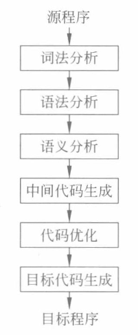
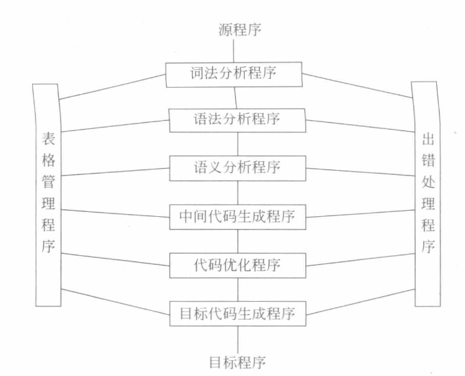

# 本章内容

- 概述、符号串
- 文法与语言
- 语法树与句型分析

# 概述

什么是编译程序？

>编译程序是一种计算机程序，其主要功能是将高级编程语言的源代码转换为低级机器代码或中间代码，以便计算机可以执行该程序。这个过程通常被称为编译，编译程序本身也叫做编译器。

编译程序的主要优点是，一旦源代码被<mark>编译成机器代码</mark>，执行速度通常比解释执行快，因为不需要在每次运行时解释代码。这使得编译程序在许多应用中非常有用，特别是需要高性能的应用程序，如操作系统和大型应用程序。

一些著名的编程语言编译器包括GCC（用于C和C++）、Java编译器（用于Java）、Python的Cython等。不同的编程语言和编译器可以采用不同的工作流程和技术，但编译程序的基本原理是相似的。

## 编译过程（编译的各个阶段）

## 编译程序的结构

# 符号串

