# 选择

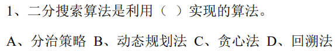  
A
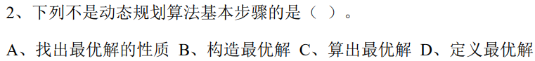  
A
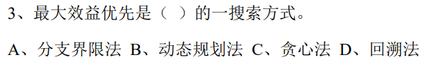  
A
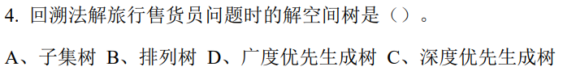  
B
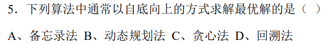  
B
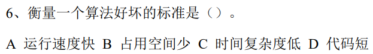  
C
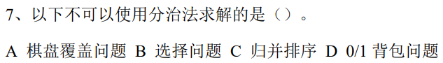  
D
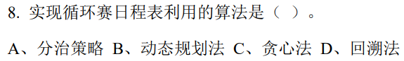  
A
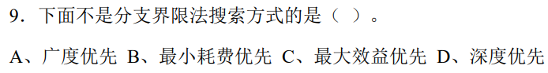  
D
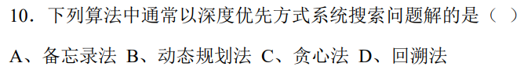  
D
  
B
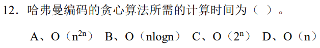  
B
  
B
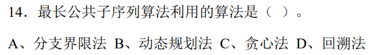  
B
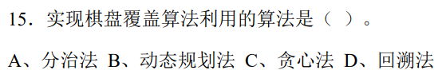  
A(不太确定)

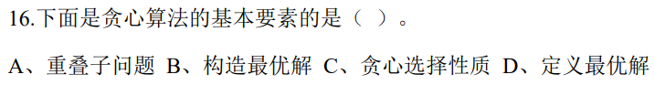  
C

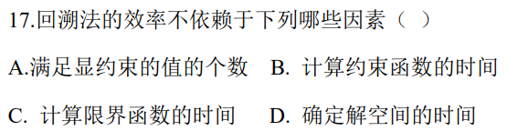  
D

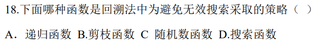  
B

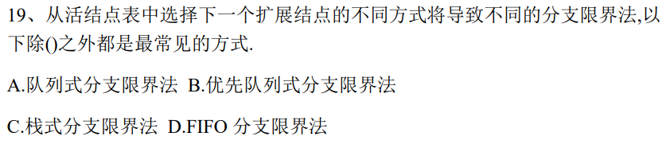  
C

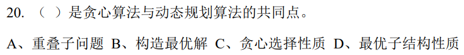  
D

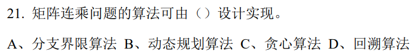  
B

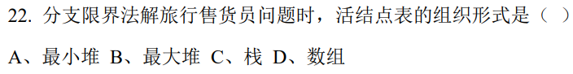  
A

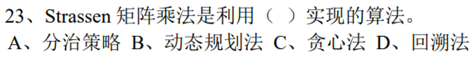  
A

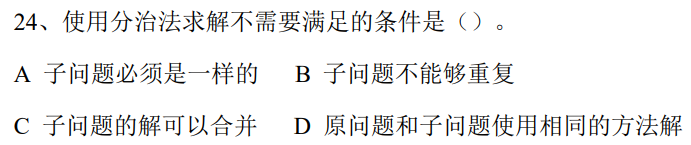  
A

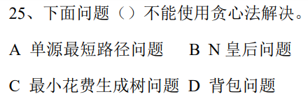  
B

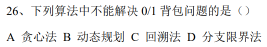  
A

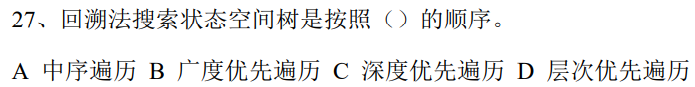  
C

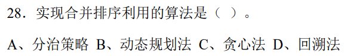  
A

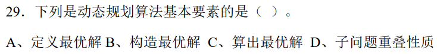  
D

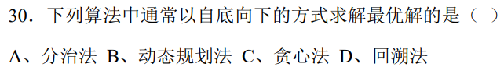  

  
A

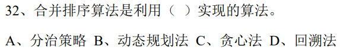  
A

  
B

  
C

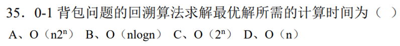  
A

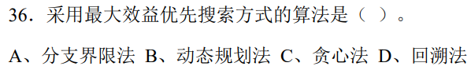  
A

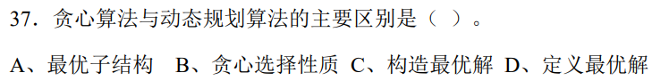  
A

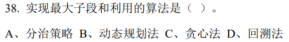  
B

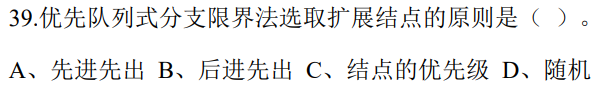  
C

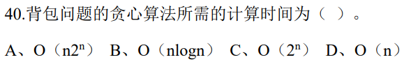  
B

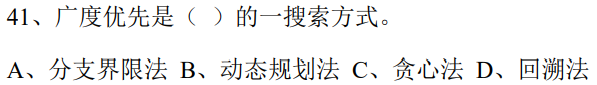  
A

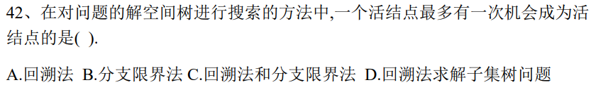  
B

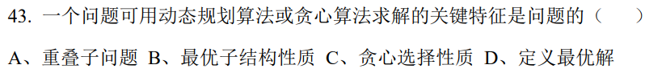  
B

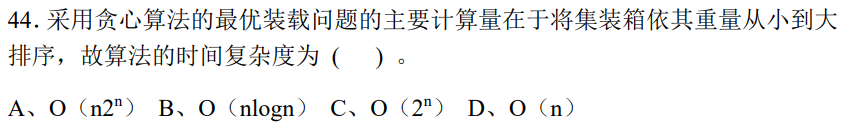  
B

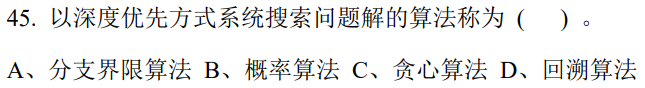  
D

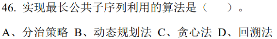  
B

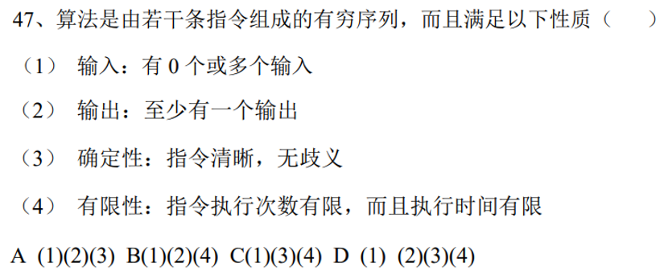  
D

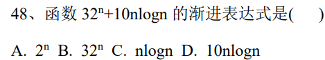  
B

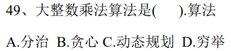  
A

  
B

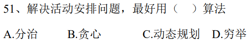  
B

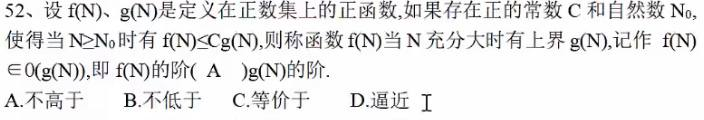   
A

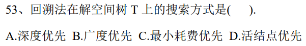  
A

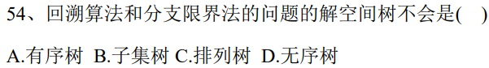  
D

# 填空

# 问答题

# 算法设计与分析题

# 考点

## 动态规划算法

### 定义

动态规划算法是一种解决复杂问题的方法，它通过将问题分解为更小、更易管理的子问题，然后解决这些子问题，并利用这些子问题的解来解决整个问题。这种方法特别适用于有大量重叠子问题的情况，也就是说，不同的问题部分需要重复计算相同的子问题。

这里有几个关键点帮助理解动态规划：

- **子问题**：动态规划将大问题分解成小问题，每个小问题只解决一次，并保存其解以便以后重用，这样可以避免重复工作。
- **最优子结构**：动态规划适用于那些整体最优解可以通过其子问题的最优解来有效构建的问题。
- **存储解**：动态规划通常使用一个表来保存子问题的解，这样每个子问题只解决一次。
- **递推关系（或状态转移方程）**：它定义了如何从一个或多个较小的子问题的解来构建另一个子问题的解。

一个简单的动态规划例子是计算斐波那契数列。在没有优化的情况下，你可能会对每个数重复计算多次。但是，如果你保存了每个数的结果（这叫做“备忘录”），你就可以避免重复计算，从而以更快的速度计算整个序列。

动态规划通常有两种实现方式：

1. **自顶向下**：这种方式采用递归来解决问题，并通过“备忘录”来保存子问题的解，以避免重复计算。
2. **自底向上**：这种方式从最小的子问题开始，逐步构建解决方案，直到得出最终问题的解。

动态规划被广泛用于各种领域，如经济学、生物信息学、控制工程、软件工程等，解决例如最短路径、最大子数组和、序列对齐等问题。

---------------------------

好的，让我们用一个简单的比喻来理解动态规划：

想象你要做一堆拼图。这个拼图非常特别，因为每一小块拼图都是一样的，并且你可以用做好的一小块来帮助你快速完成整个拼图。

1. **分解问题**：
   - 就像你把整个拼图分成许多小块，动态规划把一个大问题分成很多小问题。

2. **解决子问题**：
   - 你开始拼这些小块，就像动态规划先解决小问题。

3. **记住小块的位置**：
   - 每当你完成一小块拼图，你就记下它在整个拼图中的位置。这就像动态规划中的“记忆”部分，你保存了每个小问题的答案。

4. **避免重复工作**：
   - 如果你需要一个已经完成的小块，你不需要再次拼它，只需直接取用。同样，动态规划通过查看之前保存的答案来避免重复解决相同的问题。

5. **一步步来**：
   - 你不会马上尝试一次性完成整个拼图，而是先做一小块，然后是另一小块，慢慢地整个拼图就完成了。动态规划也是一步一步地来，从最简单的问题开始，慢慢地解决更复杂的问题。

所以，动态规划就是一种聪明的方法，它让你不用重复相同的工作，而是利用已经完成的小部分来帮助解决更大的问题。

### 基本步骤

动态规划算法是一种用于解决最优化问题的方法，它将问题分解为相互重叠的子问题，并通过保存子问题的解来避免重复计算。动态规划算法的基本步骤如下：

1. **确定状态**：这涉及到识别问题的核心参数，其变化定义了问题的状态空间。状态应该包含所有必要的信息来反映到达当前阶段的决策路径。

2. **建立状态转移方程**：也称为递推关系，它描述了当前状态是如何从一个或多个先前状态导出的。状态转移方程是动态规划中最关键的一步，因为它定义了问题的结构和子问题之间的联系。

3. **确定边界条件**：这是递推关系的基础，即最简单的子问题的解。这些是算法的起始点，通常对应于递归实现中的基案（base case）。

4. **计算最优值**：这通常涉及到按照某种顺序（通常是自底向上）解决每个子问题，并保存其结果。这个过程可以使用数组或其他数据结构来存储子问题的解。

5. **构造最优解**：一旦计算出所有子问题的最优值，可以从保存的数据中重建整个问题的最优解。这个步骤可能不是总是必需的，特别是如果只是需要知道最优解的值。

6. **优化存储空间**：在某些情况下，可以对动态规划算法进行空间优化，因为在计算过程中并不总是需要保留所有的子问题解。例如，可以使用滚动数组来减少空间复杂度。

这些步骤为解决动态规划问题提供了一个框架，但每个步骤的具体实施可能会根据具体问题而有所不同。

---------------------------------

动态规划算法的基本步骤通常可以分为以下几个阶段：

1. **问题分析**：确定问题是否可以通过动态规划来解决。这通常涉及问题的分解和子问题之间的相互关系分析。

2. **定义状态**：精确地定义问题的状态，每个状态代表一个子问题的解。

3. **状态转移方程**：找出状态之间的转移方程，也称为递推关系。状态转移方程描述了问题的不同状态如何相互转换，以及如何从一个或多个较小的子问题的解构建当前问题的解。

4. **确定边界条件**：确定初始条件或基本情况，这些是递推的起点，通常是最简单的子问题，其解可以直接给出。

5. **计算顺序**：确定计算状态的顺序，这样每次进行状态转移时，所依赖的子问题的解都已经计算过了。

6. **计算最优解**：根据确定的计算顺序和状态转移方程计算问题的最优解。

7. **构造最优解决方案**（如果需要）：如果问题要求提供解的构造，而不仅仅是解的价值，那么需要根据计算出的状态信息回溯构造最优解。

8. **优化存储**（可选）：对于一些问题，可以通过优化来减少空间复杂度，例如，只存储动态规划表中当前需要的部分。

这些步骤可能根据具体问题的需求进行调整，但大体上，动态规划问题都会遵循这个框架。

---------------------------------

当然，我可以尝试用一个简单的比喻来解释动态规划的基本步骤：

想象你要爬楼梯，这个楼梯有很多阶梯，你的目标是找到一种最省力的方式到达顶部。

1. **确定状态**：
   - 这就像确定你在哪一步上。在动态规划中，这表示问题的某个部分，比如“到达第n阶梯”。

2. **建立状态转移方程**：
   - 这就像是决定每次你是走一步上去，还是走两步，或者走三步。在动态规划中，这个“方程”告诉我们如何从较低的阶梯（已知的）到达当前阶梯（未知的）。

3. **确定边界条件**：
   - 这就像知道你已经在第一阶梯上，不需要再爬。在动态规划中，这个边界条件是最简单的情况，你不需要计算就能知道答案。

4. **计算最优值**：
   - 这就像是在不同选择之间做决策，比如是走一步还是两步更省力，然后记下每一步的结果。在动态规划中，你会计算每一步的最优解，并将结果记录下来，以便后面的计算可以使用。

5. **构造最优解**：
   - 一旦你到达顶部，你可以回头看看你怎么来的，这就是你的最优路径。在动态规划中，如果你需要详细的解决方案，你可以通过查看你保存的每一步的最优解来回溯整个过程。

6. **优化存储空间**：
   - 这就像是在爬楼梯的过程中，你不需要记住你每一步的动作，只需要知道当前的几步就足够了。在动态规划中，有时你不需要保存所有的信息，只要保存足够计算下一步的信息即可。

通过这个过程，你可以有效地找到爬到楼梯顶部的最省力方法，这就是动态规划的魅力所在。