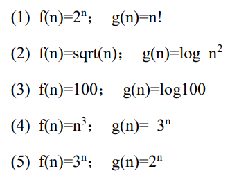
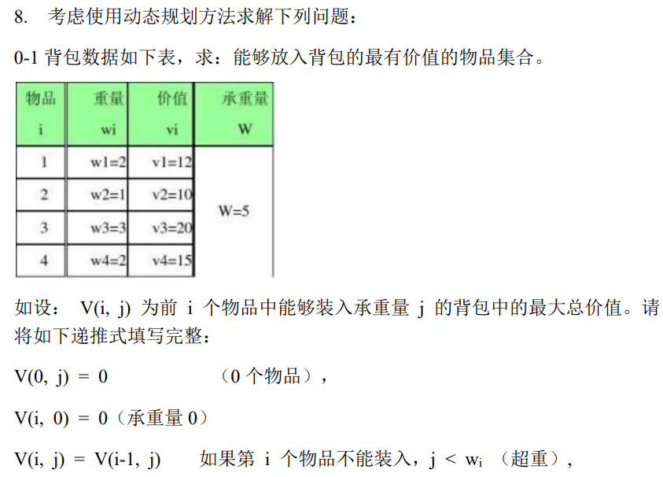
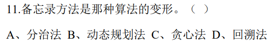
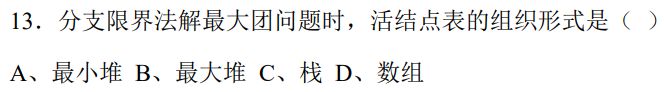

  


# 什么是算法？
算法是一组定义明确的操作序列，用于执行某种任务或解决特定问题。

```
算法的特点包括：

1. 明确性：算法的每一步都应该清晰无歧义。
2. 有限性：算法在执行有限步骤后应该能够结束。
3. 输入：算法可能有零个或多个输入。
4. 输出：算法应有一个或多个输出，是对输入数据的明确处理结果。
5. 可行性：算法中的每一步都必须足够基础，可以通过已经确定的基本操作实现。
```

算法可以用伪代码、流程图、自然语言或编程语言等多种方式表达。在计算机程序中，算法是指导如何处理数据、进行计算和做出决策的逻辑。它们应用于排序、搜索、数据处理、自动推理、人工智能等广泛领域。

# 伪代码

伪代码（Pseudocode）是一种非正式的、类似于自然语言和编程语言混合的方式来描述算法。它用于展示算法的逻辑结构，但不依赖于具体的编程语言的语法。编写伪代码没有严格的规范，但通常遵循以下几个原则：

1. **清晰性**：伪代码应该清晰易懂，逻辑明确，容易被程序员理解。

2. **结构化**：<mark>常用的结构有循环（例如，for、while）、条件判断（if-else）、分支（switch-case）等</mark>，类似于高级编程语言。

3. **一致性**：在整个伪代码中应保持术语和结构的一致性。

4. **简洁性**：尽量简洁，避免过多的细节，重点描述算法的逻辑。

5. **模块化**：复杂算法应分解为多个模块或函数。

6. **标准操作的使用**：对于一些标准操作（如输入、输出、数学运算），使用通用术语。

7. **数据结构的描述**：如果算法涉及特定的数据结构，应简要描述这些结构。

一个简单的伪代码例子：

```
算法：计算两个数的和

输入：两个数字 num1, num2
输出：它们的和

开始
    sum ← num1 + num2
    输出 sum
结束
```

在这个例子中，使用了箭头（←）表示赋值操作，使用了自然语言描述输入、输出和算法步骤。实际上，伪代码的风格和格式因人而异，关键是要确保它足够清晰，以便其他人理解算法的逻辑和流程。

# 算法效率

有两种算法效率：时间效率、空间效率。也称时间复杂度、空间复杂度。（主要讨论时间效率）

## （一）分析框架
1. 度量输入规模
2. 度量运行时间

## （二）度量运行时间

1. 标准时间度量（缺点：以来计算机速度）

   只使用时间的标准度量单位（如秒、毫秒）来度量算法程序的运行时间
2. 每一步操作的执行次数（缺点：难没必要）
3. 计算基本操作的运行次数（++++++）
   
>基本操作：是算法最内层循环中最费时的操作，是算法中最重要的操作。

运行时间的估计：

C(n)执行基本操作的次数

  

## （三）算法的最优、最差、平均效率

以顺序查找为例：输入规模为n

>顺序查找是一个简单直接的算法，为了在n个元素的列表中查找一个给定项(某些查找键 K)，它会检查列表中的连续元素，直到发现了匹配查找键的元素或者到达了列表的终点。

最优：C best(1)

最差：C worst(n)

>最优算法是用来帮助我们放弃，当算法的最优效率都达不到我们的要求时。

## （四）算法效率符号

  
这些符号用于描述算法的运行时间或空间需求与输入大小之间的关系。

当然，让我用简单的方式解释这三个算法效率的符号：

1. **大O表示法 (Big O Notation) - O(f(n))**：
   - 想象你在爬山，大O表示的是“最陡的那块岩石”。它告诉你，在最坏的情况下，算法的运行时间或所需空间有多大。
   - 例如，如果一个算法是`O(n)`，那意味着在最坏的情况下，所需时间或空间与输入的数量`n`成正比。如果`n`加倍，运行时间或所需空间也大约加倍。

2. **Ω（Omega）表示法 - Ω(f(n))**：
   - 现在想象你在一条平坦的道路上行走。Ω表示的是“最平坦的那块地面”。它告诉你，在最好的情况下，算法的运行时间或所需空间有多少。
   - 例如，`Ω(n)`意味着在最好情况下，所需时间或空间至少与输入的数量`n`成正比。即使输入再多，算法也至少需要这么多时间或空间。

3. **Θ（Theta）表示法 - Θ(f(n))**：
   - 想象你在一条既有上坡又有下坡的道路上行走。Θ表示的是这条道路的“整体坡度”。它告诉你，平均来看，或者考虑所有可能情况，算法的运行时间或所需空间是多少。
   - 例如，`Θ(n)`意味着无论是最好情况、最坏情况还是平均情况，算法的时间或空间需求通常都与输入的数量`n`成正比。

简而言之：
- **大O (O)**: 在最坏情况下会怎样？
- **Omega (Ω)**: 在最好情况下会怎样？
- **Theta (Θ)**: 通常情况下会怎样？

例题：
  

## （五）基本效率类型

  

## （六）例题

对图中各组函数 f (n) 和 g (n)，确定 f (n) = O (g (n)) 或 f (n) =Ω(g (n)) 或 f(n) =θ(g(n))，并简要说明理由。
  

好的，让我们更简单地分析这些函数的增长速度，并确定它们之间的关系。为了确定 \( f(n) \) 和 \( g(n) \) 之间的关系，我们需要比较它们随着 \( n \) 增加时的增长速度。

1. \( f(n) = 2^n \), \( g(n) = n! \)
   
   - 阶乘函数 \( n! \) 的增长速度比任何指数函数 \( 2^n \) 的增长速度都快，因为随着 \( n \) 的增加，\( n! \) 增加的速度是超指数的。所以 \( 2^n \) 是 \( n! \) 的上界，即 \( f(n) = O(g(n)) \)。

2. \( f(n) = \sqrt{n} \), \( g(n) = \log n^2 \)
   
   - 平方根函数 \( \sqrt{n} \) 随着 \( n \) 的增加比对数函数 \( \log n^2 \) 增长得快。对数函数增长得慢，但是平方根增长得更快（尽管不像线性增长那么快）。因此，\( f(n) \) 不是 \( g(n) \) 的上界，而是下界，即 \( f(n) = \Omega(g(n)) \)。

3. \( f(n) = 100 \), \( g(n) = \log 100 \)
   
   - 这两个函数都是常数，它们与 \( n \) 的值无关。因此，它们增长速度相同，我们可以说 \( f(n) \) 和 \( g(n) \) 的增长率相同，即 \( f(n) = \Theta(g(n)) \)。

4. \( f(n) = n^3 \), \( g(n) = 3^n \)
   
   - 多项式函数 \( n^3 \) 的增长速度慢于指数函数 \( 3^n \)。随着 \( n \) 变得非常大时，指数函数会远远超过多项式函数。所以，\( f(n) \) 是 \( g(n) \) 的上界，即 \( f(n) = O(g(n)) \)。

5. \( f(n) = 3^n \), \( g(n) = 2^n \)
   
   - 两个函数都是指数函数，但是 \( 3^n \) 的基数大于 \( 2^n \) 的基数，所以 \( 3^n \) 会比 \( 2^n \) 增长得快。这意味着 \( 2^n \) 是 \( 3^n \) 的上界，即 \( f(n) = \Omega(g(n)) \)。

  

# 问题类型

不同的问题有不同的算法设计技术、算法分析方法。

## 1.排序

   排序问题(sorting problem)要求我们按照升序重新排列给定列表中的数据项。类似于学校维护的学生信息、图书馆维护的图书信息以及公司维护的员工信息的记录也需要按照数字或者字符的顺序进行排序。
   
   在对记录排序的时候，我们需要<mark>选取一段信息作为排序的依据</mark>。例如，我们可以按照学生姓名的字母顺序，也可以按照学号或者学生个人的<mark>平均分数来对学生记录进行排序</mark>。这段特别选定的信息称为<mark>键(key)</mark>。计算机科学家常常只关心如何对键的列表进行排序，哪怕表中的元素不是记录，也许仅仅是整数。
## 2.查找

   查找问题(searching problem)就是在给定的集合(或者是多重集，它允许多个元素具有相同的值)中找一个给定的值[我们称之为查找键(search key)]。有许多查找算法可供选择，其中既包括直截了当的<mark>顺序搜索</mark>，也包括效率极高但应用受限的<mark>折半查找</mark>，还有那些将原集合用另一种形式表示以方便查找的算法。最后一类算法对于现实应用具有特别重要的价值因为它们对于大型数据库的信息存取来说是不可或缺的。
   
   对于查找来说，也没有一种算法在任何情况下都是最优的。有些算法比其他算法速度快，但需要较多的存储空间:有些算法速度非常快，但仅适用于有序的数组。和排序算法不同，查找算法没有稳定性问题，但会发生其他问题。
## 3.字符串处理

   字符串(string)是字母表中的符号所构成的序列。我们尤其关心文本串，它是由字母、数字以及特殊符号构成的;位串是由“0”和“1”构成的，基因序列也可以用字符串模型来表示，只不过它的字母表只包含 4个字母，即A,C,G,。但需要指出的是由于编程语言以及编译的需要，字符串处理算法在计算机科学中一直都非常重要。
   
   <mark>如何在文本中查找一个给定的词，这一特殊问题引起了研究人员的特别关注，他们称其为字符串匹配(string matching)问题</mark>。针对此类查找的特性，人们发明了好几种算法。我们会在第3章中介绍一种非常简单的算法，在第7章中讨论另外两个算法，它们分别基于R博伊尔(RBoyer)和J摩尔(JMoore)的卓越思想。

## 4.图问题

   基本的图算法包括<mark>图的遍历算法</mark>(如何能一次访问到网络中的所有节点)、<mark>最短路线算法</mark>(两个城市之间的最佳路线是哪条?)以及有向图的拓扑排序</mark>(一系列课程的预备课程是相互一致的，还是自相矛盾的?)。

   图问题广为人知的要数<mark>旅行商问题、图填色问题</mark>：
   - 旅行商问题(traveling salesman problem,TSP)就是找出访问n个城市的最短路径并且保证每个城市只访问一次。
   - 图填色问题(graph-coloring problem)就是要用最少种类的颜色为图中的顶点填色，并保证任何两个邻接顶点的颜色都不同。这个问题源于若干应用，例如安排事务进度:如果用以边相连的顶点来代表事务，当且仅当独立事务无法排定同时发生时，图填色问题的解才能生成一张最优的日程表。
## 5.组合问题

   旅行商问题、图填色问题都是组合问题的特例
## 6.几何问题
## 7.数值问题

# 五大算法思想

1. 分治
2. 贪心
3. 回溯
4. 分支界限
5. 动态规划

# 暴力法

最简单的设计策略，如果要解决的问题实例不多，暴力法可以用一种能够接受的速度对实例求解，常用于：排序、查找、矩阵乘法、字符串匹配。

1. 选择排序、冒泡排序
2. 顺序查找、暴力字符串匹配
3. 凸包问题

# 一、分治法

>合并排序、快速排序、二叉树遍历、大整数乘法、Strassen矩阵乘法、凸包问题

举个例子，要算16个数的和可能一下子算不出来的，但是可以通过几次一分为二(拆分)，直到分成两个数、两个数一组;再对这些数两两相加，算出每组的和后，再两两相加，直到最后只剩下了一个数，就算出16个数的和 (合治)。

## （一）使用分治法的步骤：
1. 分解，将原问题分解为若千个规模较小、相互独立、与原问题形式相同的子问题.
2. 解决，若子问题规模较小而容易被解决则直接解，否则递归地解各个子问题。
3. 合并，将各个子问题的解合并为原问题的解。

## （二）常见例子

1. 二分搜索
2. 大整数乘法
3. Strassen矩阵乘法
4. 棋盘覆盖
5. 合并排序
6. 快速排序
7. 线性时间选择
8. 最接近点对问题
9. 循环赛日程表
10. 汉诺塔
     

   递归方法：
     

     

     

  


## （三）例题

归并排序


  

正确答案选A

>"长度为2的有序表"指的是一个包含两个元素的列表，这两个元素已经按照某种特定的顺序排列好了，这种顺序通常是按照从小到大或者从大到小的顺序。
>
>在归并排序的上下文中，"长度为2的有序表"通常表示在排序过程的某个阶段，你有多个包含两个元素的子序列，每个子序列内部的元素都是有序的，而这些子序列之间可能还没有完全排序。
>
>例如，如果你有一组数字 `[3, 1, 4, 2]`，按照归并排序的第一步，你会将它们分成两个子序列 `[3, 1]` 和 `[4, 2]`。在这里，每个子序列可以视为一个长度为2的未排序表。接下来，你会分别对这两个子序列进行排序，得到 `[1, 3]` 和 `[2, 4]`。现在，这两个子序列就变成了“长度为2的有序表”，因为它们内部各自都是有序的。然后在归并排序的下一步中，你会将这两个有序的子序列合并成一个完全有序的序列。

通过一趟归并排序后的正确结果是 `[16, 23, 25, 35, 40, 48, 79, 82]`。这个结果是通过将原始序列分成四对长度为2的有序子序列，然后将这些子序列归并排序得到的。在归并排序中，每一对有序子序列会合并为一个有序序列，然后这些更长的有序序列继续归并，直到得到一个完全排序的序列。

在提供的选项A、B、C和D中，没有任何一个选项与通过一趟归并排序后得到的结果完全匹配。这可能是因为题目的选项有误，或者题目意图测试对归并排序理解的错误。正确的归并排序过程是这样的：

1. 分割序列为四个子序列：(25, 48), (16, 35), (79, 82), (23, 40)。
2. 每个子序列已经是有序的，因为它们只有两个元素。
3. 进行一趟归并排序：
   - 归并 (25, 48) 和 (16, 35) 得到 (16, 25, 35, 48)
   - 归并 (79, 82) 和 (23, 40) 得到 (23, 40, 79, 82)
   - 最后，归并 (16, 25, 35, 48) 和 (23, 40, 79, 82) 得到最终排序结果。

因此，正确答案应该是一趟归并后的有序列表 `[16, 23, 25, 35, 40, 48, 79, 82]`。由于这不匹配任何给定的选项，正确答案可能不在提供的选项中。

--------------------------
- 对（25, 48, 16, 35, 79, 82, 23, 40）进行归并排序后的过程和结果是？

在对序列（25, 48, 16, 35, 79, 82, 23, 40）进行归并排序的过程中，每一步的变化如下：

1. 初始序列:
   `[25, 48, 16, 35, 79, 82, 23, 40]`

2. 分割序列并开始排序:
   - 分割前半部分: `[25, 48]`
   - 分割后半部分: `[16, 35]`

3. 合并排序结果:
   - 合并 `[25, 48]` 和 `[16, 35]` 得到 `[16, 25, 35, 48]`

4. 分割序列并开始排序:
   - 分割前半部分: `[79, 82]`
   - 分割后半部分: `[23, 40]`

5. 合并排序结果:
   - 合并 `[79, 82]` 和 `[23, 40]` 得到 `[23, 40, 79, 82]`

6. 最终合并两个有序子序列:
   - 合并 `[16, 25, 35, 48]` 和 `[23, 40, 79, 82]` 得到最终排序结果 `[16, 23, 25, 35, 40, 48, 79, 82]`

所以，归并排序的最终结果是一个有序序列 `[16, 23, 25, 35, 40, 48, 79, 82]`。在每一步中，都是将两个较小的有序列表合并成一个更大的有序列表，最终得到整个有序的序列。

- 为什么不分割前半部分: [25, 48, 16, 35]
分割后半部分: [79, 82, 23, 40]？

在归并排序算法中，分割的过程是将当前序列对半分割，直到每个子序列只包含一个元素或者两个元素，因为一个元素或者两个元素易于排序。这是一个递归的过程，目的是让合并的操作更加简单，因为合并两个已排序的序列比排序一个未排序的序列要简单得多。

在您提到的序列（25, 48, 16, 35, 79, 82, 23, 40）中，分割的第一步确实是将序列分为两个部分：前半部分 `[25, 48, 16, 35]` 和后半部分 `[79, 82, 23, 40]`。这是归并排序的第一步，也是递归分割开始的地方。

之后，这两个子序列 `[25, 48, 16, 35]` 和 `[79, 82, 23, 40]` 分别再次被分割。对于前半部分 `[25, 48, 16, 35]`，它会被分割成 `[25, 48]` 和 `[16, 35]`；对于后半部分 `[79, 82, 23, 40]`，它会被分割成 `[79, 82]` 和 `[23, 40]`。这样做是为了让每个子序列足够小，以至于可以很容易地对其进行排序。

在我的之前的解释中，我直接展示了这些分割后的小序列的合并过程，因为它们是排序和合并的基本单位。但实际上，在合并之前，确实是有一个完整的分割过程的，它将原始序列分解成越来越小的子序列，直到这些子序列可以容易地被排序和合并。

归并排序的关键步骤：
1. **分割**：将原始序列分割成更小的子序列，直到子序列的长度为1或2，这样它们自然就是有序的（单个元素自视为有序，两个元素可以简单地排序）。
2. **合并**：有序子序列可以被合并成一个有序序列。因为子序列是有序的，所以合并操作可以简单地从两个子序列的头部开始，选择两者中较小的元素放入新序列，直到所有元素都被合并。

如果你不按照这个过程去做，直接对 `[25, 48, 16, 35]` 和 `[79, 82, 23, 40]` 这样的未排序子序列进行合并，你就不能保证最终的结果是有序的。所以，归并排序的正确性依赖于递归地分割和合并过程，确保每次合并操作的两个输入子序列都是有序的。

简而言之，归并排序的精髓在于**分治法**的应用：先解决子问题（对小的子序列排序），然后将子问题的答案组合起来（合并有序的子序列），从而解决原问题（排序整个序列）。

- 不能对 [25, 48, 16, 35] 和 [79, 82, 23, 40] 这样的未排序子序列排序吗？

可以对 `[25, 48, 16, 35]` 和 `[79, 82, 23, 40]` 这样的子序列进行排序，但在归并排序的过程中，这种排序是通过递归地分割子序列直到它们变得足够小（最理想是一个或两个元素），然后通过合并已排序的子序列来完成的。这种方法允许算法以统一和高效的方式来处理排序问题。

如果你不通过递归分割，而是直接对这些子序列进行排序，那么你需要使用另一种排序算法（如插入排序、选择排序或快速排序等）来对这些子序列进行排序，然后再进行归并。这样做实际上是在归并排序外部引入了另一种排序逻辑。

归并排序的优势在于其合并步骤非常高效，因为它假定合并的两个子序列已经是有序的。如果合并未排序的序列，归并排序的优势就会丧失，因为合并操作依赖于子序列的有序性来确保整个序列的有序性。这也是为什么归并排序通常是通过递归进行分割直至每个子序列简单到可以直接视为有序，然后再将它们合并起来。
>举例：（若是[16, 51, 50, 49]这种则其内还没排序合并好，不可以和另外的序列合并，这种就不能为下面例，不合规矩）
>
>合并有序列表 `[16, 49, 50, 51]` 和 `[23, 40, 79, 82]` 得到最终排序结果的过程如下：
>
>1. 初始列表:
>   `[16, 49, 50, 51, 23, 40, 79, 82]`
>
>2. 合并过程:
>   - `[16]` (取 `16`，因为 16 < 23)
>   - `[16, 23]` (取 `23`，因为 23 < 49)
>   - `[16, 23, 40]` (取 `40`，因为 40 < 49)
>   - `[16, 23, 40, 49]` (取 `49`，因为 49 < 79)
>   - `[16, 23, 40, 49, 50]` (取 `50`，因为 50 < 79)
>   - `[16, 23, 40, 49, 50, 51]` (取 `51`，因为 51 < 79)
>   - `[16, 23, 40, 49, 50, 51, 79]` (取 `79`，因为没有更多的元素在第一个列表中)
>   - `[16, 23, 40, 49, 50, 51, 79, 82]` (最后添加 `82`)
>
>在每一步，我们比较两个列表的头部元素，并选择更小的那个加入到合并后的列表中。如果一个列表的所有元素都被选中，剩余的另一个列表中的所有元素将按顺序加入到合并后的列表中。
>
>3. 最终排序结果:
>   `[16, 23, 40, 49, 50, 51, 79, 82]`
>
>这个过程展示了归并排序的合并阶段，即如何将两个已排序的子列表合并成一个单一的、更大的、有序的列表。


# 二、贪心算法

让我们通过一个非常经典的例子来进一步理解贪心算法：**找零钱问题**。

假设你是一家商店的收银员，需要给顾客找零。你的目标是使用尽可能少的硬币来找零。假设你有无限量的1元、2元、5元硬币。

**问题**：顾客支付了商品费用，需要找回11元的零钱。

**贪心算法的应用**：
1. **第一步**：你首先会选择最大面额的硬币，即5元，因为它比其他的硬币能找更多的零钱。找一枚5元后，你还需要找6元。
2. **第二步**：再次选择5元硬币。现在你总共找了10元，还需要找1元。
3. **第三步**：最后，你选择1元硬币来找剩下的1元。

所以，你总共用了两枚5元硬币和一枚1元硬币。这样，你只用了3枚硬币，这是在给11元找零时使用的最少硬币数。

**为什么这是贪心算法**：
- 在每一步，你都选择了当前最大的硬币（也就是说，你的选择是“贪婪”的）。
- 你没有考虑整体的最优解，只是每一次都尽量减少剩余要找的零钱。

**贪心算法的特点在这个例子中体现为**：
- 它简单且直接。
- 每一步都做出在那一刻看起来最好的选择。
- 在这个特定的问题中，贪心算法恰好能给出最优解。

这个例子说明了贪心算法在特定情况下可以非常有效，但请记住，并非在所有情况下贪心算法都能得到最佳解。在某些问题中，你可能需要考虑其他更复杂的算法来找到全局最优解。
## （一）使用贪心算法的步骤

1. 建立数学模型来描述问题
2. 把求解的问题分成若干个子问题
3. 对每个子问题求解，得到子问题的局部最优解
4. 把子问题的解局部最优解合成原来解问题的一个解

## （二）常见例子
1. 活动选择问题
2. 钱币找零问题
3. 再论背包问题
4. 小船过河问题
5. 区间覆盖问题

## （三）例题

  

这个问题是要求我们使用Kruskal算法来找到给定图G的最小生成树。<mar>Kruskal算法是一种贪心算法，它按照边的权重从小到大的顺序选择边，以找到连接所有顶点且权重总和最小的生成树。</mar>算法的步骤如下：

1. 将所有的边按照权重从小到大排序。
2. 初始化最小生成树为一个空集。
3. 遍历排序后的边列表，对于每一条边，检查它是否会与已经选取的边形成环：
   - 如果不会形成环，将这条边加入到最小生成树中。
   - 如果会形成环，就跳过这条边。
4. 重复步骤3，直到最小生成树中含有（顶点数-1）条边为止。

我们可以按照这些步骤来操作：

1. 首先，我们对所有的边进行排序（只列出了权重，不是全部边）：
   - 6, 7, 9, 11, 15, 17, 18, 19, 21, 26

2. 然后，我们开始从权重最小的边开始选择，并确保不会形成环。

  

# 三、回溯法

## （一）使用回溯法的基本步骤

1. 定义问题的解空间。
2. 确定易于搜索的解空间结构。
3. 以深度优先搜索的策略搜索解空间，并在搜索过程中用剪枝函数避免无效搜索。

## （二）常见例子

1. 八皇后问题
2. 装载问题
3. 批处理作业调度问题
4. 背包问题

## （三）例题

  

  

# 四、分支界限法

状态空间树：
  

  


分支界限法是一种用于求解优化问题的算法框架，特别是在决策问题和整数规划中广泛使用。它通过系统地枚举所有可能的候选解决方案来找到最优解或可行解，但与穷举法不同，分支界限法在搜索过程中使用界限技术剪枝，以减少需要探索的候选解数量。

让我们通过解决一个简单的“0-1背包问题”来理解分支界限法的基本原理。这个问题是说，你有一个背包可以承载一定重量的物品，以及一组物品，每个物品都有相应的重量和价值。目标是选择一些物品装入背包，使得背包中物品的总价值最大，但总重量不能超过背包的承载能力。

分支界限法的步骤如下：

1. **分支**（Branching）：
   - 从根节点（没有物品被选择）开始，生成两个分支：一个包含了第一个物品（选择了这个物品），另一个不包含第一个物品（没有选择这个物品）。
   - 继续这个过程，为每个新节点生成两个分支，直到达到决策树的叶节点（所有物品都被考虑过）。

2. **计算界限**（Bounding）：
   - 对于每个节点，计算上界和下界。
   - 上界：如果你在这个节点选择的物品组合下继续选择最优可能的物品，能得到的最大价值（理想情况）。
   - 下界：当前节点已经选择的物品的总价值。
   - 如果一个节点的上界低于已知的最大价值（已经找到的更好的解），则该节点及其所有子节点都可以被排除（剪枝）。

3. **选择和剪枝**（Selection and Pruning）：
   - 使用优先队列（如最大堆）来选择下一个要探索的节点，通常选择上界最高的节点。
   - 如果一个节点的重量超过背包的承载能力，剪枝掉这个节点。
   - 如果一个节点是叶节点，并且它的价值高于当前已知的最大价值，则更新最大价值。

4. **重复**：
   - 重复上述过程，直到所有活跃的节点都被探索过或剪枝掉。

这个方法之所以有效，是因为它不是盲目地搜索每个可能的解决方案，而是使用策略来避免不必要的搜索。通过界限技术，可以快速排除那些不可能产生最优解的路径，从而显著减少计算量。

-------

正经版解释:所谓"分支"就是采用广度优先的策略，依次搜索E-结点的所有分支，也就是所有相邻结点，抛弃不满足约束条件的结点，其余结点加入活结点表。然后从表中选择一个结点作为下一个E-结点，继续搜索。

动漫版解释:看过火影忍者的都知道，主角拥有影分身的能力，如果主角使用影分身从一个点出发，前往不同的分支
主角的运动速度相同的情况下，同一时刻时分支的深度也应该相同，有的分身走到死路，有的分身达到界限无法进行下去，当分身无法进行下去时，那么就解除该分身，直接放弃掉这个分身，当然，肯定也会有分身成功到达目的地找到最
优解，这与我们今天要讲的分支界限法极其相似。

## （一）使用分支界限法的基本步骤:
1. 如果问题的目标为最小化，则设定最优解的值Z=∞
2. 根据分枝法则，从尚未被洞悉节点(局部解)中选择一个节点，并在此节点的下一阶层中分为几个新的节点。
3. 计算每一个新分枝出来的节点的下限值。
4. 对每一节点进行洞悉条件测试，若节点满足以下任意一个条件，则此节点可洞悉而不再被考虑:此节点的下限值大于等于Z值
已找到在此节点中，具最小下限值的可行解，若此条件成立，则需比较此可行解与Z值，若前者较小，则需更新Z值，以此为可行解的
5. 判断是否仍有尚未被洞悉的节点，如果有，则进行步骤二，如果已无尚未被洞悉的节点，则演算停止，并得到最优解.

## （二）常见例子

分支界限法在实际运用中，用到的不多，因为实现过程较为复杂，这里用0-1背包问题来探究回溯法的使用方法。

## （三）例题

  

在0-1背包问题中，约束条件如下：

容量约束：任何时候，背包中物品的总重量不得超过背包的容量C（在这个例子中是30）。
选择约束：每个物品只能选择一次，要么完全放入背包中，要么不放。

# 五、动态规划

背包问题、最优二叉查找树、Warshall算法、计算完全最短路径的Floyd算法

以爬楼梯（斐波拉契）为例介绍动态规划的思路：
>个人爬楼梯，一次只能爬一阶或两阶，当总共有n阶楼梯时，有多少种爬法。

  

  

  

  

------

当然可以！让我用一个简单的例子来解释动态规划（Dynamic Programming, 简称DP）。

**动态规划的基本思想**：将大问题分解为小问题，解决小问题，并使用这些解决方案来构建大问题的解决方案。

想象你正在攀登一个由小石块组成的大山。你的目标是找到从山脚到山顶的最佳路径，使得沿途经过的石块的总价值最高。每一块石头都有不同的价值。

**如何使用动态规划**：
1. **分解问题**：将整个山分成小段，每一段包含一些石块。
2. **解决小问题**：首先计算出到达每一小段的最佳路径及其价值。
3. **构建解决方案**：然后，使用这些小问题的解来找出到达更高段的最佳路径。
4. **重复使用**：沿途，你会发现一些小段的最佳路径可以在攀登更高段时重复使用。

**一个具体的例子**：假设你有一个如下所示的数字三角形，你需要找到一条从顶部到底部的路径，使得路径上的数字总和最大。

```
   7
  3 8
 8 1 0
2 7 4 4
4 5 2 6 5
```

在这个数字三角形中，每一步你只能移动到下一行相邻的数字上。例如，从最顶部的7开始，你可以移动到3或者8，然后再到下一行的8、1或者0，依此类推。

**使用动态规划的方法**：
- 从三角形的底部开始，为每个数字计算到达它的最大总和。
- 每个数字的最大总和等于它自己的值加上它下面行相邻数字的最大总和。
- 逐层向上，直到计算到三角形的顶部。

最终，顶部元素的值就是从顶部到底部的最大路径总和。

**总结**：
- 动态规划是一种分而治之的策略，它将问题分解为更小、更易于管理的子问题。
- 动态规划通过存储子问题的解（通常是使用数组或者表格）来避免重复计算，这是它与纯粹递归方法的主要区别。
- 动态规划非常适用于具有重叠子问题和最优子结构的问题，比如上面的数字三角形问题。

动态规划在解决某些类型的问题时非常有效，尤其是在需要避免重复计算和优化性能方面。

-----


当然，我可以尝试用一个简单的比喻来解释动态规划的基本步骤：

想象你要爬楼梯，这个楼梯有很多阶梯，你的目标是找到一种最省力的方式到达顶部。

1. **确定状态**：
   - 这就像确定你在哪一步上。在动态规划中，这表示问题的某个部分，比如“到达第n阶梯”。

2. **建立状态转移方程**：
   - 这就像是决定每次你是走一步上去，还是走两步，或者走三步。在动态规划中，这个“方程”告诉我们如何从较低的阶梯（已知的）到达当前阶梯（未知的）。

3. **确定边界条件**：
   - 这就像知道你已经在第一阶梯上，不需要再爬。在动态规划中，这个边界条件是最简单的情况，你不需要计算就能知道答案。

4. **计算最优值**：
   - 这就像是在不同选择之间做决策，比如是走一步还是两步更省力，然后记下每一步的结果。在动态规划中，你会计算每一步的最优解，并将结果记录下来，以便后面的计算可以使用。

5. **构造最优解**：
   - 一旦你到达顶部，你可以回头看看你怎么来的，这就是你的最优路径。在动态规划中，如果你需要详细的解决方案，你可以通过查看你保存的每一步的最优解来回溯整个过程。

6. **优化存储空间**：
   - 这就像是在爬楼梯的过程中，你不需要记住你每一步的动作，只需要知道当前的几步就足够了。在动态规划中，有时你不需要保存所有的信息，只要保存足够计算下一步的信息即可。

通过这个过程，你可以有效地找到爬到楼梯顶部的最省力方法，这就是动态规划的魅力所在。

## （一）动态规划的步骤

1. 划分阶段

   按照问题的时间或空间特征，把问题分为若千个阶段。在划分阶段时，注意划分后的阶段一定要是有序的或者是可排序的，否则问题就无法求解。

2. 确定状态

   将问题发展到各个阶段时所处于的各种客观情况用不同的状态表示出来。当然，状态的选择要满足无后效性

3. 确定决策并写出状态转移方程

   因为决策和状态转移有着天然的联系，状态转移就是根据上一阶段的状态和决策来导出本阶段的状态。所以如果确定了决策，状态转移方程也就可写出。但事实上常常是反过来做，根据相邻两个阶段的状态之间的关系来确定决策方法和状态转移方程，

4. 寻找边界条件

   给出的状态转移方程是一个递推式，需要一个递推的终止条件或边界条件。

## （二）常见例子

1. 矩阵连乘
2. 走金字塔
3. 最长公共子序列（LCS，longest common subsequence）

   子序列可断开，不要求连续
     
   （最长公共子串才需要连续）
     

4. 最长递增子序列
5. 背包问题

     

     


## （三）例题
  
递归方程：
```
LCS(X, Y, m, n) =0 , 如果 m == 0 或 n == 0
LCS(X, Y, m, n) = LCS(X, Y, m - 1, n - 1) + 1 , 如果 X[m-1] == Y[n-1]
LCS(X, Y, m, n) = max(LCS(X, Y, m - 1, n), LCS(X, Y, m, n - 1)) , 如果 X[m-1] != Y[n-1]
```

# 迭代改进

# 选择

  
A
  
A
  
A
  
B
  
B
  
C
  
D
  
A
  
D
  
D
  
B
  
B
  
B
  
B
  
A(不太确定)

  
C

  
D

  
B

  
C

  
D

  
B

  
A

  
A

  
A

  
B

  
A

  
C

  
A

  
D

  


  
A

  
A

  
B

  
C

  
A

  
A

  
A

  
B

  
C

  
B

  
A

  
B

  
B

  
B

  
D

  
B

  
D

  
B

  
A

  
B

  
B

   
A

  
A

  
D

# 填空

# 问答题

