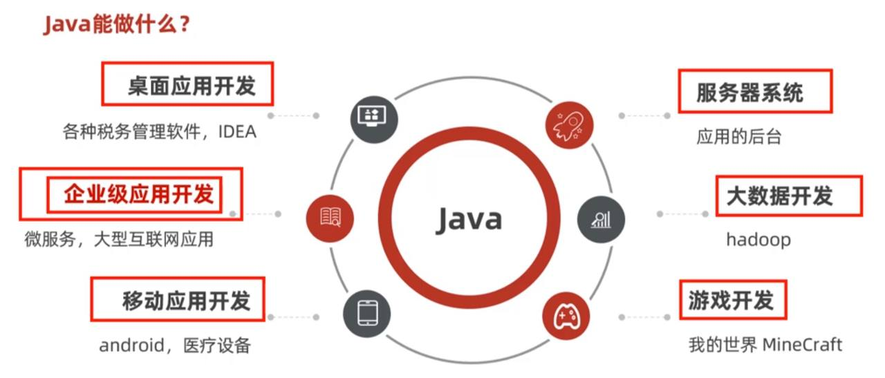
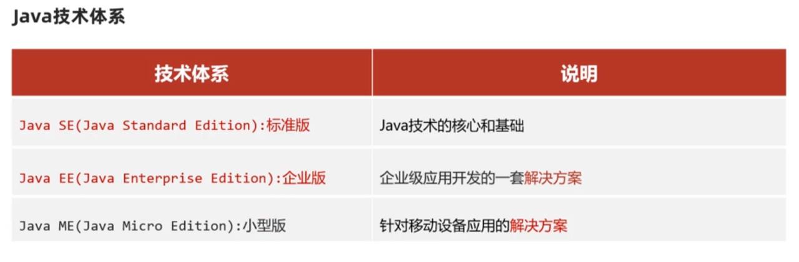
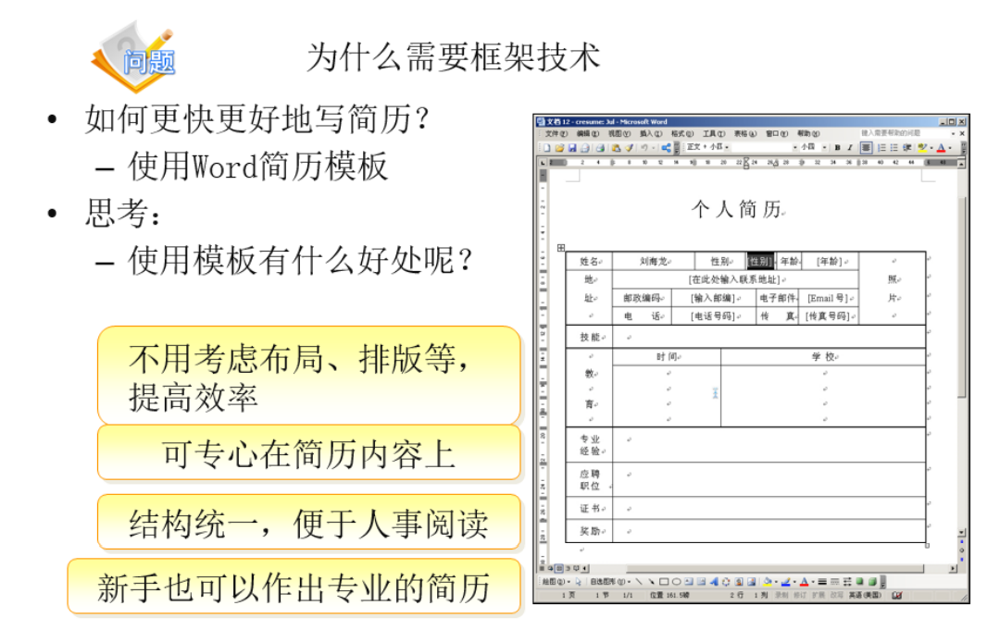

# Java

Java是美国sun公司（Stanford University Network）在1995年推出的一门计算机高级编程语言。2009年sun公司被Oracle公司收购。（Java之父：James Gosling）

它的设计目标是写一次，到处运行，这个目标一直延续至今



以下是Java常见的用途：

1. **应用程序开发**：Java可以用于开发各种类型的应用程序，包括桌面应用程序、移动应用程序和Web应用程序。
2. **Android应用开发**：Java是Android平台上最主要的编程语言之一，用于开发移动应用程序。
3. **Web开发**：虽然Java不像Python或JavaScript那样常用于前端开发，但它在后端开发中非常流行。Java的一些流行框架如Spring和JavaServer Faces (JSF)用于构建Web应用程序。
4. **大数据和分布式计算**：Java在大数据领域非常重要，例如使用Apache Hadoop和Apache Spark进行分布式数据处理和分析。
5. **企业级应用开发**：Java广泛用于开发企业级应用程序，特别是大型企业系统和应用，它的稳定性和可维护性非常受欢迎。
6. **游戏开发**：虽然不如C++在游戏开发中流行，但Java仍然用于开发Android游戏和基于Java的游戏引擎。
7. **嵌入式系统**：Java可以用于嵌入式系统和物联网设备的开发，尤其是在需要跨平台兼容性的情况下。
8. **科学计算**：Java在科学和工程计算中也有应用，例如开发模拟和仿真软件。
9. **金融领域**：Java在金融行业中广泛使用，用于开发交易平台、风险管理系统和其他金融应用。
10. **教育**：Java通常作为教育和学术研究的编程语言，因为它的语法清晰，易于学习。
11. **桌面应用程序**：使用Java的图形界面库（如Swing和JavaFX），可以创建跨平台的桌面应用程序。
12. **安全性**：Java具有强大的安全性特性，用于开发安全性要求高的应用，如金融和医疗应用。

# JavaEE和Java的区别

JavaEE（Java Platform, Enterprise Edition）和Java是两个相关但不同的概念，它们之间的区别如下：

1. **Java**：

   - **Java** 是一种编程`<mark>`语言`</mark>`，最初由Sun Microsystems开发，并后来由Oracle维护。
   - Java语言提供了一种跨平台的编程方式，使得开发者可以编写一次代码，然后在不同的操作系统上运行，只需安装适当的Java虚拟机（JVM）。
   - Java主要用于开发各种类型的应用程序，包括桌面应用程序、移动应用程序（使用Android开发工具包）、嵌入式系统、Web应用程序和后端服务器应用程序。
2. **JavaEE**：

   - **JavaEE** 是Java`<mark>`平台`</mark>`的一个子集，用于开发企业级应用程序。它构建在标准的Java平台之上，提供了一组企业级的API和规范，以支持大规模、分布式和可扩展的应用程序开发。
   - JavaEE包括一系列的规范和API，用于处理事务管理、持久化、消息传递、安全性、Web服务和分布式计算等企业级应用程序的需求。
   - JavaEE应用程序通常部署在JavaEE兼容的应用服务器（如Tomcat、Wildfly、WebLogic、WebSphere等）上，这些服务器提供了JavaEE规范所要求的运行时环境。

因此，Java是一种编程语言，而JavaEE是一种构建企业级应用程序的平台，它在Java语言的基础上提供了额外的功能和API，以满足企业级应用程序的需求。选择使用Java还是JavaEE取决于项目的性质和需求。如果只需要开发简单的应用程序，可能只需要使用Java。但如果需要构建大规模的企业级应用程序，那么JavaEE可能更合适，因为它提供了处理复杂业务逻辑和分布式系统需求的工具和规范。不过需要注意的是，JavaEE在最新的Java开发趋势中逐渐被Jakarta EE所取代。


# Java关键特点和特性

1. **跨平台性（Platform Independence）**：Java是一种`<mark>`跨平台`</mark>`的编程语言，也就是说，你可以编写一次Java代码，然后在不同的操作系统上运行，如Windows、Linux、macOS等，只要安装了相应的Java虚拟机（JVM）。这是通过将Java源代码编译为中间字节码（bytecode），然后在JVM上运行字节码来实现的。
2. **面向对象编程（Object-Oriented Programming，OOP）**：Java是一种面向对象的编程语言，它鼓励开发者使用对象、类、继承、封装和多态等OOP概念来构建程序。这有助于提高代码的可重用性和可维护性。
3. **安全性（Security）**：Java具有强大的安全性特性，包括内置的安全性机制，如沙盒环境，可以防止恶意代码执行。这使得Java成为网络和移动应用程序开发的首选语言之一。
4. **自动内存管理（Automatic Memory Management）**：Java具有垃圾回收机制，它可以自动管理内存分配和释放，帮助开发者避免内存泄漏和手动内存管理的烦恼。
5. **丰富的标准库（Rich Standard Library）**：Java附带了一个庞大的标准类库，包含了大量的工具类和API，可以用于处理各种任务，从文件操作到网络通信，再到图形界面开发，都有相应的库可用。
6. **多线程支持（Multithreading Support）**：Java内置了多线程支持，允许程序同时执行多个线程，从而提高了并发性能。
7. **广泛应用领域（Wide Range of Applications）**：Java广泛用于开发各种类型的应用程序，包括桌面应用程序、Web应用程序、移动应用程序（Android应用程序使用Java语言）、企业级应用程序、嵌入式系统等。
8. **开放源代码生态系统（Open Source Ecosystem）**：Java有一个庞大的开发社区和丰富的开源库和框架，使开发者能够更轻松地构建复杂的应用程序。

# SSH

三大开源框架：struts2，Hibernate，Spring

这三个框架合在一起提供了一种强大的方法来构建企业级Java应用程序。下面是关于这三个框架的简要介绍：

1. **Spring**：
   - **类型**：全面的应用程序框架。
   - **用途**：管理业务对象的生命周期和配置，提供了大量企业服务（如事务管理、安全性、消息传递等）。
   - **特点**：依赖注入（DI）和面向切面编程（AOP），以及与多种数据访问技术的集成。

2. **Struts**：
   - **类型**：Web框架。
   - **用途**：处理HTTP请求，实现MVC（Model-View-Controller）模式。
   - **特点**：定义了一种方式，通过响应用户的动作来控制应用程序流，并将数据呈现给用户。

3. **Hibernate**：
   - **类型**：对象关系映射（ORM）框架。
   - **用途**：将Java对象映射到数据库表，简化数据库操作。
   - **特点**：抽象了数据库操作，开发者可以使用面向对象的方式进行数据库交互，而不用编写复杂的SQL语句。

## SSH框架的整合

- **整合方式**：这三个框架通常被整合在一起，以利用各自的优势，提供一个全面的解决方案。 
   - **Spring** 作为应用程序的背脊，负责管理所有组件（包括Struts和Hibernate）的生命周期。
   - **Struts** 处理前端的Web请求，将用户的输入传递到后端。
   - **Hibernate** 负责数据持久化和检索，将业务逻辑与数据存储分离。

- **优势**：这种整合提供了高度的灵活性和可扩展性，可以高效地构建大型企业级应用。

SSH框架的整合是Java企业应用开发中的一个经典模式，它充分利用了每个单独框架的强项，同时提供了一个统一和协调的开发环境。

## Struts2

Struts2是一个流行的Java企业级Web应用框架，作为Apache Struts项目的一部分，它继承了原始Struts框架并引入了新的概念和功能。以下是Struts2的主要特点和组件：

1. **基于MVC架构**：Struts2是一个Model-View-Controller（MVC）框架。它将应用程序分为三个核心部分：模型（Model）负责数据和业务逻辑，视图（View）负责呈现数据，控制器（Controller）处理用户输入并调用模型逻辑。
2. **标签库**：提供了丰富的标签库，简化了JSP页面的开发。这些标签帮助开发人员避免编写冗长的JavaScript和HTML代码。
3. **拦截器**：Struts2使用拦截器来处理请求的预处理和后处理。开发者可以定义拦截器来实现横切关注点（如日志记录、安全性等）。
4. **Action类**：在Struts2中，Action类替代了Struts1中的ActionForm和Action。它用于封装业务逻辑，并充当模型与视图之间的桥梁。
5. **配置**：Struts2使用XML和/或注解来配置Action映射、拦截器等。这提供了灵活性和控制，同时保持了配置的清晰和简洁。
6. **集成友好**：Struts2可以很容易地与其他Java企业技术（如Spring、Hibernate等）集成，从而提供更强大的功能和灵活性。
7. **Ajax支持**：Struts2支持Ajax，允许创建更动态和交互性更强的Web应用程序。
8. **插件系统**：Struts2有一个可扩展的插件架构，允许开发者添加或创建插件以扩展其功能。
9. **异常处理**：提供了强大的异常处理机制，允许开发者优雅地处理应用程序中的异常。
10. **国际化和本地化**：支持国际化，帮助开发多语言Web应用程序。

Struts2是Java Web开发的一个强大选择，特别是对于需要可扩展性和灵活性的大型企业应用程序。由于其架构和特性，它提供了创建维护高效Web应用程序的有效框架。



# 怎么在集成开发平台eclipse上配置Struts2框架，学习Struts2编程

在Eclipse集成开发环境（IDE）中配置Struts2框架并开始学习Struts2编程涉及多个步骤。以下是一个基本的指南来帮助你开始：

### 1. 安装Eclipse

首先，确保你已经安装了Eclipse IDE。如果还没有安装，可以从[Eclipse官网](https://www.eclipse.org/downloads/)下载并安装。

### 2. 创建Java Web项目

1. 打开Eclipse，选择 `File` -> `New` -> `Dynamic Web Project`。
2. 输入项目名称。
3. 选择适当的目标运行环境（比如Tomcat服务器）。
4. 点击 `Finish` 创建项目。

### 3. 添加Struts2依赖

你可以通过手动添加JAR文件或使用Maven来添加Struts2依赖。

#### 手动添加JAR文件：

1. 下载Struts2的JAR文件。你可以从[Struts官网](https://struts.apache.org/download.cgi)下载。
2. 将下载的JAR文件复制到项目的 `WebContent/WEB-INF/lib` 目录下。

#### 使用Maven（推荐）：

1. 右击项目，选择 `Configure` -> `Convert to Maven Project`。
2. 在生成的 `pom.xml` 文件中，添加Struts2的依赖项：
   ```xml
   <dependencies>
       <dependency>
           <groupId>org.apache.struts</groupId>
           <artifactId>struts2-core</artifactId>
           <version>[适当的版本]</version>
       </dependency>
       <!-- 添加其他需要的依赖 -->
   </dependencies>
   ```

### 4. 配置Struts2

1. 在 `WebContent/WEB-INF` 目录下创建一个名为 `struts.xml` 的文件。
2. 在 `struts.xml` 文件中添加基本的Struts2配置：
   ```xml
   <?xml version="1.0" encoding="UTF-8"?>
   <!DOCTYPE struts PUBLIC
       "-//Apache Software Foundation//DTD Struts Configuration 2.5//EN"
       "http://struts.apache.org/dtds/struts-2.5.dtd">
   <struts>
       <package name="default" extends="struts-default">
           <!-- 配置Action和结果 -->
       </package>
   </struts>
   ```

### 5. 编写第一个Struts2 Action

1. 在 `src` 目录下创建一个新的Java类，比如 `HelloWorldAction`。
2. 在这个类中添加方法和逻辑。例如：
   ```java
   public class HelloWorldAction {
       public String execute() {
           return "SUCCESS";
       }
   }
   ```

### 6. 更新 `struts.xml` 配置

在 `struts.xml` 中配置你的Action：
```xml
<package name="default" extends="struts-default">
    <action name="hello" class="com.yourpackage.HelloWorldAction">
        <result name="SUCCESS">/success.jsp</result>
    </action>
</package>
```

### 7. 创建JSP页面

在 `WebContent` 目录下创建相应的JSP页面，比如 `success.jsp`。

### 8. 运行和测试

1. 配置服务器（如Tomcat）。
2. 将项目部署到服务器上。
3. 在浏览器中访问相应的URL（例如 `http://localhost:8080/YourProjectName/hello`）来测试你的Struts2应用。

### 学习资源

- **官方文档**：参阅[Struts2官方文档](https://struts.apache.org/docs/)，了解更多详细信息和高级概念。
- **在线教程**：网上有很多免费的教程可以帮助你更深入地学习Struts2。

按照这些步骤，你就可以开始在Eclipse中使用Struts2进行开发了。随着你对框架的理解加深，你可以开始探索更高级的功能，如拦截器、标签库、OGNL表达式等。