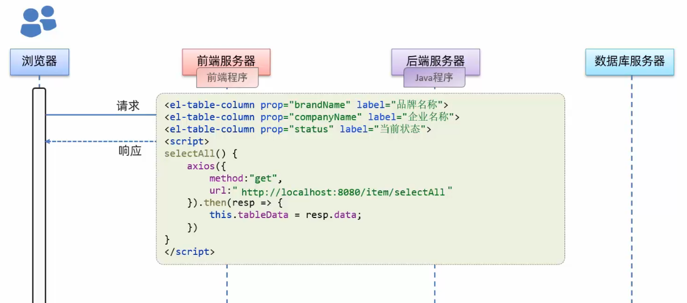

# 什么是Web？
全球广域网，也称万维网（www World Wide Web）,能通过浏览器访问的网站。

# Web网站的工作流程

比如我们在浏览器输入域名www.jd.com一敲回车就访问到此京东网站的页面

>首先浏览器它是个程序，我们访问的京东的网站也是一个程序，只不过这个程序是在人家京东的电脑上运行着的，我们只是通过浏览器远程访问而已。

京东的网站程序大体由三个部分组成的：
1. 前端程序
    - 将数据以好看的样式呈现出来
    - 运行在前端服务器中
2. 数据库程序
    - 将数据存储和管理
    - 在数据库服务器中
3. 后端程序
    - 负责逻辑处理
    - 后端服务器




浏览器也是个程序，其里内置了解析前端代码的解析引擎

>以上开发模式的特点是：前端人员开发前端程序，然后放在前端服务器上运行......前端程序和后端程序的开发和部署都是分开的。
>
>叫前后端分离开发

以前还有将前后端程序混合在一起，并都在一台服务器上，浏览器发送请求后将数据及前端代码一并返回给浏览器，再进行解析和展示。称为混合开发


# web开发技术


# 网页三剑客：
- HTML：负责网页的基本结构（页面元素和内容）
- CSS：负责网页的表现效果（页面元素的外观、位置等页面样式，如：颜色、大小等）
- JavaScript：负责网页的行为（交互效果）

## HTML

HTML is the standard markup language for **web pages**. 

A Simple HTML Document

```html
<!DOCTYPE html>                    
<html>
<head>
<title>Page Title</title>
</head>
<body>

<h1>My First Heading</h1>
<p>My first paragraph.</p>

</body>
</html>
```


## JavaScript

简称JS，是一门跨平台、面向对象的脚本语言。