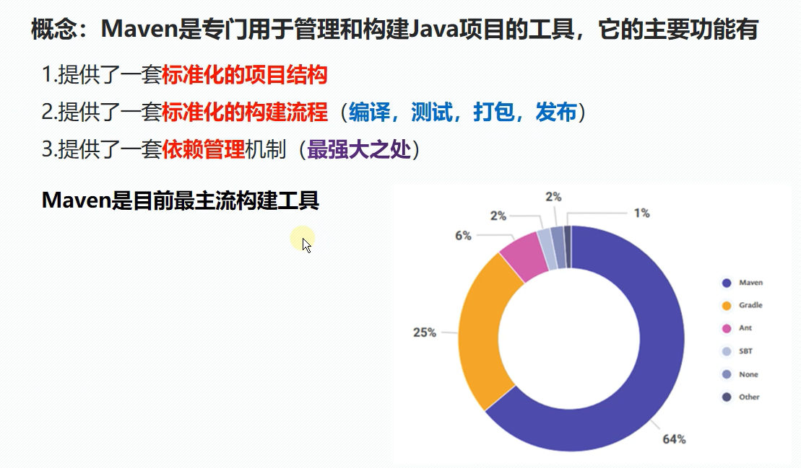
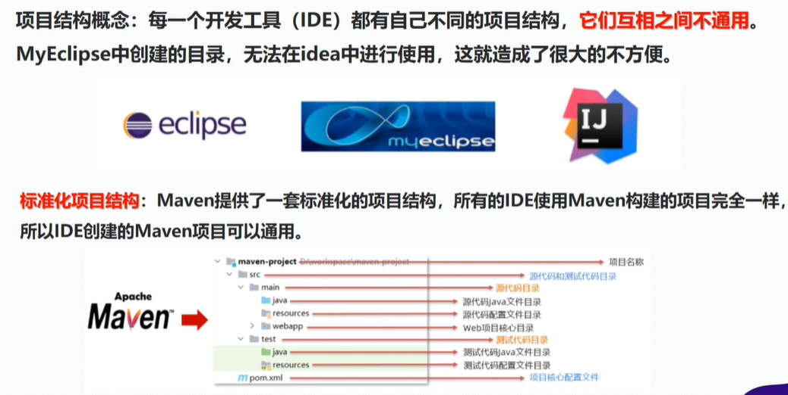

Maven 是一个流行的软件项目管理和构建自动化工具。主要用于 Java 项目，但也可以用来构建和管理各种其他语言的项目，例如 C#, Ruby, Scala, 和更多。

# 标准化项目结构

# Maven 主要功能和特点

1. 项目构建和依赖管理：Maven 允许开发者定义项目结构、依赖项、插件和其他元素在一个名为 pom.xml 的文件中。它自动化了项目构建的过程，包括编译代码、打包二进制文件和文档，以及运行测试。

2. 约定优于配置：Maven 使用一套标准的约定（比如源代码和资源的默认目录结构），这意味着开发者只需要提供少量的配置信息。

3. 中央仓库：Maven 通过中央仓库自动管理依赖，使得你不需要手动下载和管理每个依赖库。你可以添加依赖项到你的 pom.xml 文件，Maven 会自动下载并引入这些库到你的项目中。

4. 插件式架构：Maven 拥有广泛的插件生态系统，允许开发者扩展其功能，例如集成代码分析工具、生成网站文档等。

5. 生命周期管理：Maven 定义了项目生命周期的不同阶段，如编译、测试、打包和部署，以及这些阶段要执行的任务。

6. 项目模型：Maven 使用 Project Object Model (POM) 来描述项目信息和配置。

Maven 的这些功能使其成为了企业级 Java 项目的首选工具之一，特别是对于需要跨多个项目和模块管理复杂依赖关系的大型系统。