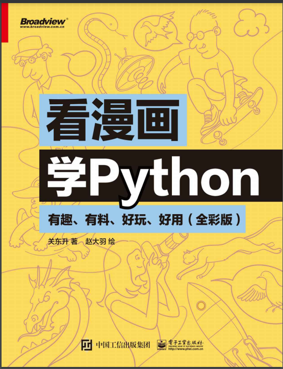
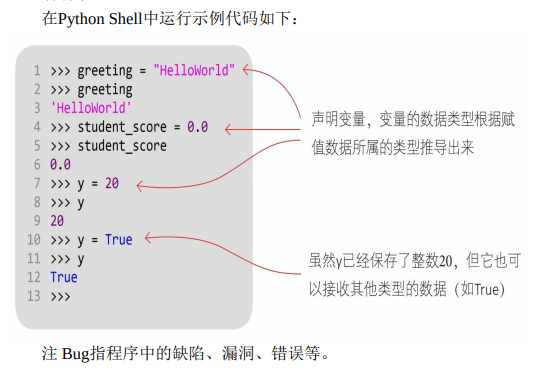
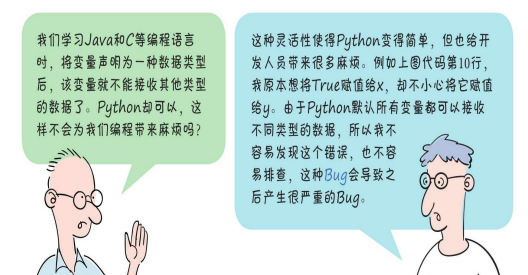
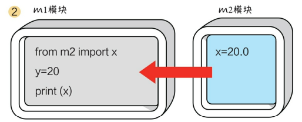
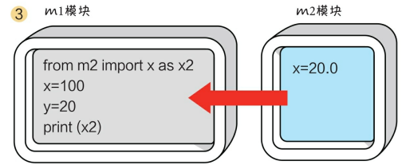
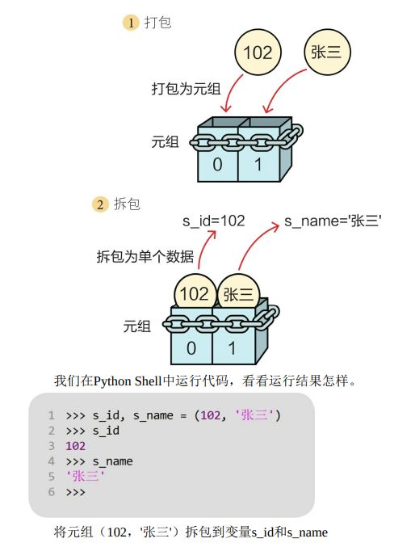
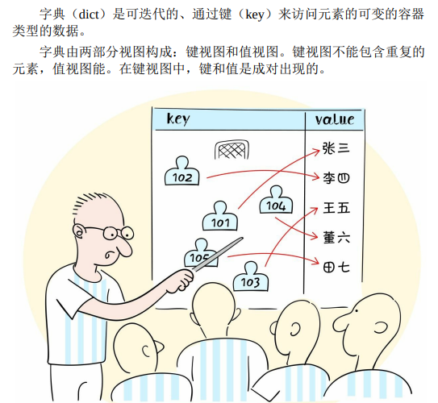
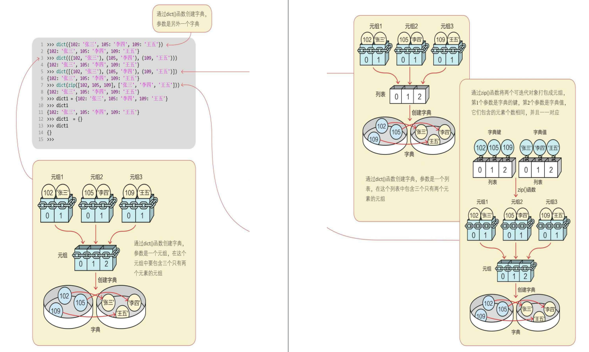

# 最经典简单的python程序

最简单的Python程序是一个打印"Hello, World!"的程序。以下是一个示例：

```python
print("Hello, World!")
```

你可以将这段代码保存为一个.py文件，然后在Python解释器中运行它，或者使用命令行运行它。它将输出 "Hello, World!"
到控制台。这是编程中的经典入门示例，用于展示基本的代码结构和打印功能。

# python能用来做什么

Python是一种多用途的编程语言，可以用于各种不同的应用和领域。以下是一些Python常见的用途：

1. **Web开发**：Python有许多流行的Web框架，如Django和Flask，用于构建高性能的Web应用程序。

2. **数据分析和科学计算**：Python在数据分析、数据可视化和科学计算方面非常流行。库如NumPy、Pandas、Matplotlib和Seaborn等使数据分析变得更加容易。

3. **人工智能和机器学习**：Python在机器学习和深度学习领域广泛使用。TensorFlow和PyTorch等框架使开发和训练机器学习模型变得更加简单。

4. **自然语言处理(NLP)**：Python在处理文本和自然语言的任务中表现出色。NLTK和Spacy等库提供了丰富的工具和资源。

5. **游戏开发**：Pygame等库支持游戏开发，使开发2D游戏变得容易。

6. **桌面应用程序**：使用工具如Tkinter、PyQt和Kivy，可以开发跨平台的桌面应用程序。

7. **物联网(IoT)**：Python可用于编写嵌入式系统和连接各种物联网设备。

8. **自动化和脚本编写**：Python非常适合编写自动化脚本，处理文件、执行重复性任务等。

9. **网络爬虫和数据采集**：Python可以用于构建网络爬虫，从互联网上获取信息。

10. **数据库管理**：Python支持多种数据库连接库，可以用于管理和操作数据库。

11. **图形设计**：Python可以用于生成图像、绘图和图形设计，例如使用Pillow库处理图像。

12. **科研**：许多科学家和研究人员使用Python来处理和分析数据，并进行模拟和实验。

总之，Python是一种灵活的编程语言，适用于各种应用和领域，从Web开发到科学研究，无所不包。这使得它成为一个非常受欢迎的编程语言，特别适合初学者和专业开发者。

# Python的基础知识概述

通常会涵盖以下主题：

1. **变量和数据类型**：

    - Python中的变量是动态类型的，无需显式声明类型。
    - 常见的数据类型包括整数（int）、浮点数（float）、字符串（str）、布尔值（bool）等。

2. **运算符**：

    - Python支持常见的算术运算符（+、-、*、/、%）、比较运算符（==、!=、<、>）和逻辑运算符（and、or、not）等。

3. **控制流**：

    - 使用条件语句（if、elif、else）来进行条件判断。
    - 使用循环（for、while）来进行重复操作。

4. **数据结构**：

    - 列表（List）：有序、可变的序列。
    - 元组（Tuple）：有序、不可变的序列。
    - 字典（Dictionary）：键值对的集合。
    - 集合（Set）：不重复元素的集合。

5. **函数**：

    - 定义函数使用关键字 `def`。
    - 可以接受参数并返回值。
    - 函数可以被调用和重复使用。

6. **模块和包**：

    - Python有丰富的标准库，也可以创建自定义模块。
    - 模块是Python代码的组织方式，包是包含多个模块的目录。

7. **异常处理**：

    - 使用 `try` 和 `except` 处理异常，确保程序在出错时不会崩溃。

8. **文件操作**：

    - 使用 `open()` 函数来读写文件。
    - 可以进行文本文件和二进制文件的操作。

9. **面向对象编程**：

    - Python支持面向对象编程，允许定义类和对象。
    - 类可以包括属性和方法。

10. **模块和库**：

    - Python社区有丰富的第三方库和框架，用于各种任务，如数据分析、Web开发、机器学习等。

11. **虚拟环境和包管理器**：

    - 使用工具如`virtualenv`和`pip`来管理项目依赖和环境。

12. **列表推导式和生成器表达式**：

    - 可以使用列表推导式和生成器表达式来快速生成列表和迭代器。

这只是Python基础知识的一个概览。深入学习每个主题并实际编写代码将有助于更好地掌握Python编程。同时，Python是一门灵活且功能强大的语言，可以用于各种应用领域，包括Web开发、数据科学、人工智能等。

# python自学笔记



## 一、python下载安装、环境配置、helloworld

略

## 二、编程基础

### 1、标识符

### 2、关键字

### 3、变量




### 4、语句

Python代码是由关键字、标识符、表达式和语句等构成的，语句是
代码的重要组成部分。
> 在Python中，一行代码表示一条语句

### 5、代码注释

在使用＃（井号）时，＃位于注释行的开头，＃后面有一个空格， 接着是注释的内容。

### 6、模块

在Python中一个模块就是一个文件，模块是保存代码的最小单位， 在模块中可以声明变量、函数、属性和类等Python代码元素。

### 7、实现两个模块间的代码元素访问





## 三、字符串

字符串有三种表示方式：普通字符串、原始字符串和长字符串。

## 四、数字类型的数据

在Python中所有的数据类型都是类，每个数据值都是类的“实例”。

在Python中有6种主要的内置数据类型：数字、字符串、列表、元组、集合和字典。列表、元组、集合和字典可以容纳多项数据，在本书中把它们统称为容器类型的数据。

Python中的数字类型有4种：整数类型、浮点类型、复数类型和布尔类型。需要注意的是，布尔类型也是数字类型，它事实上是整数类型的一种。

## 五、容器类型的数据

### （一）序列 sequence

序列包括列表（list）、字符串（str）、元组（tuple）和字节序列
（bytes）等。

1. 序列的索引操作

```python
>>> a = 'Hello'
>>> a[0]
'H'
```

2. 加和乘操作
3. 切片操作

```python
>>> a = "Hello"
>>> a[1:3]
'el'
# 切片（Slicing）运算符的语法形式为[start：end：step]
# 其中，start是开始索引，end是结束索引，step是步长
```

4. 成员测试

### （二）列表 list

1. 创建列表
2. 追加元素

```python
# append()

>>> list = [20, 10, 50, 30]
>>> list.append(80)
>>> list
[20,10,50,30,80]
```

```python
# extend()

>>> list = [20, 10, 50, 30]
>>> t = [1, 2, 3]
>>> list.extend(t)
>>>list
[20, 10, 50, 30, 1, 2, 3]
```

3. 插入元素

```python
# 使用列表的list.insert（i，x）方法，
# 其中，i指定索引位置，x是要插入的元素。

>>> list = [20, 10, 50, 30]
>>> list.insert(2,80)
>>> list
[20, 10, 80, 50, 30]
```

4. 替换元素

```python
# 将列表下标索引元素放在赋值符号（=）的左边，进行赋值即可。

>>> list= [20, 10, 50, 30]
>>> list[1] = 80
>>> list
[20, 80, 50, 30]
```

5. 删除元素

```python
# 使用列表的list.remove（x）方法，如果找到匹配的元素x，则删除该元素。
# 如果找到多个匹配的元素，则只删除第一个匹配的元素。

>>> list = [20, 10, 80, 50, 30]
>>> list.remove(80)
>>> list
[20, 10, 50, 30]
```

### （三）元组 tuple

元组是一种不可变序列类型。

1. 创建元组
2. 元组拆包

    - 创建元组，并将多个数据放到元组中，这个过程被称为元组打包。
    - 与元组打包相反的操作是拆包，就是将元组中的元素取出，分别赋值给不同的变量。



### （四）集合 set

1. 创建集合

```python
# 我们可以通过以下两种方式创建集合。
# 1  set（iterable）函数：参数iterable是可迭代对象（字符串、列表、元组、集合和字典等）。
# 2  {元素1，元素2，元素3，⋯}：指定具体的集合元素，元素之间以逗号分隔。对于集合元素，需要使用大括号括起来。

>>> set('Hello')
{'o', 'H', 'e', 'l'}

>>> {20, 15, 10, 30, 20, 15}
{10, 20, 30, 15}

>>> b = {}
>>> type(b)
<class 'dict'>
```
2. 修改集合
```python
# 修改集合类似于修改列表，可以向其中插入和删除元素。
# 修改可变集合有常用方法：add(elem)、remove(elem)、clear()。

# 添加元素，如果元素已经存在，则不能添加，不会抛出错误。
# 删除元素，如果元素不存在，则抛出错误。

>>> s_set = {'张三', '李四', '王五'}
>>> s_set.add('董六')
>>> s_set.remove('李四')
>>> '李四' in s_set
False # 由于要删除的李四已不在集合中，所以会抛出错误
# 在集合中也可以使用成员测试运算符in和not in

>>> s_set
{'王五', '张三', '董六'}
>>> s_set.remove('李四')
Traceback(most recent call last):
    File"<pyshell#14>", line 1, in <module>
        s_set.remove('李四')
KeyError：'李四'

>>> s_set.clear()
>>> s_set
set()
```

### （五）字典 dict

1. 创建字典

通过以下两种方法创建字典。
- dict（）函数
- {key1：value1，key2：value2，...，key_n：value_n}：指定具体的字典键值对，键值对之间以逗号分隔，最后用大括号括起来。


2. 修改字典

3. 访问字典视图
4. 遍历字典

## 六、程序流程控制

## 七、函数

### （一）定义函数

### （二）调用函数

### （三）参数的默认值

### （四）可变参数

### （五）函数中变量的作用域

### （六）函数类型

### （七）lambda()函数

## 八、类与对象

## 九、异常处理

## 十、常用的内置模块
### （一）数学计算模块 math
### （二）日期时间模块 datetime
### （三）正则表达式模块 re
## 十一、文件读写

## 十二、图形用户界面

## 十三、网络通信

## 十四、访问数据库

## 十五、多线程