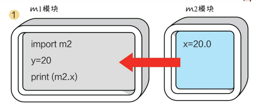

# 最经典简单的python程序

最简单的Python程序是一个打印"Hello, World!"的程序。以下是一个示例：

```python
print("Hello, World!")
```

你可以将这段代码保存为一个.py文件，然后在Python解释器中运行它，或者使用命令行运行它。它将输出 "Hello, World!" 到控制台。这是编程中的经典入门示例，用于展示基本的代码结构和打印功能。

# python能用来做什么

Python是一种多用途的编程语言，可以用于各种不同的应用和领域。以下是一些Python常见的用途：

1. **Web开发**：Python有许多流行的Web框架，如Django和Flask，用于构建高性能的Web应用程序。

2. **数据分析和科学计算**：Python在数据分析、数据可视化和科学计算方面非常流行。库如NumPy、Pandas、Matplotlib和Seaborn等使数据分析变得更加容易。

3. **人工智能和机器学习**：Python在机器学习和深度学习领域广泛使用。TensorFlow和PyTorch等框架使开发和训练机器学习模型变得更加简单。

4. **自然语言处理(NLP)**：Python在处理文本和自然语言的任务中表现出色。NLTK和Spacy等库提供了丰富的工具和资源。

5. **游戏开发**：Pygame等库支持游戏开发，使开发2D游戏变得容易。

6. **桌面应用程序**：使用工具如Tkinter、PyQt和Kivy，可以开发跨平台的桌面应用程序。

7. **物联网(IoT)**：Python可用于编写嵌入式系统和连接各种物联网设备。

8. **自动化和脚本编写**：Python非常适合编写自动化脚本，处理文件、执行重复性任务等。

9. **网络爬虫和数据采集**：Python可以用于构建网络爬虫，从互联网上获取信息。

10. **数据库管理**：Python支持多种数据库连接库，可以用于管理和操作数据库。

11. **图形设计**：Python可以用于生成图像、绘图和图形设计，例如使用Pillow库处理图像。

12. **教育**：Python通常用作教育和初学者编程的首选语言，因为它易于学习和理解。

13. **科研**：许多科学家和研究人员使用Python来处理和分析数据，并进行模拟和实验。

总之，Python是一种灵活的编程语言，适用于各种应用和领域，从Web开发到科学研究，无所不包。这使得它成为一个非常受欢迎的编程语言，特别适合初学者和专业开发者。

# 当谈到Python的基础知识时，通常会涵盖以下主题：

1. **变量和数据类型**：
   
   - Python中的变量是动态类型的，无需显式声明类型。
   - 常见的数据类型包括整数（int）、浮点数（float）、字符串（str）、布尔值（bool）等。

2. **运算符**：
   
   - Python支持常见的算术运算符（+、-、*、/、%）、比较运算符（==、!=、<、>）和逻辑运算符（and、or、not）等。

3. **控制流**：
   
   - 使用条件语句（if、elif、else）来进行条件判断。
   - 使用循环（for、while）来进行重复操作。

4. **数据结构**：
   
   - 列表（List）：有序、可变的序列。
   - 元组（Tuple）：有序、不可变的序列。
   - 字典（Dictionary）：键值对的集合。
   - 集合（Set）：不重复元素的集合。

5. **函数**：
   
   - 定义函数使用关键字 `def`。
   - 可以接受参数并返回值。
   - 函数可以被调用和重复使用。

6. **模块和包**：
   
   - Python有丰富的标准库，也可以创建自定义模块。
   - 模块是Python代码的组织方式，包是包含多个模块的目录。

7. **异常处理**：
   
   - 使用 `try` 和 `except` 处理异常，确保程序在出错时不会崩溃。

8. **文件操作**：
   
   - 使用 `open()` 函数来读写文件。
   - 可以进行文本文件和二进制文件的操作。

9. **面向对象编程**：
   
   - Python支持面向对象编程，允许定义类和对象。
   - 类可以包括属性和方法。

10. **模块和库**：
    
    - Python社区有丰富的第三方库和框架，用于各种任务，如数据分析、Web开发、机器学习等。

11. **虚拟环境和包管理器**：
    
    - 使用工具如`virtualenv`和`pip`来管理项目依赖和环境。

12. **列表推导式和生成器表达式**：
    
    - 可以使用列表推导式和生成器表达式来快速生成列表和迭代器。

这只是Python基础知识的一个概览。深入学习每个主题并实际编写代码将有助于更好地掌握Python编程。同时，Python是一门灵活且功能强大的语言，可以用于各种应用领域，包括Web开发、数据科学、人工智能等。

When it comes to the basic knowledge of Python, it typically covers the following topics:

1. **Variables and Data Types**:
   
   - Variables in Python are dynamically typed and don't require explicit type declarations.
   - Common data types include integers (int), floating-point numbers (float), strings (str), booleans (bool), and more.

2. **Operators**:
   
   - Python supports common arithmetic operators (+, -, *, /, %), comparison operators (==, !=, <, >), and logical operators (and, or, not), among others.

3. **Control Flow**:
   
   - Conditional statements (if, elif, else) are used for decision-making.
   - Loops (for, while) are used for repetitive tasks.

4. **Data Structures**:
   
   - Lists: Ordered, mutable sequences.
   - Tuples: Ordered, immutable sequences.
   - Dictionaries: Collections of key-value pairs.
   - Sets: Collections of unique elements.

5. **Functions**:
   
   - Functions are defined using the `def` keyword.
   - They can take parameters and return values.
   - Functions allow for code reusability and modularity.

6. **Modules and Packages**:
   
   - Python has a rich standard library, and you can create custom modules.
   - Modules are a way to organize Python code, and packages are directories containing multiple modules.

7. **Exception Handling**:
   
   - Use `try` and `except` to handle exceptions, ensuring that your program doesn't crash on errors.

8. **File Operations**:
   
   - Use the `open()` function for reading and writing files.
   - You can work with both text and binary files.

9. **Object-Oriented Programming**:
   
   - Python supports object-oriented programming, allowing you to define classes and objects.
   - Classes can have attributes and methods.

10. **Modules and Libraries**:
    
    - The Python community offers a vast array of third-party libraries and frameworks for various tasks, such as data analysis, web development, and machine learning.

11. **Virtual Environments and Package Managers**:
    
    - Use tools like `virtualenv` and `pip` to manage project dependencies and environments.

12. **List Comprehensions and Generator Expressions**:
    
    - You can use list comprehensions and generator expressions to quickly create lists and iterators.

This is just an overview of Python's basic knowledge. Going deeper into each topic and practicing coding will help you gain a better understanding of Python programming. Python is a versatile and powerful language used in various domains, including web development, data science, artificial intelligence, and more.

# python自学笔记


## 一、python下载安装、环境配置、helloworld
略
## 二、编程基础
### 1、标识符
### 2、关键字
### 3、变量


### 4、语句

Python代码是由关键字、标识符、表达式和语句等构成的，语句是
代码的重要组成部分。
>在Python中，一行代码表示一条语句
### 5、代码注释

在使用＃（井号）时，＃位于注释行的开头，＃后面有一个空格， 接着是注释的内容。
### 6、模块

在Python中一个模块就是一个文件，模块是保存代码的最小单位， 在模块中可以声明变量、函数、属性和类等Python代码元素。

### 7、实现两个模块间的代码元素访问



## 三、字符串
字符串有三种表示方式：普通字符串、原始字符串和长字符串。

## 四、数字类型的数据
在Python中所有的数据类型都是类，每个数据值都是类的“实例”。

在Python中有6种主要的内置数据类型：数字、字符串、列表、元组、集合和字典。列表、元组、集合和字典可以容纳多项数据，在本书中把它们统称为容器类型的数据。

Python中的数字类型有4种：整数类型、浮点类型、复数类型和布尔类型。需要注意的是，布尔类型也是数字类型，它事实上是整数类型的一种。

## 五、容器类型的数据

### （一）序列 sequence
序列包括列表（list）、字符串（str）、元组（tuple）和字节序列
（bytes）等。
1. 序列的索引操作
```python
>>> a = 'Hello'
>>> a[0]
'H'
```
2. 加和乘操作
3. 切片操作
```python
>>> a = "Hello"
>>> a[1:3]
'el'
# 切片（Slicing）运算符的语法形式为[start：end：step]
# 其中，start是开始索引，end是结束索引，step是步长
```
4. 成员测试
### （二）列表 list
1. 创建列表
2. 追加元素

```python
# append()

>>> list = [20, 10, 50, 30]
>>> list.append(80)
>>> list
[20,10,50,30,80]
```
```python
# extend()

>>> list = [20, 10, 50, 30]
>>> t = [1, 2, 3]
>>> list.extend(t)
>>>list
[20, 10, 50, 30, 1, 2, 3]
```
3. 插入元素
```python
# 使用列表的list.insert（i，x）方法，
# 其中，i指定索引位置，x是要插入的元素。

>>> list = [20, 10, 50, 30]
>>> list.insert(2,80)
>>> list
[20, 10, 80, 50, 30]
```
4. 替换元素
```python
# 将列表下标索引元素放在赋值符号（=）的左边，进行赋值即可。

>>> list= [20, 10, 50, 30]
>>> list[1] = 80
>>> list
[20, 80, 50, 30]
```
5. 删除元素
```python
# 使用列表的list.remove（x）方法，如果找到匹配的元素x，则删除该元素。
# 如果找到多个匹配的元素，则只删除第一个匹配的元素。

>>> list = [20, 10, 80, 50, 30]
>>> list.remove(80)
>>> list
[20, 10, 50, 30]
```
### （三）元组 tuple

元组是一种不可变序列类型。
1. 创建元组
2. 元组拆包

### （四）集合
1. 创建集合
2. 修改集合

### （五）字典
1. 创建字典
2. 修改字典
3. 访问字典视图

## 六、程序流程控制

## 七、函数
### （一）定义函数
### （二）调用函数
### （三）参数的默认值
### （四）可变参数
### （五）函数中变量的作用域
### （六）函数类型
### （七）lambda()函数

## 八、类与对象

## 九、异常处理

## 十、常用的内置模块

## 十一、文件读写

## 十二、图形用户界面

## 十三、网络通信

## 十四、访问数据库

## 十五、多线程