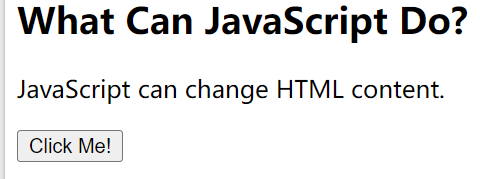

JavaScript is one of the 3 languages all web developers must learn:

   1. HTML to define the content of web pages

   2. CSS to specify the layout of web pages

   3. JavaScript to program the behavior of web pages

# 最简单经典的js
下面的例子是：JavaScript Can Change HTML Content

One of many JavaScript HTML methods is `getElementById()`.

The example below "finds" an HTML element (with id="demo"), and changes the element content (innerHTML) to "Hello JavaScript":

```html
<!DOCTYPE html>
<html>
<body>

<h2>What Can JavaScript Do?</h2>

<p id="demo">JavaScript can change HTML content.</p>

<button type="button" onclick='document.getElementById("demo").innerHTML = "Hello JavaScript!"'>Click Me!</button>

</body>
</html>
```
原：


点击后：


# JavaScript又一个例子

In this example JavaScript changes the value of the `src` (source) attribute of an `` tag:

```html
<!DOCTYPE html>
<html>
<body>

<h2>What Can JavaScript Do?</h2>

<p>JavaScript can change HTML attribute values.</p>

<p>In this case JavaScript changes the value of the src (source) attribute of an image.</p>

<button onclick="document.getElementById('myImage').src='pic_bulbon.gif'">Turn on the light</button>


<button onclick="document.getElementById('myImage').src='pic_bulboff.gif'">Turn off the light</button>

</body>
</html>
```
原：


开灯后：
