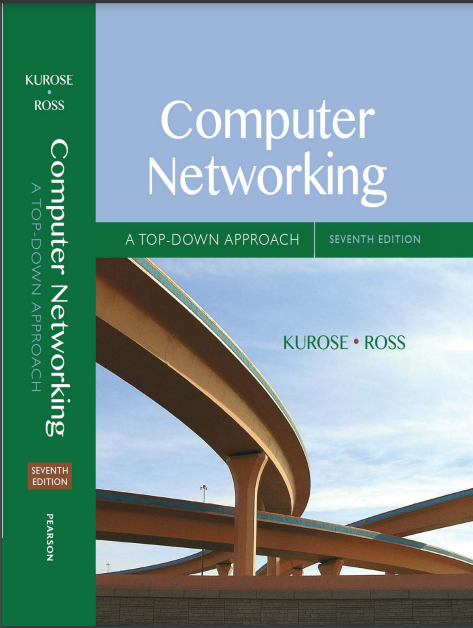

# 《计算机网络：自顶向下》（第七版）

# 这本书的主要内容和知识点

- 第1章：计算机网络和因特网

    - 介绍计算机网络的基本概念、组成、功能和应用。
    - 讨论了因特网的结构和组成，以及基本的数据传输原理。

- 第2章：应用层

    - 探讨了应用层协议的原理和常见类型，例如HTTP、SMTP、DNS等。
    - 详细讲解了客户端-服务器模型和对等网络模型。

- 第3章：传输层

    - 涵盖了传输层协议，特别是TCP（传输控制协议）和UDP（用户数据报协议）。
    - 讨论了可靠数据传输、流量控制、拥塞控制等概念。

- 第4章：网络层

    - 介绍了网络层的功能，包括路由和转发。
    - 深入分析了路由算法和因特网中的路由协议，如IP、ICMP、OSPF、BGP等。

- 第5章：链路层和局域网

    - 讨论了链路层的功能和局域网的技术，包括MAC地址、以太网、WiFi、PPP等。
    - 介绍了交换、错误检测和纠错机制。

- 第6章：无线和移动网络

    - 专注于无线通信的基本原理和移动网络的技术。
    - 包括蜂窝网络结构、移动IP和无线网络安全问题。

- 第7章：多媒体网络

    - 探讨了支持视频和音频传输的网络服务，包括流媒体和实时通信。
    - 讨论了QoS（服务质量）的概念和实现。

- 第8章：安全

    - 介绍了网络安全的基础，包括加密、数字签名、认证协议等。
    - 讨论了防火墙、入侵检测系统和安全协议。

- 第9章：网络管理

    - 讨论了网络管理的概念、工具和策略。
    - 包括SNMP、网络管理策略和故障排除。

这本书的特点在于它从应用层开始逐步深入，使读者能够先了解应用层协议和网络服务，然后再逐渐学习底层技术。这种方法有助于建立对计算机网络整体架构和各层之间相互作用的深入理解。此外，书中包含了大量的实例和案例研究，有助于将理论知识与实际应用相结合。

# Internet

internet

>The Internet is a computer network that interconnects billions of computing devices throughout the world.
>
>互联网是一个连接全球数十亿计算设备的计算机网络。

End systems are connected together by a network of communication links and packet switches.
>终端系统通过通信链路和分组交换机的网络连接在一起。

There are many types of communication links, which are made up of different types of physical media, including coaxial cable, copper wire, optical fiber, and radio spectrum. Different links can transmit data at different rates, with the transmission rate of a link measured in bits/second. 
>通信链路有多种类型，它们由不同类型的物理介质，包括同轴电缆、铜线、光纤和无线电频谱。不同的链路可以以不同的速率传输数据，链路的传输速率以
位/秒。

When one end system has data to send to another end system, the sending end system segments the data and adds header bytes to each segment. The resulting packages of information, known as packets in the jargon of computer networks, are then sent through the network to the destination end system, where they are reassembled into the original data. A packet switch takes a packet arriving on one of its incoming communication links and forwards that packet on one of its outgoing communication links. 
>当一端系统有数据要发送到另一端系统时，发送端系统对数据进行分段并向每个段添加标头字节。 由此产生的信息包，在计算机网络术语中称为数据包，然后通过网络发送到目的地端系统，在那里它们被重新组装成原始数据。数据包交换机接收到达其传入通信链路之一的数据包并转发该数据包其传出通信链路之一上的数据包。

Packet switches come in many shapes and flavors,
but the two most prominent types in today’s Internet are routers and link-layer switches. Both types of
switches forward packets toward their ultimate destinations. Link-layer switches are typically used in
access networks, while routers are typically used in the network core. The sequence of communication
links and packet switches traversed by a packet from the sending end system to the receiving end
system is known as a route or path through the network.
>分组交换机有多种形状和风格，
但当今互联网中最重要的两种类型是路由器和链路层交换机。 两种类型的
交换机将数据包转发到其最终目的地。 链路层交换机通常用于
接入网络，而路由器通常用于网络核心。 通讯顺序
数据包从发送端系统到接收端所经过的链路和数据包交换机
系统被称为通过网络的路由或路径。

Packet-switched networks (which transport packets) are in many ways similar to transportation networks
of highways, roads, and intersections (which transport vehicles). Consider, for example, a factory that
needs to move a large amount of cargo to some destination warehouse located thousands of kilometers
away. At the factory, the cargo is segmented and loaded into a fleet of trucks. Each of the trucks then
independently travels through the network of highways, roads, and intersections to the destination
warehouse. At the destination warehouse, the cargo is unloaded and grouped with the rest of the cargo
arriving from the same shipment. Thus, in many ways, packets are analogous to trucks, communication
links are analogous to highways and roads, packet switches are analogous to intersections, and end
systems are analogous to buildings. Just as a truck takes a path through the transportation network, a
packet takes a path through a computer network.
>分组交换网络（传输分组）在很多方面与运输网络相似
高速公路、道路和交叉路口（运输车辆）。 例如，考虑一家工厂
需要将大量货物转移到距离数千公里的目的地仓库
离开。 在工厂，货物被分段并装载到卡车车队中。 然后每辆卡车
独立行驶通过高速公路、道路和交叉路口网络到达目的地
仓库。 在目的地仓库，货物被卸载并与其余货物分组
来自同一批货物。 因此，在很多方面，数据包类似于卡车、通信
链路类似于高速公路和道路，分组交换机类似于十字路口，而终端
系统类似于建筑物。 正如卡车在运输网络中行驶一样，
数据包采用通过计算机网络的路径。

End systems access the Internet through Internet Service Providers (ISPs), including residential ISPs such as local cable or telephone companies; corporate ISPs; university ISPs; ISPs that provide WiFi access in airports, hotels, coffee shops, and other public places; and cellular data ISPs, providing mobile access to our smartphones and other devices. Each ISP is in itself a network of packet switches and communication links. ISPs provide a variety of types of network access to the end systems, including residential broadband access such as cable modem or DSL, high-speed local area network access, and mobile wireless access. ISPs also provide Internet access to content providers, connecting Web sites and video servers directly to the Internet. The Internet is all about connecting end
systems to each other, so the ISPs that provide access to end systems must also be interconnected. These lower-tier ISPs are interconnected through national and international upper-tier ISPs such as Level 3 Communications, AT&T, Sprint, and NTT. An upper-tier ISP consists of high-speed routers interconnected with high-speed fiber-optic links. Each ISP network, whether upper-tier or lower-tier, is managed independently, runs the IP protocol (see below), and conforms to certain naming and address conventions. 
>终端系统通过互联网服务提供商 (ISP) 访问互联网，包括住宅 ISP，例如本地有线电视或电话公司； 企业 ISP； 大学 ISP； 在机场、酒店、咖啡店和其他公共场所提供 WiFi 接入的 ISP； 和蜂窝数据 ISP，为我们的智能手机和其他设备提供移动访问。 每个 ISP 本身就是一个由数据包交换机和通信链路组成的网络。 ISP 提供对终端系统的多种类型的网络接入，包括电缆调制解调器或DSL 等住宅宽带接入、高速局域网接入和移动无线接入。 ISP 还向内容提供商提供 Internet 访问，将网站和视频服务器直接连接到 Internet。 互联网就是连接端
系统之间相互连接，因此提供终端系统访问的 ISP 也必须互连。 这些下层 ISP 通过国内和国际上层 ISP（例如 Level 3 Communications、AT&T、Sprint 和 NTT）互连。 上层 ISP 由通过高速光纤链路互连的高速路由器组成。 每个 ISP 网络，无论是上层还是下层，都是独立管理的，运行 IP 协议（见下文），并遵守一定的命名和地址约定。

End systems, packet switches, and other pieces of the Internet run protocols that control the sending and receiving of information within the Internet. The Transmission Control Protocol (TCP) and the Internet Protocol (IP) are two of the most important protocols in the Internet. The IP protocol specifies the format of the packets that are sent and received among routers and end systems. The Internet’s principal protocols are collectively known as TCP/IP.
>终端系统、数据包交换机和互联网的其他部分运行控制互联网内信息发送和接收的协议。 传输控制协议（TCP）和互联网协议（IP）是互联网中最重要的两个协议。 IP 协议指定在路由器和终端系统之间发送和接收的数据包的格式。 互联网的主要协议统称为 TCP/IP。

Given the importance of protocols to the Internet, it’s important that everyone agree on what each and every protocol does, so that people can create systems and products that interoperate. This is where standards come into play. Internet standards are developed by the Internet Engineering Task Force (IETF) [IETF 2016]. The IETF standards documents are called requests for comments (RFCs). RFCs started out as general requests for comments (hence the name) to resolve network and protocol design problems that faced the precursor to the Internet [Allman 2011]. RFCs tend to be quite technical and detailed. They define protocols such as TCP, IP, HTTP (for the Web), and SMTP (for e-mail). There are currently more than 7,000 RFCs. Other bodies also specify standards for network components, most notably for network links. The IEEE 802 LAN/MAN Standards Committee [IEEE 802 2016], for example,specifies the Ethernet and wireless WiFi standards.
>鉴于协议对互联网的重要性，每个人都必须就每个协议的用途达成一致，这样人们才能创建可互操作的系统和产品。 这就是标准发挥作用的地方。 互联网标准由互联网工程任务组 (IETF) [IETF 2016] 制定。 IETF 标准文档称为征求意见 (RFC)。 RFC 最初是为了解决互联网先驱所面临的网络和协议设计问题而提出的一般性意见请求（因此得名）[Allman 2011]。 RFC 往往技术性很强且详细。 它们定义了 TCP、IP、HTTP（用于 Web）和 SMTP（用于电子邮件）等协议。 目前有 7,000 多个 RFC。 其他机构也指定了网络组件的标准，尤其是网络链路的标准。 例如，IEEE 802 LAN/MAN 标准委员会 [IEEE 802 2016]指定以太网和无线 WiFi 标准。