内个，既然大佬们都提出来了,**萌新们可以直接跳过此部分**

先回答一下大佬们的疑问。

1. 用微软官方办法我认为比PE简单易懂，而且必定安装的官方原版，所以做的是这个教程，并不是否认PE，刻录ISO等方法，这些方法反而兼容性更好，同样推荐使用。

2. msdn等官方镜像网站系统来源同样是微软，各有优缺点，没必要为此争论。

3. Legacy BIOS模式下的Windows只允许被装在MBR分区表下面。

UEFI BIOS模式下的Windows只允许被装在GPT分区下。

> 如果你的分区表和引导方式不匹配，请自行百度GPT分区与MBR分区转换，并按照教程进行转换

4. win10系统内直接安装，高级启动以及重置等方法同样很好用，而且简单到不需要再专门出一个教程去教授，我提供的只是一个通用解决方法。

---

**萌新跳跃终点线**

**哦，在这停顿！(●′ω`●) **

---

接下来回答几个小白常见问题。

 **1.** 这是**正版系统**吗？

答：正版系统是指使用**微软官方认可的渠道**进行激活的系统，至于系统的来历不管是 **风林火山** ，**MSDN**还是 **微软寄过来的安装盘** ，只要是 **正规渠道激活，就是正版系统。** 没错，是不是正版只看你激活的方式，而不是下载的来源。

不过使用官方系统工具制作安装的系统，应该是和用微软寄过来的安装盘一样，属于 **微软→你** ，没有**任何第三方经手**或是可以 **对系统做出修改** ，可以称为**纯净版**或者 **官方原版** 。

2.我使用KMS激活，或者淘宝购买的激活码成功激活了，我的系统算是正版系统吗？

答：从使用上，功能上， **一切物理因素上** ，和正版系统 **没有任何区别** ，享受正版系统的一切权益，但是从**法律上**属于盗版系统。微软有权利起诉你。

### 3.你使用的 **哪种系统** ？

我的笔记本使用的**厂商预装**并**激活**的各种意义上的 **正版系统** 。
我的台式使用**数字激活**的盗版系统。
因为我真的拿不出**1000块钱**去买个**正版激活码**QAQ
如果问我怎么选？
**支持正版！抵制盗版！**
**请叫我律政先锋(*▔＾▔*)**

-------------------------------

声明：**本方法为微软官方提供的新办法！**
**适用对象为近年新买的PC或笔记本安装WIN10系统！**
**不适用于WIN7，XP等系统！**

实测能用的最久远的电脑是**12年**配的自家老台式（2代I5)

如果你使用此方法失败，请使用**PE**或**ISO**装系统。
**老办法就是好办法**这句话不无道理。
不过这两年买的本子或者PC用这个方法还是很稳的，**基本不会翻车**
（翻了是你车技不好，(╯｀□′)╯哼~）

---

要重装系统，你需要准备：

1. 一块大于等于8G的**空白U盘**
2. 一台能上网的 **电脑** /年满18周岁的身份证和10块钱网费（要是想顺便来瓶营养快线可能还要加钱）
3. 一颗勇敢的心（划掉）

---

好了，接下来开始制作**U盘启动盘**

**制作U盘启动盘会格式化U盘！使得里面所有文件被删除！请提前转移！**

---

1.打开浏览器，搜索**WIN10**

2.找到**微软官方**提供的装系统工具下载页

附送下载页网址（感动不( ´･∀･｀)）：
https://www.microsoft.com/zh-cn/software-download/windows10
进去后会白屏一段时间，那是微软在读取cooke等数据试图分辨你是谁 (￣▽￣)
等一会就好了

3.然后点进去选择**立即下载**呗

4.下载下来大概是这么个东西，双击打开就行，中间有什么有什么提示确认就好了啊

---

此刻，你已经走过了一半的路程（好的开始是成功的一般没有听说过吗(╬▔＾▔)）

0.如果你真的是 **天选之人** ，那么就能看到这个

1.接下来，屈辱的**接受**这一系列不平等（划掉）**条约**

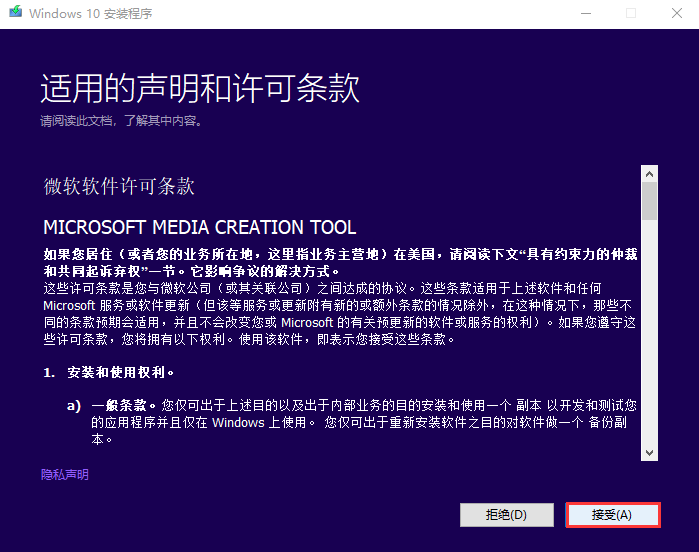

2.你猜猜制作**U盘启动盘**选哪个？

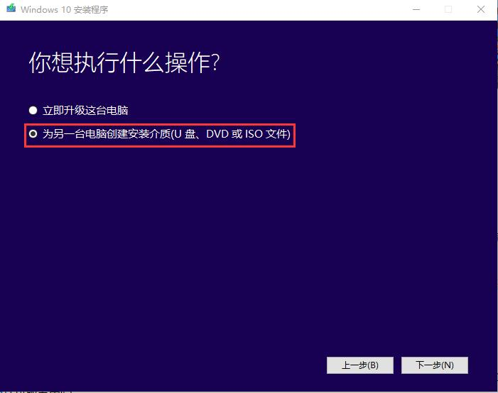

3.接下来，最重要的，打开版本，选择WIN10(家庭版也可以），如果没有特殊使用要求，请选择 **64位** （如果你是9102年还在使用**2G**以下内存的金丹强者，请忽略我刚才说的话）

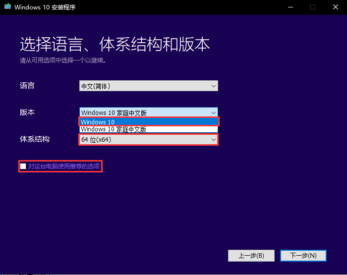

4.使用介质请果断选择 **U盘** ，
其实**ISO**也不是不能选，但我就是不让你选，你来咬我啊(*▔＾▔*)

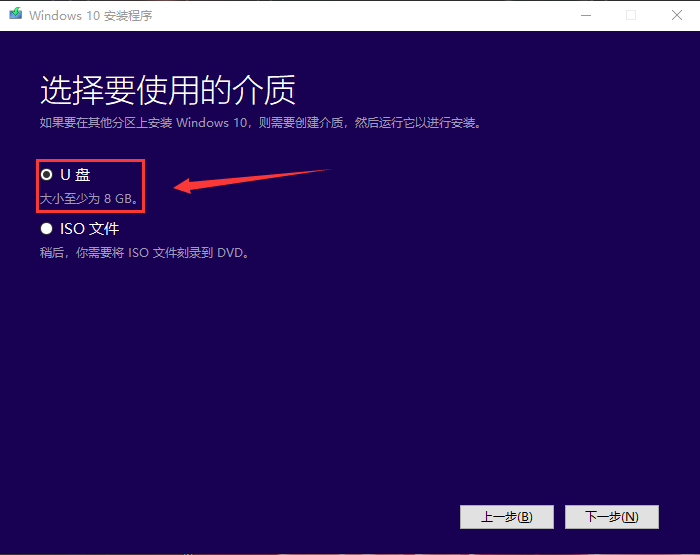

5.这时候，你就可以插上你的**U盘**了（插哪里？你看看哪里好插，然后大力出奇迹吧！）
这里我家境贫寒只插了一个U盘，你可能家财万贯，一口气插了10个，没有关系，闭着眼睛点一个，选中那个是哪个

**注意，进行此步骤时，请保证你的U盘是空U盘或者里面没有重要文件。**

## 制作系统安装盘要对U盘进行格式化，里面所有文件都会丢失！！！

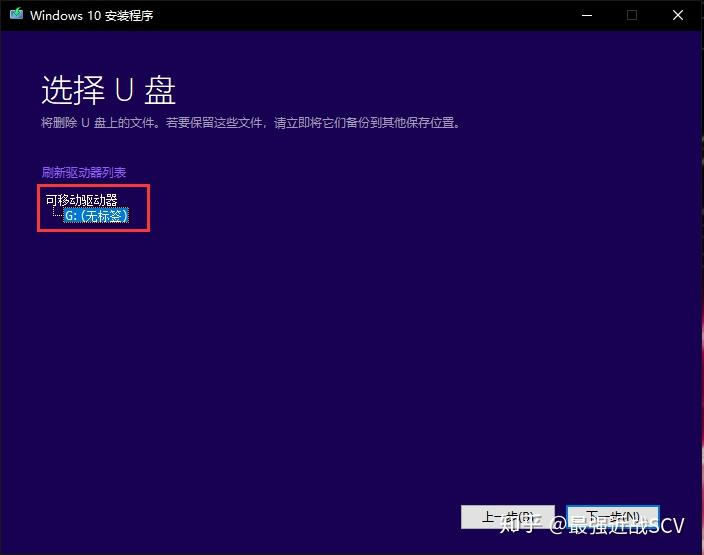

6.选完了U盘，就进入了**下载WIN10系统**的环节，
这是你个人的一小步，但你的电脑并不会因此长出脚来，所以不要鸡冻。
 **这一步的速度由你的网速决定** ，如果你是网吧用户，这时候就可以去过道转转看看有没有开挂的，好拖出去打一顿（划掉）
软件已经提示了，你可以继续使用电脑，丝毫不受影响，这时候，该拆机箱拆机箱，该偷内存偷内存（划掉）
**窃拉丁提醒您：上午偷内存，下午局里蹲**

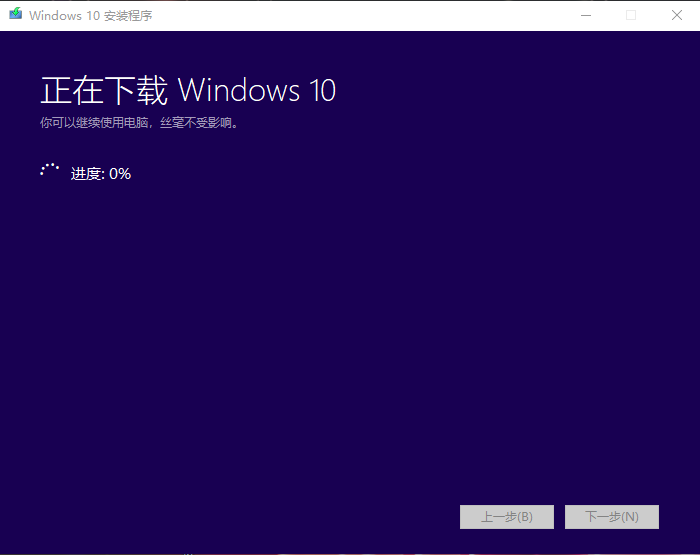

7.下载完成，会有个短暂的校验文件过程，接下来就开始向U盘写入
依然 **微软式吹牛** ，不受影响我可以把C盘格式化玩玩吗╮(╯▽╰)╭

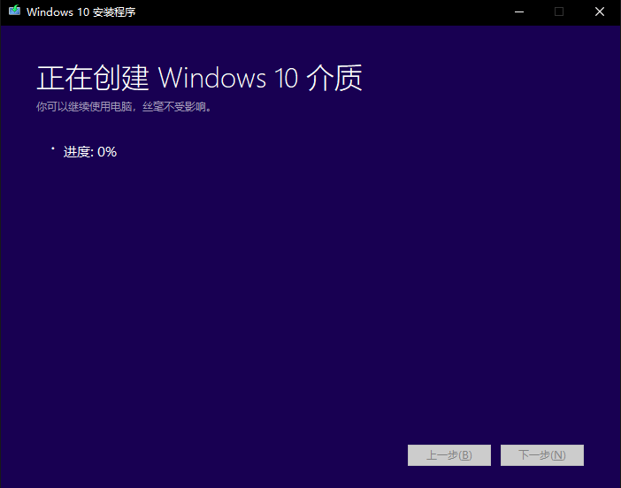

8.终于，你的努力没有白费，一块带着引导和系统的热乎乎的装机U盘，出炉了

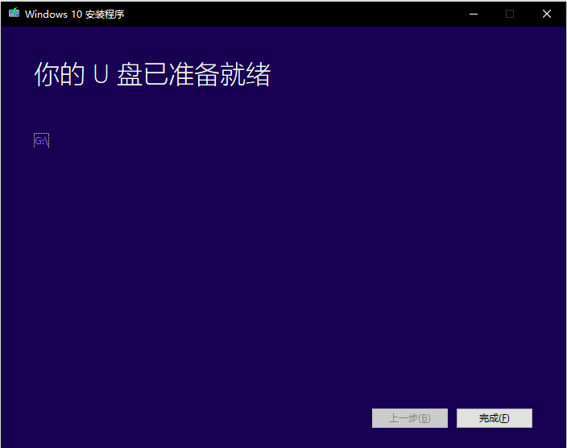

9.接下来，省心的微软会自行清理掉自己干活时留下的垃圾（手动@**360**大流氓**2345**小流氓）

10.最后，你的U盘就会出现这些东西请不要乱动

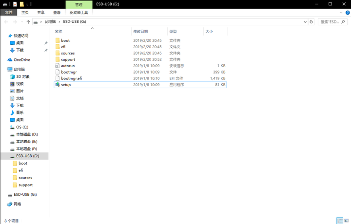

**系统启动盘教程到这里就结束了**

---

### 接下来，进行安装

---

首先，将 **U盘插入电脑** （最好是机箱背面**直连主板**的）USB接口中（不认识USB接口？那就找个能插的地方大力出奇迹）

接下来开机后，电脑就会进行以下对话
主板先问硬盘：系统在你这不？= =
硬盘：在我这里呦。 (●′ω`●)
主板不再啰嗦，直接进♂入♂硬盘，读取系统

 **但是！** 现在你既然要 **重装系统** ，那你肯定是不能再找**硬盘**要系统了
插上U盘之后，我们得**先教会**你那愚蠢的 **主板** ，先去问问**U盘**那里有没有
所以我们首先要做的就是，进入BIOS，**改为U盘启动**

---

在开机出现**品牌logo**的时候，按下对应的按键

（常用笔电品牌按键： **华硕/ROG：F2** ， **戴尔/AW:F12** ， **惠普:F10** ， **联想：F2** ）
其他品牌或台式可以**自行百度**如何进入（搜索关键词： **XXX笔记本/主板进入BIOS** ）

我是用家里的**华硕主板**的老PC和室友无辜的**戴尔本子**进行的实验，所以暂时按照华硕来（后续会努力**嫖**到暗影精灵和拯救者来补充教程的\(╯▼╰)/）
在这里疯狂 **按下F2** （啊快快快快！）

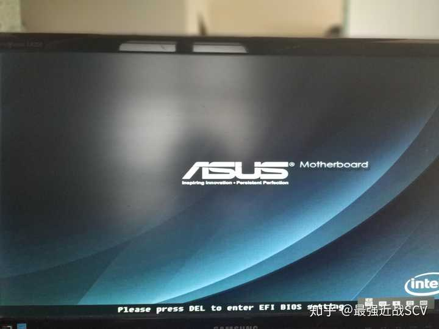

接下来进入了这个界面我们只需要用鼠标**拖动U盘到硬盘前方**

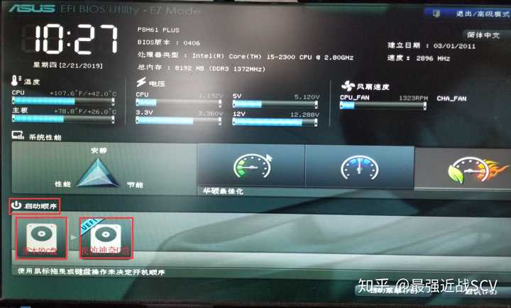

华硕的**图形界面**真的很友好，而戴尔则就。。。

我的U盘是从家里扒翻出来的老 **渣** (jin) **士** (shi) **顿** (dun)U盘，
而你的则可能叫任何名字，只要你能认出来就行
在这里，用键盘方向键**选中**我的 **U盘** 。 **F10保存退出** ，搞定。

而其他非图形界面的主板，则是使用这样的方法：
 **Advanced BIOS Features** （高级BIOS功能）→ **Hard Disk Boot Priority** （硬盘启动优先级）→**直接回车选择**或者用小键盘上**加号减号**把U盘移动到最上方

大概就是这个样子

接下来闭着眼睛也知道该**F10保存退出**了(～￣▽￣)～

如果你的电脑不属于以上任何一种，那么你可以去寻找一些关键词如： **BOOT（引导）** ， **Advanced（高级选项）** ， **Hard Disk Boot Priority（硬盘启动优先级）** ， **1st Drive（第一驱动器）** 之类的词汇，也会很快的找到如何设置。
如果你没找到，不用担心，万能的百度有着几乎 **全部型号的设置方法** ，你甚至还可以给**品牌客服打电话**询问如何进入。

这一步其实是最难说清楚的，所以我还是额外说明下吧
（字数太多看不下去，可以直接 **跳过此段不影响后面操作** ）

1. 虽然进入BIOS的方法花里胡哨，但是**保存退出**则几乎都 **统一为F10+回车保存退出** ， **ESC+回车不保存直接退出** ，如果你误动了自己不明觉厉的选项，可以ESC然后装作没事人一样退出。
2. 如果你真的是个小机灵鬼，把BIOS弄出问题，不要慌，PC平台有一记大招— **扣电池** ，只要拆开电脑扣下主板上所有的（一般就一块） **纽扣电池** ，等上**3分钟以上**再装回去，就成功恢复了 **出厂设置** ，不会再有什么问题了。笔记本嘛，啊哈哈哈哈，要不**找售后**帮个忙。。。养兵千日用兵一时嘛hhh。
3. 总之一般BIOS也动不出问题，尤其是笔记本，没啥可以让你调整的选项。自己会用百度和翻译基本上问题不大。

---

这时你的电脑进入了仿佛**重启**一般的样子（诶，好像就是重启哦= =）

待**品牌LOGO**呲楞一声闪过后
**转啊转啊**

进入了这个界面
其实选项都**默认**好了，如果没有，请选择你的语言，不过我寻思你都能看懂我这这么多汉字的攻略，你应该中文不错，所以就**默认中文**了。

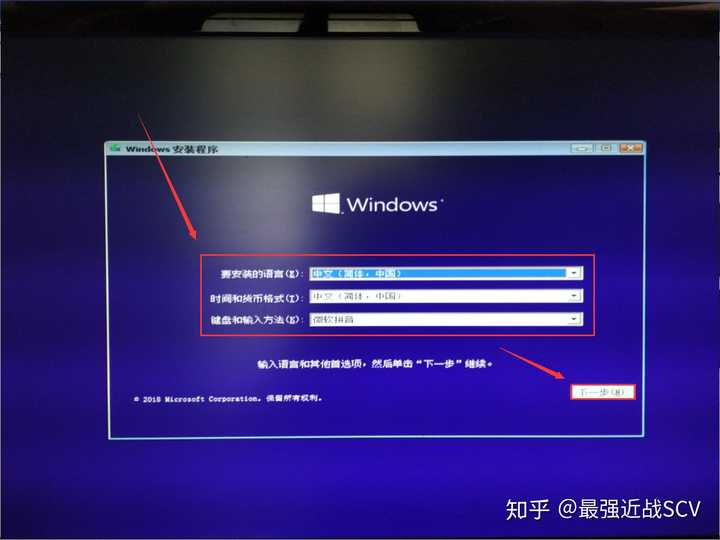

接下来，你陷入了沉思，诶！我是谁？我在哪？我要干什么？
屏幕中间的红圈把你拉回残酷的现实
哦，我是想**安装系统。**

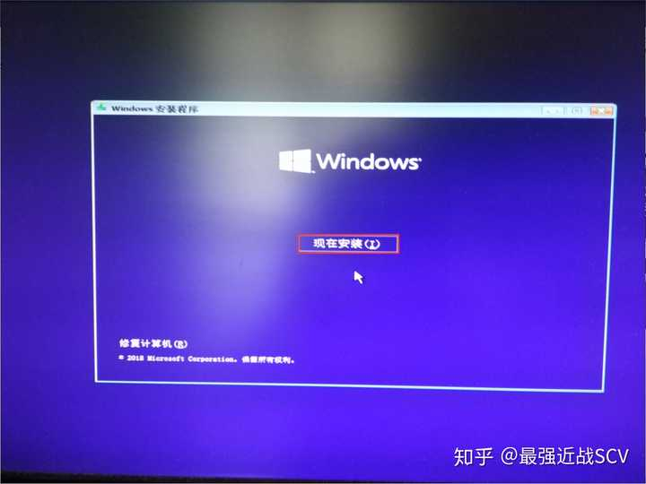

接下来，等待他启动

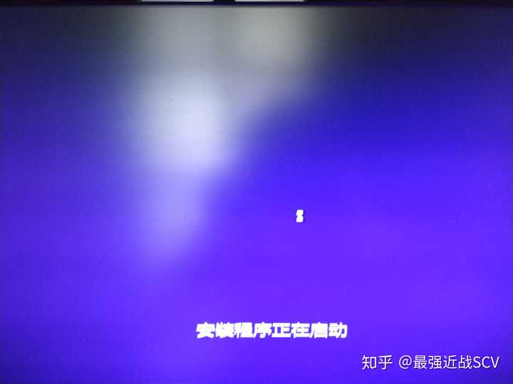

开玩乐，9102年了，谁还用激活码激活啊，就算激活我一会进去桌面再激活不更舒坦？请选择**我没有产品密钥**来跳过就可以了（你有密钥自然可以直接在这里用嗷）。

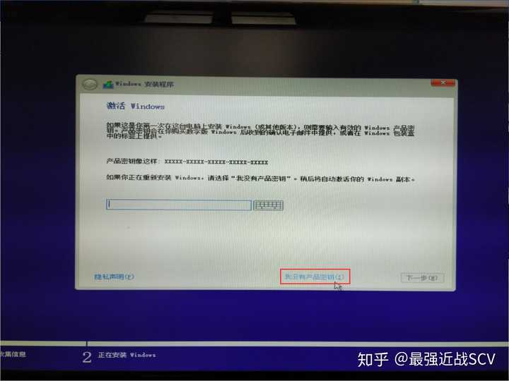

接下来，微软向你扔了一大串条款，请认真背诵考试要考（划掉），并**接受。**

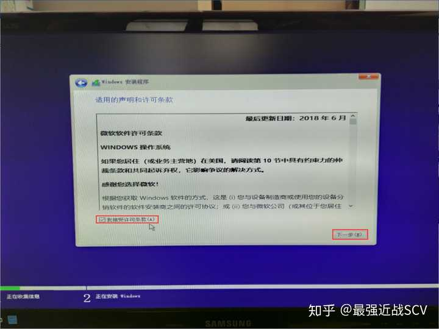

接下来，
请 **不要选择升级** ，因为这玩意BUG真是多，尤其是驱动相关，既然你已经下定了决心，想必已经做好了舍弃过去的C盘的想法，请 **选择仅安装** 。（什么？你C盘有重要文件还没转移？ **赶紧点叉回去用老系统或者PE转移啊，一会就没机会了！** ）

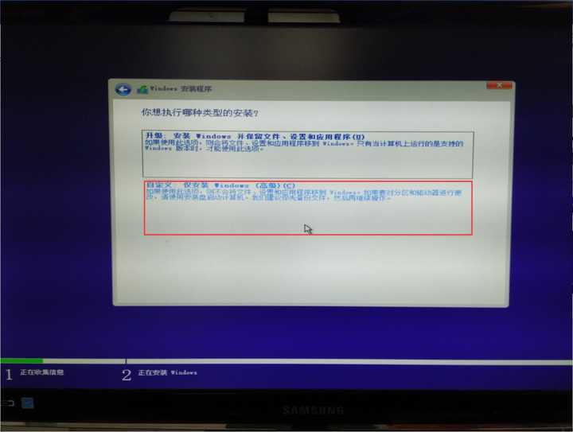

咳咳，敲黑板，接下来**划重点**

## **注意，下一步删除分区的操作会清空被删分区的一切数据**

我的电脑有两块 **现实中存在的硬盘（物理硬盘）** ，但是每个硬盘可以分为有很多不同的区域，也就是进入了系统之后所显示的C盘D盘E盘F盘。
他们可以**一个物理硬盘**分 **一个虚拟盘符** （比如我的固态硬盘就是电脑里面的 **C盘** ），也可以**一个物理硬盘**分出 **多个虚拟盘符** （如我的电脑**D盘E盘F盘**都在一块1024G的机械硬盘上，而每个盘符有300多G大小）。
除了系统中显示出来日常使用的盘符，还会有一些**很小**并且**系统中不显示**的分区，用来供系统偷偷干点什么（并不是干坏事昂(￣▽￣)）

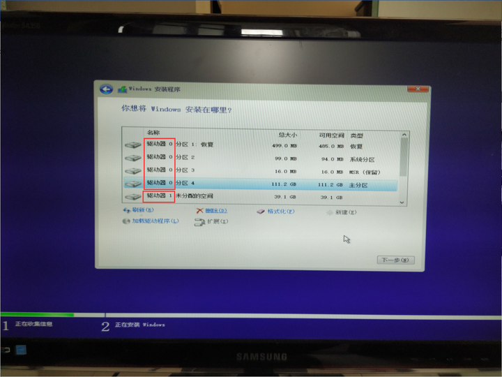

接下来，如果你也是一块固态一块机械的组合，请将固态硬盘驱动器中所有分区 **全部删除** ，只剩下一块很大的**未分配空间。**
只有一块机械硬盘，请将所有除了你电脑上显示出盘符（如C盘D盘这种的， **看大小就能识别出来** ）以外的分区 **全部删除** ，其他盘如果数据没啥用，也可以都删掉重新分区。
固态**推荐**只分一个盘符，机械硬盘尽量少分，每个盘符最好别小于250G。（小于250G倒是也没什么大问题）
删除完毕后可能不会立即显示出来，这时请手动点击一下**刷新**

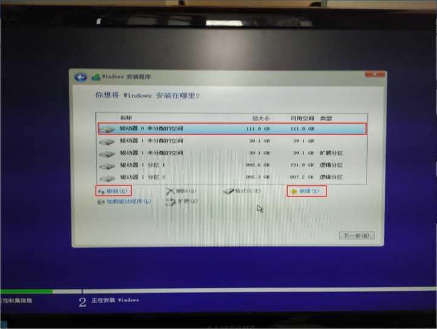

接下来选择你的固态硬盘的那一大块未分配空间，选择**新建**
一般会**默认全部使用**来作为C盘（会自动留下一点系统自己用的空间，不用担心）
建议就直接 **默认** ，固态硬盘不要分区
直接选择**应用**

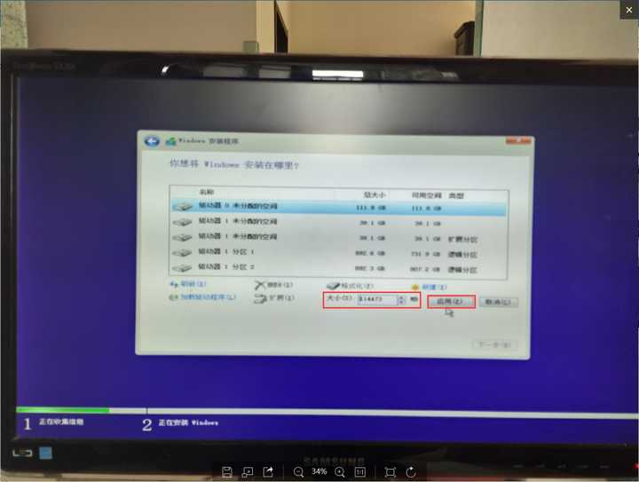

怕你摸不到头脑，windows还会贴心提醒你一声，
翻译成**人话**就是：**除了你C盘用的地方，我还得给自己再单独整点私人空间，你一会别又给我删了。你敢删，我就敢罢工(*▔＾▔*)哼！**
这时候请直接**确定**

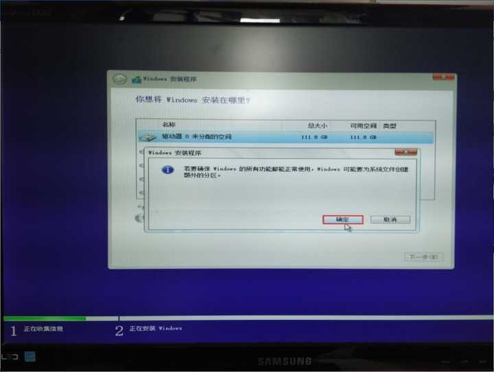

请选择 **最大的主分区** （也就是你C盘能看到的）作为系统安装的地方，之后选择**下一步**

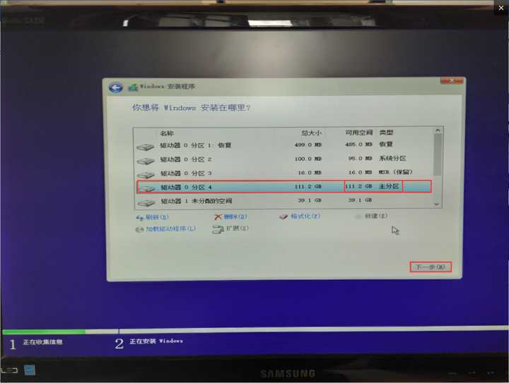

如果看到这个界面，恭喜你！已经 **度过了所有的的难关** ，只需要 **无脑下一步** ，甚至就算你不识字，也能顺利解决。（这时候如果**断电**可就前功尽弃了嗷）

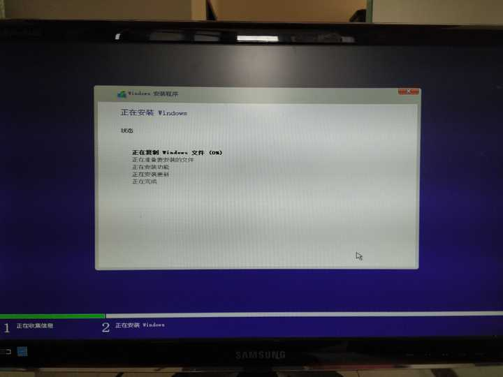

系统安装现在 **基本完毕** ，选不选择立即重启由你，反正我是不想再看这个傻乎乎的界面了

 **关机黑屏后，** 请以迅雷不及掩耳盗铃儿响叮当仁不让之势，**拔出U盘。**
接下来，等待+期待ing~~~

恭喜你！系统安装完毕，这是 **开机前最后的设置** 。
首先是喜闻乐见的不选不是中国人系列（大雾）

然后你是用拼音输入还是五笔输入？我估摸现在基本上只有**元老级电脑使用者**还在用五笔吧，反正我小学时上课会学，结果现在早就全忘干净了hhh。

这个跳过就可以， **一般人用不着** ，需要时从**设置**里随时还能再加

OK经过这一步我们终于顺利进入桌面
**系统安装圆满成功！欢庆撒花！**

---

## 如果开机后你的电脑少了其他盘

右键此电脑，管理，磁盘管理

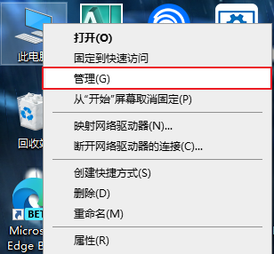

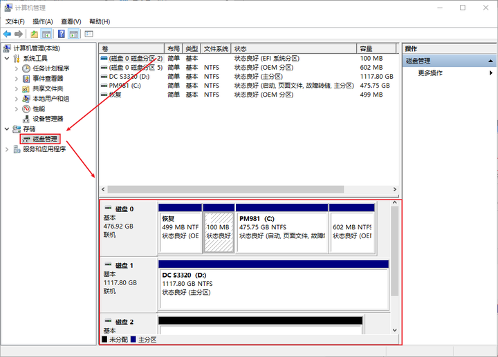

如果存在未分配空间

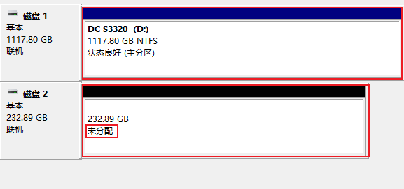

右键 **新建简单卷** ，然后一路确认就好了

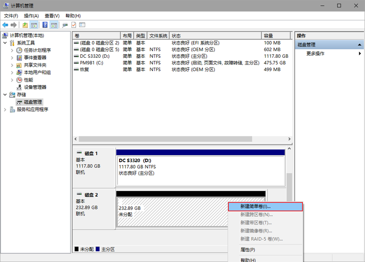
---

如果你是这样显示

可以看到，磁盘1有了盘符（驱动器号）而下方磁盘2没有

你只需要给他分配一个就OK了

右键这个磁盘，**更改驱动器号和路径**

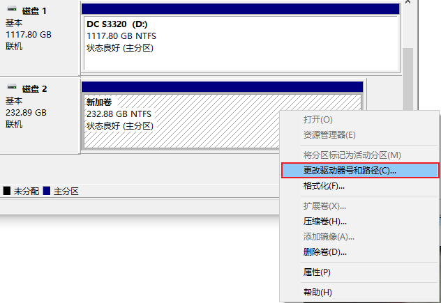

添加

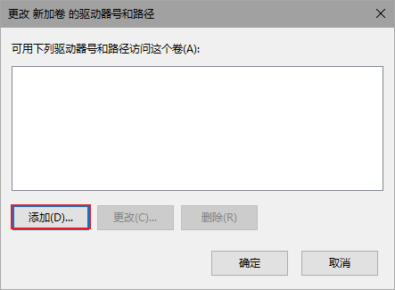

随便分一个你喜欢的字母

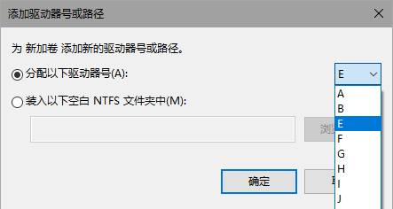

再进入此电脑，盘就出现辣

---

WIN10系统会**内置大部分有线网卡**的**驱动**和 **部分无线网卡驱动** （不过还是有不少无线网卡的驱动没有内置）一般你装好WIN10后，就可以**直接插上网线**或**连接WIFI上网。**
**少数**不在这个这个范围内的 **网卡** ，你就需要用一块U盘拷贝来这个网卡的 **驱动** （后面下载驱动部分会讲到从哪里下载） **手动安装** ，或者使用驱动/人生/管家/大师这类流氓软件（捂嘴）安装网卡驱动， **仅限网卡驱动！！！安装后立即卸载！** 其他驱动使用这些软件安装**很容易翻车！**

接下来看着桌面右下角的水印，是不是感觉浑身难受？
如果你是笔记本电脑，装的系统版本也和出厂时 **预装的版本相同** （一般是 **家庭版** ）开机一会/联网一会后，系统会**自动读取主板**上厂家提前放好的激活码， **自动激活** 。
你就可以快快乐乐的使用你的正版系统辣！

电脑没自动激活？手动激活哇。

怎么激活？佛曰：不可说不可说。

---
>笔记本安装好系统后进－更新与安全－Windows更新－点击 检查更新，然后就会帮你下载那些驱动，不用去其他地方下

接下来就是 **驱动下载安装** ，你想想，你以后用电脑的时间长着呢，自己**手动安装官方驱动**多花点时间，总比现在**一键安装**以后**小毛病不断**要好吧。

1. 搜索：你的电脑**品牌官网**

大概就长这个样子

2.找到带有**支持**字样的选项

3.进入之后根据官网提示，下载你的**对应型号**的**驱动程序**
值得一提的是，像华硕戴尔这类厂商，会提供 **驱动下载工具** ，安装之后会**自动识别电脑型号**进行驱动下载安装。
大概就长这个样子，直接全选下载就可以把电脑扔那里自己该干啥干啥去了

如果你没有，或者不会装，那也没关系，一个一个下载安装就好了，值得一提的是，一个组件驱动可能有很多版本，挑选**最新版**下载安装就好了。

像是显卡一类的常见驱动，只需要联网一段时间，就会自动安装完毕，如果你等不及，可以直接从品牌官网下载或者去英伟达官网下载。

**特别提醒！！！**
**笔记本电脑**WIN10，预装了**1809版本**及以后版本，普通exe驱动无法安装（微软强制喂shit），下载安装请选择 **DCH版本** （普通版本披上**UWP**的皮），以后升级只能使用geforce experience或者Windows的自动更新

英伟达驱动还分为**桌面端**和 **移动端** ，
带有 **（notebooks）** 的是**笔记本电脑**的驱动，请注意区分。

装好驱动之后，你的电脑算是**完美安装**完毕（没有任何第三方经手，100%纯血**纯净版**哦！）
已经可以拿来正常使用了！
