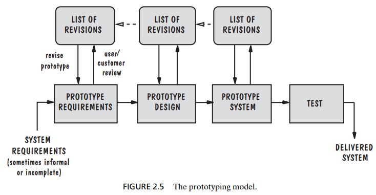
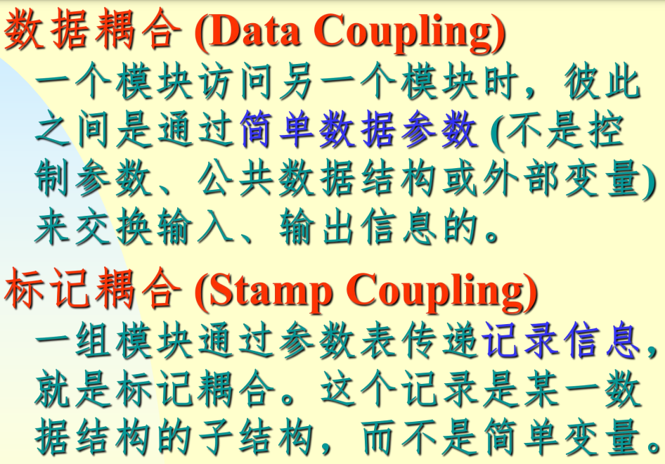
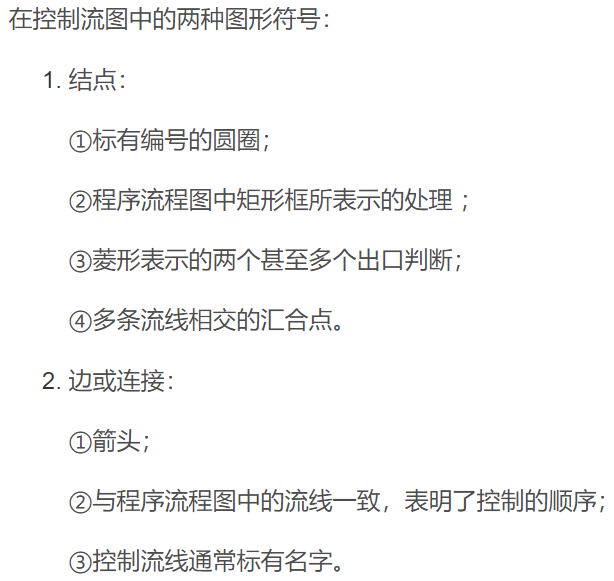

# 《Software Engineering Theory and Practice》（第四版）


# 目录
1. Why Software Engineering?

   为什么选择软件工程？
2. Modeling the Process and Life Cycle

   流程和生命周期建模
3. Planning and Managing the Project

   项目的规划和管理
4. Capturing the Requirements

   捕捉需求
5. Designing the Architecture

   设计架构
6. Designing the Modules

   模块设计
7. Writing the Programs

   编写程序
8. Testing the Programs

   测试程序
9.  Testing the System
   
      测试系统
10. Delivering the System

      交付系统
11. Maintaining the System

      系统维护
12. Evaluating Products, Processes, and Resources

      评估产品、流程和资源
13. Improving Predictions, Products, Processes, and Resources

      改进预测、产品、流程和资源
14. The Future of Software Engineering

      软件工程的未来

```
1. 为什么选择软件工程？
2. 流程和生命周期建模
3. 项目的规划和管理
4. 捕捉需求
5. 设计架构
6. 模块设计
7. 编写程序
8. 测试程序
9. 测试系统
10. 交付系统
11. 系统维护
12. 评估产品、流程和资源
13. 改进预测、产品、流程和资源
14.软件工程的未来
```

# 此书主要内容的概述：

1. 软件工程基础

- 介绍软件工程的基本概念、历史和重要性。
- 讨论软件生命周期、软件过程模型（如瀑布模型、迭代模型、敏捷模型）。

2. 需求工程

- 探讨如何收集、分析、规范化和验证软件需求。
包括用户需求、系统需求和软件需求规格的概念。
设计与实现

- 涉及软件设计的原则、方法和模式。
讨论面向对象设计、模块化、API设计等。

3. 测试与维护

- 介绍软件测试的各种技术和策略，包括单元测试、集成测试、系统测试和验收测试。
- 讨论软件维护的重要性和挑战，包括错误修复、功能增强和性能优化。

4. 项目管理

- 探讨软件项目管理的基本概念，如项目计划、风险管理、进度估计和成本估计。
- 介绍敏捷方法和传统项目管理方法之间的比较。

5. 软件质量

- 讨论软件质量保证的方法，包括代码审查、静态分析、度量和测试。
- 探讨软件质量标准和模型，如ISO/IEC质量模型。

6. 软件工程专业实践

- 介绍软件工程师应遵循的职业道德和法律规定。
- 讨论案例研究和实际软件项目的应用。

7. 新兴话题

- 包括对当前软件工程领域的新兴技术和趋势的讨论，如云计算、移动应用开发、大数据和物联网。

这本书不仅提供了软件工程领域的全面覆盖，还强调了理论与实践之间的联系，通过案例研究和现实世界的例子来展示概念的应用。此外，作者还讨论了软件工程作为一个不断发展的领域，关注新技术和方法如何影响软件开发实践。
# Software Process Models 软件过程模型

## Waterfall Model 瀑布模型
  

## V Model V型模型
  

## Prototyping Model 原型模型
  

## Operational Specification Model 操作规范模型
  

## Transformational Model 转型模式
  

## Phased Development Model 分阶段开发模型
  

## Incremental and Iterative Model 增量和迭代模型（增量模型）
  

## Spiral Model 螺旋模型
  

# software life cycle 软件生命周期
When the process involves the building of some product, we sometimes refer to the process as a life cycle. Thus, the software development process is sometimes called the **software life cycle**, because it describes the life of a software product from its conception to its implementation, delivery, use, and maintenance.
/当流程涉及某些产品的构建时，我们有时将流程称为生命周期。 因此，软件开发过程有时称为软件生命周期，因为它描述了软件产品从构思到实现、交付、使用和维护的生命周期。

# 耦合内聚的各个层次

一般采用两个准测度量模块独立性。即模块间的耦合和模块内聚。

  
软件工程中的耦合与内聚是衡量软件设计质量的两个重要概念。理解这两个概念对于设计高质量、易于维护和扩展的软件系统至关重要。

### 耦合（Coupling）

>非直接、数据、标记、控制、外部、公共、内容
>
>（非直接数据标记、控制外部内容）
>
>“飞速标控外公累”

  
- **内容耦合（Content Coupling）**: 最高级别的耦合。一个模块直接访问或修改另一个模块的内容。
- **公共耦合（Common Coupling）**: 两个或多个模块共享全局数据。当全局数据发生变化时，所有依赖这些数据的模块都可能受到影响。
- **外部耦合（External Coupling）**: 模块依赖于外部环境的因素，比如文件格式、通信协议等。
- **控制耦合（Control Coupling）**: 一个模块控制另一个模块的逻辑流程，例如通过传递控制参数。
- **标记耦合（Stamp Coupling）**: 模块之间共享数据结构（如结构体、类），但不使用所有数据。
- **数据耦合（Data Coupling）**: 最低级别的耦合。模块之间仅通过参数（基本类型）传递信息，不需要了解对方的内部工作。

### 内聚（Cohesion）

>功能、信息、通信、过程、时间、逻辑、巧合
>
>（功能信息、通信过程、时间逻辑、巧合）
>
>“公信通过实螺巧”

  

- **巧合内聚（Coincidental Cohesion）**: 模块的各个部分之间没有明显的关系。
- **逻辑内聚（Logical Cohesion）**: 模块中的元素相关，因为它们逻辑上类似，通常通过一个控制语句（如if-else）调用。
- **时间内聚（Temporal Cohesion）**: 模块中的操作在时间上紧密相关，比如初始化操作。
- **过程内聚（Procedural Cohesion）**: 模块中的元素协同完成某个任务，按特定的顺序执行。
- **通信内聚（Communication Cohesion）**: 模块中的操作处理同一数据集上的不同部分。
- **功能内聚（Functional Cohesion）**: 最高级别的内聚。模块中所有的功能元素都是为了完成一个单一的、定义明确的任务。

理想的软件设计是致力于最小化耦合（尤其是避免内容耦合和公共耦合）和最大化内聚（尤其是功能内聚）。这样的设计有助于提高代码的可维护性、可读性和可扩展性。

## 耦合层次

  
  
  
  
  
  
  
## 内聚层次

  
  
  
  
  
  
  
  
  
  

# 需求，设计的概念
在软件工程中，需求和设计是软件开发生命周期中的两个关键阶段，它们对于构建成功的软件系统至关重要。下面详细解释这两个概念：

### 需求（Requirements）

需求是对软件系统所期望功能和限制的正式陈述。它们是项目开发的基础，并指导整个软件开发过程。需求可以分为几种类型：

1. **功能性需求（Functional Requirements）**: 描述系统应该执行的具体功能，例如用户登录、数据处理、报告生成等。
2. **非功能性需求（Non-functional Requirements）**: 描述系统的性能和质量属性，如可靠性、可用性、性能、安全性和兼容性等。
3. **业务需求（Business Requirements）**: 描述了项目背后的业务目标，如市场需求、客户问题、法律要求等。
4. **用户需求（User Requirements）**: 从用户的角度描述系统应该提供的功能和服务。
5. **系统需求（System Requirements）**: 描述了实现用户需求所需的高级系统功能。

需求收集和分析通常涉及与利益相关者的交流，如客户、用户和其他项目成员。

### 设计（Design）

设计是指规划解决方案的过程，以满足已经定义的需求。设计阶段涉及决定系统的架构、组件、接口和其他特性。设计可以分为两个主要层面：

1. **概念设计或高级设计（Conceptual or High-level Design）**: 在这一阶段，定义了软件的总体结构和它的主要组件以及它们之间的关系。这包括系统的架构设计、数据流程、整体的服务架构等。
2. **详细设计或低级设计（Detailed or Low-level Design）**: 这一阶段详细规定了每个系统组件的具体实现。它包括具体的算法、类设计、数据结构、接口设计等。

设计阶段的产出通常是设计文档，包括架构图、类图、序列图、数据库设计等，为编码阶段提供指导。

### 需求与设计的关系

需求是设计的基础；设计是为了满足这些需求。需求定义了“做什么”，而设计定义了“怎么做”。一个成功的软件项目需要明确、完整的需求和一个经过良好思考的设计方案。如果需求分析做得不充分，设计阶段可能会遇到问题，导致项目成本和时间的增加。同样，一个良好的设计可以确保需求得到有效实现，并为未来的维护和扩展打下良好基础。

# 关键路径
关键路径方法（Critical Path Method, CPM）是一种项目管理技术，用于安排和控制复杂项目中的任务。它帮助项目经理确定项目的最短完成时间和哪些活动是对完成时间影响最大的关键活动。理解和应用关键路径方法是有效管理大型项目的关键。

### 步骤

1. **定义活动**: 列出项目中所有必需的活动。

2. **确定依赖关系**: 确定活动之间的依赖关系。即，哪些活动必须在其他活动开始之前完成。

3. **估算活动持续时间**: 为每个活动估算所需时间。

4. **创建网络图**: 利用活动和依赖关系创建项目网络图。这可以是一个箭头图（AOA, Activity-on-Arrow）或节点图（AON, Activity-on-Node）。

5. **确定关键路径**: 计算各路径的持续时间，最长的路径即为关键路径。关键路径上的活动是关键活动，它们决定了项目的最短完成时间。任何关键路径上活动的延迟都会直接影响整个项目的完成日期。

6. **计算浮动时间**: 对于非关键活动，计算浮动时间（也称为松弛时间），即活动可以延迟的时间而不影响项目总时间。

### 重要概念

- **最早开始时间（Earliest Start Time, EST）**: 在不延迟整个项目的情况下，活动可以开始的最早时间点。
- **最晚开始时间（Latest Start Time, LST）**: 活动必须开始的最晚时间点，以免延迟整个项目。
- **最早完成时间（Earliest Finish Time, EFT）**: 活动可以完成的最早时间点。
- **最晚完成时间（Latest Finish Time, LFT）**: 活动必须完成的最晚时间点，以免延迟整个项目。
- **浮动时间（Float）**: 活动可以延迟的时间而不影响整个项目的完成时间。

### 重要性

关键路径方法是项目管理中的核心工具，它帮助项目经理：

- 确定项目的最短完成时间。
- 识别项目的关键活动。
- 管理资源和时间分配。
- 预测项目时间表中的潜在延误。
- 优化和调整项目计划。

通过有效应用关键路径方法，项目经理可以更好地控制项目时间表和资源分配，提高项目管理的效率和成功率。

# 用例图

用例图（Use Case Diagram）是一种在软件工程和系统设计中广泛使用的UML（统一建模语言）图表。它帮助开发者和利益相关者理解系统的功能需求，并且展示了系统与外部实体（如用户或其他系统）的交互。用例图对于捕获系统功能性需求是非常有用的。

### 基本组成元素

1. **用例（Use Cases）**: 用例表示系统能够执行的一项功能或任务。它通常是用户可以执行的动作，例如“查看账户余额”、“注册账户”等。在用例图中，它被表示为一个椭圆。

2. **参与者（Actors）**: 参与者代表与系统交互的外部实体，可以是人（例如用户、管理员）或其他系统。在用例图中，参与者通常被表示为小人图形。

3. **关系（Relationships）**: 描述用例和参与者之间的交互。主要有以下几种类型：
   - **关联（Association）**: 直接的交互线，表示参与者参与了某个用例。
   - **包含（Include）**: 用例图中的“include”关系表示一个用例（基础用例）总是包含另一个用例（附加用例）的行为。
   - **扩展（Extend）**: 用例图中的“extend”关系表示在某些条件下，一个用例（扩展用例）可以扩展另一个用例（基础用例）的行为。
   - **泛化（Generalization）**: 主要用于参与者，表示一般化和特殊化的关系。

### 创建用例图的步骤

1. **识别参与者**: 确定谁将与系统交互。这些可以是用户、外部系统或外部硬件设备。

2. **定义用例**: 确定系统需要支持的功能。每个用例应描述一个主要的业务目标或功能。

3. **建立关系**: 确定参与者与用例之间的关系，以及用例之间可能的包含或扩展关系。

4. **绘制用例图**: 使用标准的UML符号绘制用例图。保持图表简洁且易于理解。

5. **复审和完善**: 与利益相关者一起复审用例图，确保所有重要的用户交互都被捕获，并根据反馈进行调整。

### 注意事项

- 用例应该是用户目标导向的，避免过于技术化或专注于内部实现。
- 用例图应该是高层次的，不要涉及太多细节。
- 用例名称应清晰、具体，能够传达用例的目的。

用例图是一个有力的工具，可以帮助团队清晰地理解系统的功能需求和用户交互，是早期需求收集和分析阶段的重要组成部分。

# 流程图

有两种：程序流程图、系统流程图。

流程图是一种广泛用于展示流程或系统中各步骤的图形化表示方式。它们在业务流程分析、程序设计、数据流管理等领域都非常有用。流程图通过一系列的图形和箭头来描述过程中的步骤、决策点和输出。

### 流程图的基本符号

1. **开始/结束（Oval）**: 用椭圆或圆形表示，标志流程的开始和结束。
2. **步骤/操作（Rectangle）**: 用矩形表示，显示流程中的一个主要步骤。
3. **决策（Diamond）**: 用菱形表示，显示流程中的决策点，通常包含一个“是/否”或“真/假”的问题。
4. **数据（Parallelogram）**: 用平行四边形表示，表示流程中的输入或输出。
5. **流程线（Arrows）**: 用箭头表示，显示流程中的方向或流程顺序。
6. **文档（Document）**: 用类似波浪形的矩形表示，显示流程中涉及到的文档。
7. **预定义过程（Predefined Process）**: 用矩形表示，边角带有双线，表示流程中调用的已定义过程或子程序。
8. **注释（Annotation）**: 用带有一条斜线的开放矩形表示，提供流程图的附加信息。

### 创建流程图的步骤

1. **确定目的**: 确定你希望流程图达到的目的或描述的过程。

2. **收集和分析信息**: 收集有关该流程的所有必要信息，包括步骤、参与者和决策点。

3. **定义流程的开始和结束点**: 明确流程的起始点和结束点。

4. **列出主要步骤**: 识别并列出流程中的所有主要步骤。

5. **使用符号绘制流程图**: 根据每个步骤和决策点选择合适的符号，使用箭头连接这些符号，表示流程的方向。

6. **检查流程**: 审查流程图以确保它准确地反映了流程，并且是逻辑上连贯的。

7. **审阅和改进**: 与团队成员或流程的参与者一起审阅流程图，以验证其准确性并进行必要的改进。

### 注意事项

- **保持简单**: 流程图应简洁明了，避免不必要的复杂性。
- **一致性**: 在整个流程图中保持符号和格式的一致性。
- **清晰的方向流**: 确保流程图中的流向是清晰和一致的。
- **有效的标注**: 在需要时添加注释和描述，以便他人理解。

流程图是理解和分析流程的有力工具，能够帮助团队和个人可视化复杂过程，并作为沟通和改进流程的基础。


# 盒图/N-S图
  

  


# +++++程序流程图

也称程序框图，程序流程图使用的5种基本控制结构是：

  

## 画图用符号
  


# +++++基本路径测试法

基本路径测试（Basic Path Testing）是一种软件测试技术，它用于确保测试用例覆盖了软件程序中的所有可能路径。这种方法是由华特斯（Watson）和麦卡布（McCabe）于1976年提出的，主要基于程序的控制流图（CFG）来识别程序中所有可能的执行路径。这种方法的核心是计算程序的圈复杂度（Cyclomatic Complexity），一个衡量程序复杂性的指标。

  

## 基本路径测试的步骤
  

1. **绘制控制流图（CFG）**: 首先，你需要将程序的源代码转换成控制流图。这个图表展示了程序中所有可能的控制流路径。在这个图中，每个节点代表程序中的一个基本块（一组顺序执行的语句），边代表程序的控制流。

2. **计算圈复杂度**: 圈复杂度是一个度量软件程序复杂性的数值，它定义为：

    V(G) = E - N + 2P 

   其中， V(G) 是圈复杂度，E 是图中的边数， N 是图中的节点数， P  是连通分支的数量（对于大多数程序，P = 1）。
   >所有方法如截图所示
   >  


   圈复杂度提供了测试用例数量的上限，以确保每个可能的路径至少被执行一次。

3. **识别独立路径**: 基于控制流图，识别所有的独立路径。独立路径是那些至少包含一个新边的路径，它们不能通过其他路径的组合来形成。

4. **设计测试用例**: 对每个独立路径设计测试用例，确保每个路径都被执行。

5. **执行测试**: 运行设计的测试用例，并观察程序的行为是否符合预期。


优点：
- 提高了代码覆盖率。
- 发现程序中的逻辑错误。
- 确保了测试的全面性。

缺点：

- 对于具有高圈复杂度的程序，可能需要大量的测试用例。
- 并不总是能发现所有类型的错误，例如性能问题或并发相关的错误。

基本路径测试主要适用于单元测试阶段，在这个阶段中，重点是验证程序的内部逻辑。尽管这种方法可能无法覆盖程序的所有方面，但它是确保代码质量的一个重要工具。

## 怎么画出控制流图（由程序流程图简化）
流程图是用来描述程序控制结构的

  
  
  

## 例题
  
  

  

  

  
  
  

# +++++流程图和控制流图有什么区别

流程图（Flow Chart）和控制流图（CFG）都是用于表示软件程序的结构的图表工具，但它们的焦点和细节层次有所不同。以下是它们之间的主要区别：

### 程序流程图

1. **焦点**: 程序流程图主要关注程序的操作流程和步骤序列。它强调的是程序执行的逻辑顺序。

2. **内容**: 包括程序的每个步骤，如输入、输出、计算、条件判断和循环等。

3. **用途**: 流程图适用于描述算法的逻辑，展示程序的整体结构和流程。它对于理解程序的操作和决策流程很有帮助。

4. **符号**: 使用标准的流程图符号，如矩形（代表处理步骤）、菱形（代表决策点）、箭头（代表流向）等。

5. **例子**:
   ```
       开始
        |
     输入数据
        |
     处理数据
        |
     条件判断
      /   \
     是    否
     |     |
    输出A 输出B
      \   /
       结束
   ```

### 控制流图（CFG）

1. **焦点**: 控制流图更注重程序内部的控制结构，即程序中的执行路径和控制点。

2. **内容**: 描述程序中的基本块（执行序列不包含跳转）和这些基本块之间的控制流关系。

3. **用途**: CFG主要用于软件测试（特别是路径测试）、程序分析和优化。它有助于确定程序的所有可能执行路径，用于复杂度分析和测试用例的生成。

4. **符号**: 使用较为简单的节点和边来表示。节点代表程序中的一个基本块，边代表控制流。

5. **例子**:
   ```
        开始
         |
     [输入数据]
         |
     [处理数据]
         |
     [条件判断]
       /   \
   [输出A] [输出B]
    \   /
    [结束]
   ```

### 总结

- **程序流程图**: 更多关注于“做什么”，用于展示程序操作的高层视图。
- **控制流图**: 更多关注于“怎么做”，用于深入分析程序的控制结构和路径。

两者都是重要的工具，可以帮助开发人员和分析师以图形化的方式理解和展示程序的结构。不过，它们服务于不同的目的和受众。

# 软件测试技术

## 两种常用的测试方法：黑盒测试、白盒测试

### 黑盒测试
又叫功能测试或数据驱动测试

### 白盒测试
又叫结构测试或逻辑驱动测试

## 基本路径测试（程序控制流图CFG）

### 程序控制流图CFG，Control Flow Graph

绘制程序的控制流图（CFG，Control Flow Graph）是基本路径测试的一个关键步骤。控制流图是一种图形表示，显示了程序中所有可能的执行路径。以下是绘制控制流图的一般步骤：

### 1. 理解代码逻辑

在绘制控制流图之前，你需要彻底理解代码的逻辑。这包括对所有的决策点（如if-else语句、循环、case语句等）和程序执行的可能路径有一个清晰的认识。

### 2. 确定节点

在控制流图中，节点代表程序中的一个语句或一组语句（基本块）。基本块是一个没有任何跳转语句（如goto, break, return等）的代码序列，也没有跳转到它中间的代码。

- **开始节点**: 代表程序的起点。
- **结束节点**: 代表程序的终点。
- **决策节点**: 对应于决策点，如if、while、for、switch等语句。

### 3. 确定边

图中的边代表程序的控制流。从一个节点到另一个节点的边表示程序执行的流向。

- 在顺序执行的语句之间画线。
- 在决策节点后根据条件的真假画出两条或多条流向不同节点的线。
- 对于循环结构，确保从循环体回到循环开始的地方的反向边。

### 4. 处理循环和分支

对于循环（如while、for循环），确保控制流可以在满足循环条件的情况下循环回到循环的开始，也可以在不满足循环条件时跳出循环。

对于if-else结构，要展示两个路径：一个对应于条件为真时的执行路径，另一个对应于条件为假时的路径。

### 5. 绘制图形

使用标准的流程图符号开始绘制控制流图。可以手动绘制，也可以使用各种软件工具。

### 6. 审查和优化

完成控制流图后，审查以确保它准确地反映了代码的控制流。确保图中包含了所有可能的路径，没有遗漏或错误。

### 示例

假设有以下简单的伪代码：

```pseudo
start
read x
if x > 0 then
    print "x is positive"
else
    print "x is non-positive"
endif
stop
```

为这段代码绘制的控制流图将有如下节点：

- 开始节点
- 读取x的节点
- 判断x > 0的决策节点
- 打印"x is positive"的节点
- 打印"x is non-positive"的节点
- 结束节点

以及连接这些节点的边，表示程序的流程。

控制流图的绘制可以在纸上手动完成，也可以使用各种绘图软件，如Microsoft Visio、Lucidchart、Draw.io等。重要的是要确保图形准确地反映了程序的逻辑结构。

-------------

当然，我会用一个简单的例子来说明如何绘制控制流图（CFG）。假设我们有一个非常基础的程序，它包含一些条件判断和循环。以下是这个程序的伪代码：

```plaintext
开始
输入 a
如果 a > 10
   输出 "a 大于 10"
否则
   输出 "a 小于等于 10"
结束
```

为了绘制这个程序的控制流图，我们需要按照以下步骤操作：

### 1. 识别节点

首先，我们要识别程序中的关键节点。在我们的示例中，关键节点包括：

- 开始（程序开始）
- 输入 a（输入操作）
- 判断 a > 10（条件判断）
- 输出 "a 大于 10"（条件为真时的输出）
- 输出 "a 小于等于 10"（条件为假时的输出）
- 结束（程序结束）

### 2. 绘制节点和流程

现在，我们将这些节点按照程序的流程顺序排列，并用箭头连接它们，表示程序的执行顺序。

1. **开始节点**：画一个椭圆，里面写“开始”。
2. **输入节点**：画一个矩形，连接到开始节点，里面写“输入 a”。
3. **决策节点**：画一个菱形，连接到输入节点，里面写“a > 10？”。
4. **输出节点**：从决策节点引出两条线：
   - 一条连接到一个新的矩形，写上“输出 'a 大于 10'”，表示当条件为真时的路径。
   - 另一条连接到另一个新的矩形，写上“输出 'a 小于等于 10'”，表示当条件为假时的路径。
5. **结束节点**：最后，两个输出节点都连接到一个椭圆形的结束节点，里面写“结束”。


### 完成的控制流图

这样，你就得到了一个简单的控制流图，它展示了你的程序从开始到结束的所有可能路径。这个图会类似于这样：

```
开始
  |
输入 a
  |
a > 10？
 /  \
|    |
是   否
|    |
输出 输出
'a > 10' 'a <= 10'
  \  /
   结束
```

每个箭头都表示程序的流程方向。这个控制流图帮助我们理解程序在不同条件下的行为，并确保我们考虑到了所有可能的执行路径。


# 状态转换图STD
  
  


# gpt出的模拟考卷

根据《Software Engineering: Theory and Practice》（第四版）的内容，我可以为您设计一张期末考试试卷。考试可以包括多种类型的问题，如选择题、填空题、简答题和案例分析题，以全面评估学生对软件工程知识的掌握情况。

### 一、选择题（每题2分，共20分）
1. 软件工程的主要目的是什么？
   A. 编程 B. 测试 C. 维护 D. 开发高质量软件
>D
>
>选项 A（迭代）和 B（灵活）更多地描述了敏捷开发模型的特点，D（用户参与）虽然在所有软件开发模型中都很重要，但并不是瀑布模型的一个特定特点。

2. 在软件过程模型中，瀑布模型的主要特点是什么？
   A. 迭代 B. 灵活 C. 顺序严格 D. 用户参与
>C

3. 在需求工程中，哪项不是需求收集的方法？
   A. 访谈 B. 问卷 C. 编程 D. 观察
>C

4. 面向对象设计中，封装的主要目的是什么？
   A. 增强安全性 B. 提高效率 C. 简化代码 D. 引入多态
>A
>
>封装是面向对象编程（OOP）的一个核心概念，它涉及将数据（属性）和操作这些数据的代码（方法）捆绑到单个单元或对象中，并对对象的实际实现细节进行隐藏。下面是封装的主要目的和优势：
>
>1. 增强安全性：通过隐藏对象的内部状态和只允许通过定义好的接口（即公共方法）来访问和修改这些状态，封装有助于防止外部代码直接访问对象的内部表示，从而提高了数据的安全性和完整性。
>
>2. 简化接口：封装使得对象的使用者不需要了解对象内部的复杂性，只需关注它提供的公共接口。这简化了代码间的交互，并提高了可用性。
>
>3. 减少代码重复：通过将功能封装在方法内，可以避免在多个地方重复相同的代码。
>
>4. 易于修改和维护：封装使得开发者可以独立地修改内部实现，而不影响其他部分的代码。这种模块化设计提高了代码的可维护性。
>
>而其他选项：
>
>B. 提高效率：这并非封装的主要目的。虽然良好的封装可以间接提高开发效率，但它并不直接关注性能优化。
>C. 简化代码：尽管封装有助于简化对外的接口，但它的主要目的是保护对象的内部状态，而不是简化代码本身。
>D. 引入多态：多态是另一个OOP概念，与封装不同，它允许对象以不同的形式表现（比如，通过继承和实现接口）。

5. 以下哪项不是软件测试的类型？
   A. 单元测试 B. 系统测试 C. 用户验收测试 D. 性能优化
>D
>
>在这些选项中，不属于软件测试类型的是 **D. 性能优化**。
>
>解释每个选项：
>
>1. **A. 单元测试（Unit Testing）**: 这是测试过程中的最基本层面。单元测试通常由开发人员编写，用于验证代码中最小的可测试部分（如函数、方法或类）是否按预期工作。
>
>2. **B. 系统测试（System Testing）**: 在这个阶段，整个软件系统作为一个完整的单元进行测试。系统测试的目的是验证软件的完整功能和确保软件组件之间的交互按预期工作。
>
>3. **C. 用户验收测试（User Acceptance Testing, UAT）**: 这是在软件开发过程中的最后阶段进行的测试，通常由最终用户进行，以确保软件满足他们的需求并按照业务需求正确工作。
>
>4. **D. 性能优化（Performance Optimization）**: 这不是一种测试类型，而是在软件开发的不同阶段进行的活动，旨在提高软件的性能。这可能包括优化代码、改善系统架构或增强资源管理等。
>
>因此，性能优化是一个旨在提高软件效率和响应速度的过程，而不是一种测试。
### 二、填空题（每题2分，共10分）
1. 软件工程的生命周期通常包括 <u>需求分析</u>、设计、实现、测试和维护。

2. 敏捷方法强调的核心原则之一是 __________ 和响应变化。

3. 在软件设计中，__________ 模式可以用来创建对象，同时隐藏创建逻辑。

4. 在软件测试过程中，__________ 测试关注于不同模块之间的接口。

5. 软件维护中的一个主要活动是 __________，指的是修改软件以改进性能或其他属性。

### 三、简答题（每题10分，共30分）
1. 介绍软件项目管理中风险管理的重要性及其基本步骤。

2. 解释软件质量保证中的静态分析和动态测试之间的区别。

3. 描述敏捷软件开发方法与传统瀑布模型在项目管理上的主要区别。

### 四、案例分析题（每题20分，共40分）
1. 给定一个软件开发案例，描述如何从需求收集到系统部署的整个过程，并指出每一阶段可能遇到的挑战。

2. 分析一个现实中的软件项目失败案例，探讨其失败的原因，并提出改进措施。

---

这张试卷旨在评估学生对软件工程基本概念、方法论和实践的理解。您可以根据实际教学情况进行适当的调整和补充。

## 试卷一

>根据软件工程的关键考点，我将为每个考点生成一道题目。这将包括选择题和简答题。

**选择题 / Multiple Choice Questions (MCQs)**

1. 软件工程的定义是什么？ / What is the definition of software engineering?

   A. 仅编程 / Just programming

   B. 软件的设计、开发和维护 / Design, development, and maintenance of software

   C. 硬件设计 / Hardware design

   D. 网络管理 / Network management
>B
2. 需求工程的主要目的是什么？ / What is the primary goal of requirement engineering?
   
   A. 编码 / Coding

   B. 测试 / Testing

   C. 确定用户和市场需求 / Identifying user and market requirements

   D. 文档编写 / Writing documentation
>C
3. 在软件开发过程中，哪个环节负责移除系统缺陷？ / Which phase in the software development process is responsible for removing system defects?
   
   A. 需求分析 / Requirement Analysis

   B. 设计 / Design

   C. 实现 / Implementation

   D. 测试 / Testing
>D
4. 在面向对象的设计中，什么是封装？ / What is encapsulation in object-oriented design?
   
   A. 存储数据 / Storing data

   B. 将数据和操作数据的方法组合在一起 / Combining data and the methods that operate on the data into a single unit

   C. 重用代码 / Reusing code

   D. 分割程序 / Dividing the program
>B
5. 哪个原则指的是软件应该容易扩展而不是修改？ / Which principle refers to the idea that software should be easy to extend rather than modify?
   
   A. 封装 / Encapsulation

   B. 继承 / Inheritance

   C. 多态 / Polymorphism

   D. 开放/封闭原则 / Open/Closed Principle
>D

**简答题 / Short Answer Questions**

1. 解释软件开发生命周期（SDLC）中的“维护”阶段。 / Explain the 'Maintenance' phase in the Software Development Life Cycle (SDLC).

   >维护阶段是软件开发生命周期的最后阶段，主要涉及对已部署软件的更新和修正，以保持其有效性和效率。这包括修复错误、添加新功能和优化性能。 / The Maintenance phase is the final stage of the Software Development Life Cycle, primarily involving updating and correcting deployed software to maintain its effectiveness and efficiency. This includes fixing bugs, adding new features, and optimizing performance.

2. 描述结构化编程和面向对象编程之间的主要差异。 / Describe the main differences between structured programming and object-oriented programming.

   >结构化编程侧重于程序的逻辑结构，通常使用顺序、选择和循环控制结构。面向对象编程（OOP）侧重于使用对象（数据和方法的集合）来设计软件，强调了数据的封装、继承和多态。 / Structured programming focuses on the logical structure of the program, typically using sequential, selection, and iteration control structures. Object-Oriented Programming (OOP) focuses on using objects (collections of data and methods) to design software, emphasizing data encapsulation, inheritance, and polymorphism.
3. **什么是“软件度量”，它在软件工程中为什么重要？ / What is 'software metrics' and why are they important in software engineering?**

   >软件度量是对软件特性的定量评估。这些度量对于评估软件的质量、效率、复杂性和其他重要方面至关重要，有助于改进软件开发和维护过程。 / Software metrics are quantitative measures of software characteristics. These metrics are crucial for assessing the quality, efficiency, complexity, and other important aspects of software, aiding in the improvement of software development and maintenance processes.

4. **敏捷方法论中的“Scrum”是什么？ / What is 'Scrum' in Agile methodologies?**

   >Scrum是一种敏捷方法论，它采用迭代和增量的方法来管理和控制软件开发。Scrum框架包括固定长度的迭代（Sprints），其中团队完成从产品待办事项列表中选定的软件部分。 / Scrum is an Agile methodology that adopts an iterative and incremental approach to managing and controlling software development. The Scrum framework involves fixed-length iterations (Sprints) where teams complete a portion of software selected from a product backlog.
5. **解释“重构”的概念及其在软件开发中的重要性。 / Explain the concept of 'refactoring' and its importance in software development.**

   >重构是修改软件内部结构而不改变其外部行为的过程。这是为了改善代码的可读性、减少复杂性、提高软件性能和可维护性而进行的。重构在软件开发中非常重要，因为它有助于保持代码的健康和可扩展性。 / Refactoring is the process of altering the internal structure of software without changing its external behavior. It is done to improve the readability of the code, reduce complexity, and enhance software performance and maintainability. Refactoring is crucial in software development as it helps in maintaining the health and scalability of the code.

## 试卷二

当然可以。以下是一份针对软件工程的双语（中英文）试卷。试卷分为选择题和简答题两部分。

---

**软件工程试卷 / Software Engineering Exam**

**选择题 / Multiple Choice Questions (MCQs)**

1. **软件工程的主要目的是什么？ / What is the primary goal of software engineering?**


   A. 编写程序 / Writing programs

   B. 提高软件质量 / Improving software quality

   C. 修复软件错误 / Fixing software bugs

   D. 编写文档 / Writing documentation

   >B
2. **在敏捷开发方法中，哪个原则被认为最重要？ / In Agile development methodologies, which principle is considered most important?**


   A. 代码复用 / Code reuse

   B. 定期交付可工作的软件 / Regular delivery of working software

   C. 完整的文档 / Comprehensive documentation

   D. 严格的项目计划 / Strict project planning

   >B
3. **哪个是软件开发生命周期（SDLC）的常见模型？ / Which one is a common model of the Software Development Life Cycle (SDLC)?**


   A. 水晶模型 / Crystal Model

   B. 螺旋模型 / Spiral Model

   C. 钻石模型 / Diamond Model

   D. 立方体模型 / Cube Model

   >B

**简答题 / Short Answer Questions**

1. **解释“模块化”在软件工程中的重要性。 / Explain the importance of 'modularity' in software engineering.**
   >模块化指的是将一个系统分解成独立的模块，每个模块具有特定的功能。这种做法的重要性在于：提高了代码的可读性和可维护性，简化了调试和测试过程，以及使得功能的扩展和修改变得更加容易。 / Modularity refers to dividing a system into separate modules, each with a specific function. The importance of this practice lies in improving code readability and maintainability, simplifying debugging and testing processes, and making it easier to extend and modify functionalities.
2. **描述敏捷和传统软件开发方法之间的主要区别。 / Describe the main differences between Agile and traditional software development methodologies.**
   >敏捷和传统软件开发方法的主要区别在于：敏捷方法强调灵活性和持续改进，更倾向于逐步和迭代的开发；而传统方法（如瀑布模型）通常是线性和顺序的，强调事先详细规划。敏捷方法还强调客户与开发团队之间的紧密协作。 / The main differences between Agile and traditional software development methodologies are that Agile methods emphasize flexibility and continuous improvement, favoring incremental and iterative development, whereas traditional approaches (like the Waterfall model) are typically linear and sequential, emphasizing detailed planning upfront. Agile also stresses close collaboration between customers and the development team.
3. **什么是“持续集成”，并解释它为什么在现代软件开发中重要。 / What is 'Continuous Integration' and explain why it is important in modern software development.**
   >持续集成是一种软件开发实践，在此实践中，开发人员频繁地（通常是每天多次）将代码集成到共享存储库中。这种做法的重要性在于它可以快速发现和解决集成错误，提高软件质量，减少发布新版本时的困难。 / Continuous Integration is a software development practice where developers frequently integrate their code into a shared repository, often multiple times a day. The importance of this practice lies in its ability to quickly discover and address integration errors, improve software quality, and reduce the difficulties when releasing new versions.

# 软件工程的关键概念包括：

1. 需求分析：了解和文档化用户和市场的需求。
2. 系统设计：基于需求分析，设计软件的架构和组件。
3. 编程：实现设计，编写代码。
4. 测试：确保软件按预期工作，没有错误。
5. 维护：软件发布后的更新和修复。
6. 项目管理：规划、组织和管理软件开发过程。

# 考点：
> 
> 数据流图、用例图、实体联系图、程序流程图、盒图、PAD图、判定表、判定树

## 1️⃣画出下列伪代码的程序流程图、盒图、PAD图。并计算程序复杂度。


