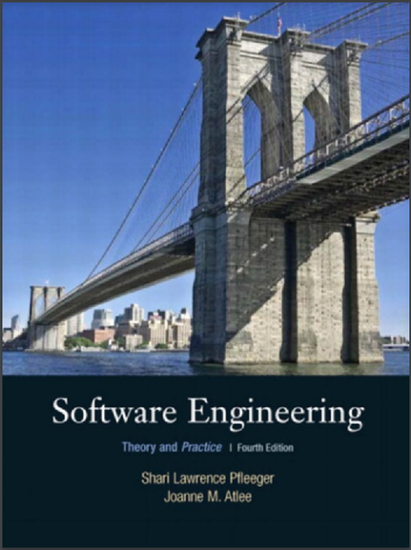

# 《Software Engineering Theory and Practice》（第四版）

# 此书主要内容的概述：

1. 软件工程基础

- 介绍软件工程的基本概念、历史和重要性。
- 讨论软件生命周期、软件过程模型（如瀑布模型、迭代模型、敏捷模型）。

2. 需求工程

- 探讨如何收集、分析、规范化和验证软件需求。
包括用户需求、系统需求和软件需求规格的概念。
设计与实现

- 涉及软件设计的原则、方法和模式。
讨论面向对象设计、模块化、API设计等。

3. 测试与维护

- 介绍软件测试的各种技术和策略，包括单元测试、集成测试、系统测试和验收测试。
- 讨论软件维护的重要性和挑战，包括错误修复、功能增强和性能优化。

4. 项目管理

- 探讨软件项目管理的基本概念，如项目计划、风险管理、进度估计和成本估计。
- 介绍敏捷方法和传统项目管理方法之间的比较。

5. 软件质量

- 讨论软件质量保证的方法，包括代码审查、静态分析、度量和测试。
- 探讨软件质量标准和模型，如ISO/IEC质量模型。

6. 软件工程专业实践

- 介绍软件工程师应遵循的职业道德和法律规定。
- 讨论案例研究和实际软件项目的应用。

7. 新兴话题

- 包括对当前软件工程领域的新兴技术和趋势的讨论，如云计算、移动应用开发、大数据和物联网。

这本书不仅提供了软件工程领域的全面覆盖，还强调了理论与实践之间的联系，通过案例研究和现实世界的例子来展示概念的应用。此外，作者还讨论了软件工程作为一个不断发展的领域，关注新技术和方法如何影响软件开发实践。

# gpt出的模拟考卷

根据《Software Engineering: Theory and Practice》（第四版）的内容，我可以为您设计一张期末考试试卷。考试可以包括多种类型的问题，如选择题、填空题、简答题和案例分析题，以全面评估学生对软件工程知识的掌握情况。

### 一、选择题（每题2分，共20分）
1. 软件工程的主要目的是什么？
   A. 编程 B. 测试 C. 维护 D. 开发高质量软件

2. 在软件过程模型中，瀑布模型的主要特点是什么？
   A. 迭代 B. 灵活 C. 顺序严格 D. 用户参与

3. 在需求工程中，哪项不是需求收集的方法？
   A. 访谈 B. 问卷 C. 编程 D. 观察

4. 面向对象设计中，封装的主要目的是什么？
   A. 增强安全性 B. 提高效率 C. 简化代码 D. 引入多态

5. 以下哪项不是软件测试的类型？
   A. 单元测试 B. 系统测试 C. 用户验收测试 D. 性能优化

### 二、填空题（每题2分，共10分）
1. 软件工程的生命周期通常包括 __________、设计、实现、测试和维护。

2. 敏捷方法强调的核心原则之一是 __________ 和响应变化。

3. 在软件设计中，__________ 模式可以用来创建对象，同时隐藏创建逻辑。

4. 在软件测试过程中，__________ 测试关注于不同模块之间的接口。

5. 软件维护中的一个主要活动是 __________，指的是修改软件以改进性能或其他属性。

### 三、简答题（每题10分，共30分）
1. 介绍软件项目管理中风险管理的重要性及其基本步骤。

2. 解释软件质量保证中的静态分析和动态测试之间的区别。

3. 描述敏捷软件开发方法与传统瀑布模型在项目管理上的主要区别。

### 四、案例分析题（每题20分，共40分）
1. 给定一个软件开发案例，描述如何从需求收集到系统部署的整个过程，并指出每一阶段可能遇到的挑战。

2. 分析一个现实中的软件项目失败案例，探讨其失败的原因，并提出改进措施。

---

这张试卷旨在评估学生对软件工程基本概念、方法论和实践的理解。您可以根据实际教学情况进行适当的调整和补充。

在软件工程的课程和考试中，通常不会涉及直接的算术问题，因为软件工程更多关注于软件开发的过程、方法、技术和管理，而不是数学运算。然而，可以设计一些计算题来考察学生对于软件工程中的某些量化管理技术和估算方法的理解。例如，可以包含关于项目成本估算、时间安排、质量度量等方面的问题。

以下是一些可能与算术相关的考题示例：

### 五、计算题（每题10分，共30分）
1. **成本估算**：假设一个软件项目的预计代码行数为50,000行，平均每行代码的开发成本为\$15。请计算整个项目的预估总成本。

2. **效率分析**：如果一个团队在前两个迭代周期内分别完成了800行和1000行代码，且每个迭代周期为两周，请计算该团队的平均代码生产率（行数/人-周）。

3. **缺陷密度计算**：在软件测试过程中，一个项目发现了150个缺陷，项目总代码行数为75,000行。请计算该项目的缺陷密度（每千行代码的缺陷数）。

这些题目有助于考察学生对软件项目管理中的一些基本量化分析方法的理解。这些计算可以帮助学生更好地把握软件工程项目的规模、成本和质量。

# 软件工程的关键概念包括：

1. 需求分析：了解和文档化用户和市场的需求。
2. 系统设计：基于需求分析，设计软件的架构和组件。
3. 编程：实现设计，编写代码。
4. 测试：确保软件按预期工作，没有错误。
5. 维护：软件发布后的更新和修复。
6. 项目管理：规划、组织和管理软件开发过程。

# 软件工程综合题

> 考点：
> 
> 数据流图、用例图、实体联系图、程序流程图、盒图、PAD图、判定表、判定树

## 1️⃣画出下列伪代码的程序流程图、盒图、PAD图。并计算程序复杂度。

2️⃣
